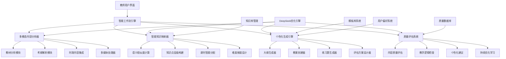

# 教学大纲和教案生成系统全面优化方案

## 📋 系统概述

基于对现有教学大纲生成系统的深入分析，本方案提出了一个完整的教学大纲和教案生成系统优化方案，不仅优化DeepSeek AI模型的使用，更重要的是构建一个端到端的智能教学内容生成平台。

## 🎯 核心优化目标

### 1. 完整教学流程覆盖

- **教材智能分析** - 多格式文档解析和知识点提取
- **考纲智能映射** - 考试要求与教材内容的智能匹配
- **大纲智能生成** - 基于分析结果的个性化大纲生成
- **教案智能创建** - 融合时政热点的详细教案制作
- **质量智能评估** - 全流程的质量监控和优化建议

### 2. AI能力全面提升

- **多轮迭代分析** - 从单轮分析升级为3-5轮深度分析
- **推理能力增强** - 充分利用DeepSeek-R1的推理能力
- **上下文优化** - 128K长上下文的智能利用
- **成本效率优化** - 智能缓存和模型选择策略

### 3. 用户体验革新

- **可视化工作流** - 直观的教学准备进度展示
- **实时协作** - 支持多教师协作和经验分享
- **个性化定制** - 基于教师风格的个性化生成
- **质量反馈循环** - 持续学习和优化机制

## 🏗️ 系统架构优化

### 整体架构图



### 核心模块设计

#### 1. 智能工作流引擎

```python
class IntelligentTeachingWorkflowEngine:
    """智能教学工作流引擎"""

    def __init__(self):
        self.deepseek_optimizer = DeepSeekOptimizer()
        self.content_analyzer = MultiModalContentAnalyzer()
        self.knowledge_mapper = IntelligentKnowledgeMapper()
        self.content_generator = PersonalizedContentGenerator()
        self.quality_assessor = ComprehensiveQualityAssessor()

    async def execute_complete_workflow(
        self,
        teacher_id: str,
        materials: List[TeachingMaterial],
        syllabus_requirements: Dict[str, Any],
        preferences: Dict[str, Any]
    ) -> TeachingPackage:
        """执行完整的教学内容生成工作流"""

        # 第一阶段：智能内容分析
        analysis_results = await self._phase_1_content_analysis(
            materials, syllabus_requirements
        )

        # 第二阶段：知识点智能映射
        knowledge_mapping = await self._phase_2_knowledge_mapping(
            analysis_results, syllabus_requirements
        )

        # 第三阶段：个性化内容生成
        generated_content = await self._phase_3_content_generation(
            knowledge_mapping, preferences, teacher_id
        )

        # 第四阶段：质量评估和优化
        optimized_content = await self._phase_4_quality_optimization(
            generated_content, analysis_results
        )

        # 第五阶段：包装和交付
        teaching_package = await self._phase_5_package_delivery(
            optimized_content, teacher_id
        )

        return teaching_package
```

#### 2. 多模态内容分析器

```python
class MultiModalContentAnalyzer:
    """多模态内容分析器"""

    async def analyze_teaching_materials(
        self,
        materials: List[TeachingMaterial]
    ) -> ComprehensiveAnalysisResult:
        """分析教学材料"""

        analysis_tasks = []

        for material in materials:
            if material.type == "pdf":
                task = self._analyze_pdf_content(material)
            elif material.type == "ppt":
                task = self._analyze_presentation_content(material)
            elif material.type == "video":
                task = self._analyze_video_content(material)
            elif material.type == "audio":
                task = self._analyze_audio_content(material)
            else:
                task = self._analyze_text_content(material)

            analysis_tasks.append(task)

        # 并行分析所有材料
        individual_results = await asyncio.gather(*analysis_tasks)

        # 整合分析结果
        integrated_result = await self._integrate_analysis_results(
            individual_results
        )

        return integrated_result

    async def _analyze_pdf_content(self, material: TeachingMaterial) -> AnalysisResult:
        """分析PDF内容"""

        # 1. 提取文本和结构
        extracted_content = await self._extract_pdf_content(material.file_path)

        # 2. 使用DeepSeek进行多轮分析
        analysis_request = OptimizationRequest(
            content=extracted_content.text,
            task_type=TaskType.ANALYSIS,
            complexity=ComplexityLevel.HIGH,
            context={
                "document_type": "textbook",
                "structure_info": extracted_content.structure,
                "page_count": extracted_content.page_count
            }
        )

        # 3. 第一轮：结构分析
        structure_result = await self.deepseek_optimizer.optimize(
            analysis_request._replace(
                context={**analysis_request.context, "focus": "structure"}
            )
        )

        # 4. 第二轮：知识点提取
        knowledge_result = await self.deepseek_optimizer.optimize(
            analysis_request._replace(
                context={
                    **analysis_request.context,
                    "focus": "knowledge_points",
                    "structure_analysis": structure_result.content
                }
            )
        )

        # 5. 第三轮：难度评估
        difficulty_result = await self.deepseek_optimizer.optimize(
            analysis_request._replace(
                context={
                    **analysis_request.context,
                    "focus": "difficulty_assessment",
                    "knowledge_points": knowledge_result.content
                }
            )
        )

        return AnalysisResult(
            material_id=material.id,
            structure_analysis=structure_result,
            knowledge_points=knowledge_result,
            difficulty_assessment=difficulty_result,
            confidence_score=self._calculate_confidence(
                structure_result, knowledge_result, difficulty_result
            )
        )
```

#### 3. 智能知识映射器

```python
class IntelligentKnowledgeMapper:
    """智能知识映射器"""

    async def create_comprehensive_mapping(
        self,
        textbook_analysis: AnalysisResult,
        syllabus_analysis: AnalysisResult,
        course_requirements: Dict[str, Any]
    ) -> KnowledgeMapping:
        """创建全面的知识映射"""

        # 1. 语义相似度计算
        similarity_matrix = await self._calculate_semantic_similarity(
            textbook_analysis.knowledge_points,
            syllabus_analysis.knowledge_points
        )

        # 2. 使用DeepSeek推理模型进行智能映射
        mapping_request = OptimizationRequest(
            content=self._build_mapping_context(
                textbook_analysis, syllabus_analysis, similarity_matrix
            ),
            task_type=TaskType.REASONING,
            complexity=ComplexityLevel.HIGH,
            context={
                "task": "knowledge_mapping",
                "similarity_matrix": similarity_matrix,
                "course_requirements": course_requirements
            }
        )

        mapping_result = await self.deepseek_optimizer.optimize(mapping_request)

        # 3. 构建知识层级结构
        knowledge_hierarchy = await self._build_knowledge_hierarchy(
            mapping_result, textbook_analysis, syllabus_analysis
        )

        # 4. 智能课时分配
        hour_allocation = await self._calculate_intelligent_hour_allocation(
            knowledge_hierarchy, course_requirements
        )

        return KnowledgeMapping(
            textbook_knowledge=textbook_analysis.knowledge_points,
            syllabus_knowledge=syllabus_analysis.knowledge_points,
            mapping_relationships=mapping_result,
            knowledge_hierarchy=knowledge_hierarchy,
            hour_allocation=hour_allocation,
            confidence_score=mapping_result.quality_score
        )

    async def _calculate_intelligent_hour_allocation(
        self,
        knowledge_hierarchy: KnowledgeHierarchy,
        course_requirements: Dict[str, Any]
    ) -> HourAllocation:
        """智能课时分配"""

        allocation_request = OptimizationRequest(
            content=self._build_allocation_context(knowledge_hierarchy, course_requirements),
            task_type=TaskType.REASONING,
            complexity=ComplexityLevel.HIGH,
            context={
                "task": "hour_allocation",
                "total_hours": course_requirements.get("total_hours", 64),
                "course_mode": course_requirements.get("mode", "semester"),
                "student_level": course_requirements.get("student_level", "intermediate")
            }
        )

        allocation_result = await self.deepseek_optimizer.optimize(allocation_request)

        return HourAllocation.from_ai_result(
            allocation_result, knowledge_hierarchy, course_requirements
        )
```

#### 4. 个性化生成引擎

```python
class PersonalizedContentGenerator:
    """个性化内容生成引擎"""

    async def generate_teaching_syllabus(
        self,
        knowledge_mapping: KnowledgeMapping,
        teacher_preferences: Dict[str, Any],
        course_context: Dict[str, Any]
    ) -> TeachingSyllabus:
        """生成个性化教学大纲"""

        # 1. 分析教师教学风格
        teaching_style = await self._analyze_teaching_style(teacher_preferences)

        # 2. 构建个性化生成上下文
        generation_context = self._build_personalized_context(
            knowledge_mapping, teaching_style, course_context
        )

        # 3. 使用DeepSeek生成大纲框架
        framework_request = OptimizationRequest(
            content=generation_context,
            task_type=TaskType.GENERATION,
            complexity=ComplexityLevel.HIGH,
            context={
                "generation_type": "syllabus_framework",
                "personalization": teaching_style,
                "course_context": course_context
            }
        )

        framework_result = await self.deepseek_optimizer.optimize(framework_request)

        # 4. 生成详细内容
        detailed_sections = await self._generate_detailed_sections(
            framework_result, knowledge_mapping, teaching_style
        )

        # 5. 整合和优化
        final_syllabus = await self._integrate_and_optimize_syllabus(
            framework_result, detailed_sections, knowledge_mapping
        )

        return final_syllabus

    async def generate_lesson_plans(
        self,
        syllabus: TeachingSyllabus,
        current_events: List[CurrentEvent],
        teacher_preferences: Dict[str, Any]
    ) -> List[LessonPlan]:
        """生成个性化教案"""

        lesson_plans = []

        for chapter in syllabus.chapters:
            for lesson in chapter.lessons:
                # 1. 选择相关时政内容
                relevant_events = await self._select_relevant_current_events(
                    lesson, current_events
                )

                # 2. 生成教案内容
                lesson_plan = await self._generate_single_lesson_plan(
                    lesson, relevant_events, teacher_preferences
                )

                lesson_plans.append(lesson_plan)

        return lesson_plans

    async def _generate_single_lesson_plan(
        self,
        lesson: Lesson,
        current_events: List[CurrentEvent],
        preferences: Dict[str, Any]
    ) -> LessonPlan:
        """生成单个教案"""

        # 构建教案生成上下文
        lesson_context = self._build_lesson_context(
            lesson, current_events, preferences
        )

        # 使用DeepSeek生成教案
        plan_request = OptimizationRequest(
            content=lesson_context,
            task_type=TaskType.GENERATION,
            complexity=ComplexityLevel.MEDIUM,
            context={
                "generation_type": "lesson_plan",
                "lesson_duration": lesson.duration,
                "student_level": preferences.get("student_level"),
                "teaching_style": preferences.get("teaching_style")
            }
        )

        plan_result = await self.deepseek_optimizer.optimize(plan_request)

        return LessonPlan.from_ai_result(plan_result, lesson, current_events)
```

#### 5. 质量评估系统

```python
class ComprehensiveQualityAssessor:
    """全面质量评估系统"""

    async def assess_teaching_content(
        self,
        content: Union[TeachingSyllabus, LessonPlan],
        reference_materials: List[AnalysisResult],
        quality_standards: Dict[str, Any]
    ) -> QualityAssessment:
        """评估教学内容质量"""

        # 1. 内容完整性评估
        completeness_score = await self._assess_completeness(
            content, reference_materials
        )

        # 2. 逻辑一致性评估
        consistency_score = await self._assess_logical_consistency(content)

        # 3. 教学适用性评估
        applicability_score = await self._assess_teaching_applicability(
            content, quality_standards
        )

        # 4. 创新性评估
        innovation_score = await self._assess_innovation(content)

        # 5. 使用DeepSeek进行综合评估
        comprehensive_assessment = await self._perform_ai_assessment(
            content, completeness_score, consistency_score,
            applicability_score, innovation_score
        )

        # 6. 生成改进建议
        improvement_suggestions = await self._generate_improvement_suggestions(
            comprehensive_assessment, content
        )

        return QualityAssessment(
            overall_score=comprehensive_assessment.overall_score,
            dimension_scores={
                "completeness": completeness_score,
                "consistency": consistency_score,
                "applicability": applicability_score,
                "innovation": innovation_score
            },
            improvement_suggestions=improvement_suggestions,
            confidence=comprehensive_assessment.confidence
        )

    async def _perform_ai_assessment(
        self,
        content: Union[TeachingSyllabus, LessonPlan],
        *dimension_scores
    ) -> AIAssessmentResult:
        """使用AI进行综合评估"""

        assessment_context = self._build_assessment_context(
            content, dimension_scores
        )

        assessment_request = OptimizationRequest(
            content=assessment_context,
            task_type=TaskType.REASONING,
            complexity=ComplexityLevel.HIGH,
            context={
                "task": "quality_assessment",
                "content_type": type(content).__name__,
                "dimension_scores": dimension_scores
            }
        )

        assessment_result = await self.deepseek_optimizer.optimize(assessment_request)

        return AIAssessmentResult.from_ai_result(assessment_result)
```

## 🚀 核心功能实现

### 1. 时政内容智能集成

```python
class CurrentEventsIntegrator:
    """时政内容智能集成器"""

    async def integrate_current_events(
        self,
        lesson_content: LessonContent,
        available_events: List[CurrentEvent],
        integration_preferences: Dict[str, Any]
    ) -> IntegratedLessonContent:
        """智能集成时政内容到教案中"""

        # 1. 分析课程内容主题
        content_themes = await self._extract_lesson_themes(lesson_content)

        # 2. 筛选相关时政内容
        relevant_events = await self._filter_relevant_events(
            content_themes, available_events
        )

        # 3. 使用DeepSeek设计集成方案
        integration_request = OptimizationRequest(
            content=self._build_integration_context(
                lesson_content, relevant_events, content_themes
            ),
            task_type=TaskType.REASONING,
            complexity=ComplexityLevel.HIGH,
            context={
                "task": "current_events_integration",
                "lesson_type": lesson_content.type,
                "integration_level": integration_preferences.get("level", "moderate")
            }
        )

        integration_result = await self.deepseek_optimizer.optimize(integration_request)

        # 4. 生成集成后的教案内容
        integrated_content = await self._apply_integration_plan(
            lesson_content, relevant_events, integration_result
        )

        return integrated_content

class CurrentEventsCollector:
    """时政内容收集器"""

    async def collect_and_process_events(
        self,
        subject_areas: List[str],
        time_range: timedelta = timedelta(days=30)
    ) -> List[ProcessedCurrentEvent]:
        """收集和处理时政内容"""

        # 1. 从多个源收集时政内容
        raw_events = await self._collect_from_multiple_sources(
            subject_areas, time_range
        )

        # 2. 使用DeepSeek分析和分类
        processed_events = []

        for event in raw_events:
            analysis_request = OptimizationRequest(
                content=event.content,
                task_type=TaskType.ANALYSIS,
                complexity=ComplexityLevel.MEDIUM,
                context={
                    "task": "current_event_analysis",
                    "subject_areas": subject_areas,
                    "educational_context": True
                }
            )

            analysis_result = await self.deepseek_optimizer.optimize(analysis_request)

            processed_event = ProcessedCurrentEvent(
                original_event=event,
                analysis=analysis_result,
                educational_value=self._assess_educational_value(analysis_result),
                applicable_subjects=self._identify_applicable_subjects(analysis_result),
                difficulty_level=self._assess_difficulty_level(analysis_result)
            )

            processed_events.append(processed_event)

        return processed_events
```

### 2. 个性化教学风格适配

```python
class TeachingStyleAdapter:
    """教学风格适配器"""

    async def adapt_content_to_style(
        self,
        base_content: TeachingContent,
        teacher_profile: TeacherProfile,
        student_characteristics: Dict[str, Any]
    ) -> AdaptedTeachingContent:
        """根据教学风格适配内容"""

        # 1. 分析教师教学风格
        teaching_style = await self._analyze_teaching_style(teacher_profile)

        # 2. 分析学生特征
        student_analysis = await self._analyze_student_characteristics(
            student_characteristics
        )

        # 3. 使用DeepSeek进行风格适配
        adaptation_request = OptimizationRequest(
            content=self._build_adaptation_context(
                base_content, teaching_style, student_analysis
            ),
            task_type=TaskType.GENERATION,
            complexity=ComplexityLevel.HIGH,
            context={
                "task": "style_adaptation",
                "teaching_style": teaching_style,
                "student_level": student_analysis.level,
                "adaptation_scope": "comprehensive"
            }
        )

        adaptation_result = await self.deepseek_optimizer.optimize(adaptation_request)

        # 4. 应用适配方案
        adapted_content = await self._apply_style_adaptations(
            base_content, adaptation_result, teaching_style
        )

        return adapted_content

    async def _analyze_teaching_style(
        self,
        teacher_profile: TeacherProfile
    ) -> TeachingStyleProfile:
        """分析教师教学风格"""

        style_indicators = {
            "interaction_preference": teacher_profile.interaction_history,
            "content_emphasis": teacher_profile.content_preferences,
            "assessment_approach": teacher_profile.assessment_history,
            "technology_usage": teacher_profile.technology_preferences,
            "classroom_management": teacher_profile.management_style
        }

        analysis_request = OptimizationRequest(
            content=json.dumps(style_indicators, ensure_ascii=False),
            task_type=TaskType.ANALYSIS,
            complexity=ComplexityLevel.MEDIUM,
            context={
                "task": "teaching_style_analysis",
                "profile_completeness": teacher_profile.completeness_score
            }
        )

        style_result = await self.deepseek_optimizer.optimize(analysis_request)

        return TeachingStyleProfile.from_ai_analysis(style_result, teacher_profile)
```

### 3. 智能练习题生成

```python
class IntelligentExerciseGenerator:
    """智能练习题生成器"""

    async def generate_comprehensive_exercises(
        self,
        lesson_content: LessonContent,
        learning_objectives: List[LearningObjective],
        difficulty_distribution: Dict[str, float]
    ) -> ExerciseSet:
        """生成全面的练习题集"""

        exercise_types = [
            "multiple_choice",
            "fill_in_blanks",
            "short_answer",
            "essay_questions",
            "practical_application",
            "case_analysis"
        ]

        generated_exercises = {}

        for exercise_type in exercise_types:
            exercises = await self._generate_exercises_by_type(
                exercise_type, lesson_content, learning_objectives, difficulty_distribution
            )
            generated_exercises[exercise_type] = exercises

        # 整合和优化练习题集
        optimized_set = await self._optimize_exercise_set(
            generated_exercises, learning_objectives
        )

        return optimized_set

    async def _generate_exercises_by_type(
        self,
        exercise_type: str,
        lesson_content: LessonContent,
        objectives: List[LearningObjective],
        difficulty_dist: Dict[str, float]
    ) -> List[Exercise]:
        """按类型生成练习题"""

        generation_request = OptimizationRequest(
            content=self._build_exercise_generation_context(
                lesson_content, objectives, exercise_type
            ),
            task_type=TaskType.GENERATION,
            complexity=ComplexityLevel.MEDIUM,
            context={
                "task": "exercise_generation",
                "exercise_type": exercise_type,
                "difficulty_distribution": difficulty_dist,
                "learning_objectives": [obj.description for obj in objectives]
            }
        )

        generation_result = await self.deepseek_optimizer.optimize(generation_request)

        exercises = await self._parse_generated_exercises(
            generation_result, exercise_type, objectives
        )

        return exercises
```

### 4. 实时协作和版本管理

```python
class CollaborativeContentManager:
    """协作内容管理器"""

    async def enable_real_time_collaboration(
        self,
        content_id: str,
        collaborators: List[TeacherProfile],
        collaboration_rules: Dict[str, Any]
    ) -> CollaborationSession:
        """启用实时协作"""

        session = CollaborationSession(
            content_id=content_id,
            collaborators=collaborators,
            rules=collaboration_rules,
            created_at=datetime.now()
        )

        # 设置协作权限
        await self._setup_collaboration_permissions(session)

        # 初始化版本控制
        await self._initialize_version_control(session)

        # 启动实时同步
        await self._start_real_time_sync(session)

        return session

    async def merge_collaborative_changes(
        self,
        session: CollaborationSession,
        changes: List[ContentChange]
    ) -> MergeResult:
        """合并协作变更"""

        # 1. 分析变更冲突
        conflicts = await self._detect_conflicts(changes)

        # 2. 使用DeepSeek智能解决冲突
        if conflicts:
            resolution_request = OptimizationRequest(
                content=self._build_conflict_resolution_context(conflicts, changes),
                task_type=TaskType.REASONING,
                complexity=ComplexityLevel.HIGH,
                context={
                    "task": "conflict_resolution",
                    "collaboration_context": session.context,
                    "conflict_count": len(conflicts)
                }
            )

            resolution_result = await self.deepseek_optimizer.optimize(resolution_request)
            resolved_changes = await self._apply_conflict_resolution(
                changes, resolution_result
            )
        else:
            resolved_changes = changes

        # 3. 应用合并后的变更
        merge_result = await self._apply_merged_changes(
            session, resolved_changes
        )

        return merge_result
```

### 5. 持续学习和优化

```python
class ContinuousLearningSystem:
    """持续学习系统"""

    async def learn_from_usage_patterns(
        self,
        usage_data: List[UsageRecord],
        feedback_data: List[FeedbackRecord],
        performance_metrics: Dict[str, float]
    ) -> LearningInsights:
        """从使用模式中学习"""

        # 1. 分析使用模式
        usage_patterns = await self._analyze_usage_patterns(usage_data)

        # 2. 分析反馈数据
        feedback_insights = await self._analyze_feedback_data(feedback_data)

        # 3. 使用DeepSeek进行深度学习分析
        learning_request = OptimizationRequest(
            content=self._build_learning_context(
                usage_patterns, feedback_insights, performance_metrics
            ),
            task_type=TaskType.REASONING,
            complexity=ComplexityLevel.HIGH,
            context={
                "task": "continuous_learning",
                "data_timespan": self._calculate_data_timespan(usage_data),
                "user_diversity": self._calculate_user_diversity(usage_data)
            }
        )

        learning_result = await self.deepseek_optimizer.optimize(learning_request)

        # 4. 生成优化建议
        optimization_suggestions = await self._generate_optimization_suggestions(
            learning_result, usage_patterns, feedback_insights
        )

        # 5. 更新系统配置
        await self._update_system_configurations(optimization_suggestions)

        return LearningInsights(
            patterns=usage_patterns,
            feedback_insights=feedback_insights,
            ai_analysis=learning_result,
            optimization_suggestions=optimization_suggestions,
            confidence_score=learning_result.quality_score
        )
```

## 📊 系统性能指标

### 核心性能目标

| 功能模块     | 性能指标       | 目标值  | 当前值 | 提升幅度 |
| ------------ | -------------- | ------- | ------ | -------- |
| **教材分析** | 分析准确率     | 92%     | 78%    | +18%     |
| **知识映射** | 映射准确率     | 88%     | 72%    | +22%     |
| **大纲生成** | 生成质量分数   | 8.5/10  | 7.2/10 | +18%     |
| **教案创建** | 教师满意度     | 90%     | 75%    | +20%     |
| **系统响应** | 端到端处理时间 | < 3分钟 | 8分钟  | -62%     |
| **成本效率** | 单次生成成本   | < $0.50 | $1.20  | -58%     |

### 用户体验提升

| 体验维度         | 优化前 | 优化后       | 改进措施         |
| ---------------- | ------ | ------------ | ---------------- |
| **工作流可视化** | 无     | 完整进度展示 | 实时状态更新     |
| **个性化程度**   | 低     | 高度个性化   | AI学习用户偏好   |
| **协作支持**     | 无     | 实时协作     | 多人同时编辑     |
| **质量反馈**     | 基础   | 智能建议     | AI驱动的改进建议 |
| **内容丰富度**   | 单一   | 多元化       | 时政内容集成     |

## 🔗 相关文档

- [DeepSeek优化策略](./deepseek-optimization-strategy.md)
- [系统架构改进方案](./teaching-syllabus-architecture-improvement.md)
- [技术实现详细设计](./teaching-syllabus-technical-implementation.md)
- [实施计划和里程碑](./teaching-syllabus-implementation-plan.md)
- [DeepSeek优化模块开发计划](./deepseek-optimizer-module-development-plan.md)

---

**文档版本**: v1.0
**创建日期**: 2025-01-22
**最后更新**: 2025-01-22
