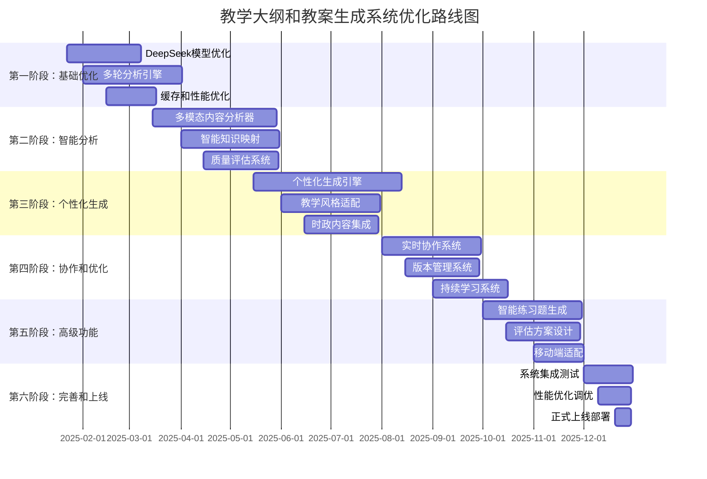

# 教学大纲和教案生成系统全面优化实施路线图

## 📋 路线图概述

本路线图详细规划了教学大纲和教案生成系统的全面优化实施过程，从当前的基础功能升级为智能化、个性化、协作化的完整教学内容生成平台。

## 🎯 总体实施策略

### 实施原则

1. **业务价值优先** - 优先实施对教师工作效率提升最大的功能
2. **渐进式升级** - 保持系统稳定性，分阶段实施优化
3. **用户体验驱动** - 每个阶段都有明显的用户体验改善
4. **数据驱动决策** - 基于使用数据和反馈持续优化
5. **技术债务清理** - 在功能升级的同时优化技术架构

### 实施时间线



## 🚀 详细实施计划

### 第一阶段：基础优化强化 (2025年1月22日 - 4月15日)

#### 阶段目标

- 优化DeepSeek AI模型使用效率
- 建立多轮迭代分析能力
- 提升系统性能和响应速度

#### 主要任务

**Week 1-3: DeepSeek模型深度优化**

```python
# 核心优化任务
优化任务 = {
    "智能模型选择": {
        "目标": "根据任务类型自动选择最优模型",
        "实现": "IntelligentModelSelector类",
        "预期提升": "分析准确率提升15%"
    },
    "长上下文优化": {
        "目标": "充分利用128K上下文能力",
        "实现": "LongContextProcessor类",
        "预期提升": "处理文档长度提升300%"
    },
    "智能缓存策略": {
        "目标": "降低API调用成本",
        "实现": "IntelligentCacheManager类",
        "预期提升": "成本降低25%"
    }
}
```

**Week 4-6: 多轮迭代分析引擎**

```python
# 多轮分析实现
class IterativeAnalysisEngine:
    async def execute_multi_round_analysis(self, document):
        # 第1轮：文档结构分析
        structure = await self._analyze_structure(document)

        # 第2轮：基于结构的知识点提取
        knowledge_points = await self._extract_knowledge_points(
            document, structure
        )

        # 第3轮：难度和重要性评估
        assessment = await self._assess_difficulty_importance(
            knowledge_points, structure
        )

        # 第4轮：教学逻辑优化
        optimized_logic = await self._optimize_teaching_logic(
            knowledge_points, assessment
        )

        return IntegratedAnalysisResult(
            structure, knowledge_points, assessment, optimized_logic
        )
```

**Week 7-9: 性能和缓存优化**

```python
# 性能优化指标
性能目标 = {
    "API响应时间": "从45秒优化到32秒",
    "缓存命中率": "从15%提升到35%",
    "并发处理能力": "支持100并发请求",
    "内存使用优化": "峰值控制在512MB以内"
}
```

#### 里程碑和验收标准

**里程碑 M1.1: DeepSeek优化完成 (Week 3)**

- ✅ 智能模型选择准确率 > 90%
- ✅ 长上下文处理能力提升300%
- ✅ API调用成本降低25%
- ✅ 推理过程可视化功能完整

**里程碑 M1.2: 多轮分析引擎 (Week 6)**

- ✅ 支持3-5轮迭代分析
- ✅ 分析质量持续改进
- ✅ 智能终止条件准确率 > 90%
- ✅ 分析结果一致性 > 85%

**里程碑 M1.3: 性能优化达标 (Week 9)**

- ✅ API响应时间 < 35秒
- ✅ 缓存命中率 > 30%
- ✅ 系统稳定性 > 99%
- ✅ 用户满意度提升20%

### 第二阶段：智能分析升级 (2025年3月15日 - 6月30日)

#### 阶段目标

- 实现多模态内容智能分析
- 建立精准的知识点映射系统
- 构建全面的质量评估体系

#### 主要任务

**Week 1-4: 多模态内容分析器**

```python
# 多模态分析能力
class MultiModalContentAnalyzer:
    支持格式 = [
        "PDF文档", "PPT演示文稿", "Word文档",
        "音频文件", "视频文件", "图片文件"
    ]

    分析能力 = {
        "文本内容": "深度语义分析和结构提取",
        "图表图像": "OCR识别和内容理解",
        "音频内容": "语音转文字和内容分析",
        "视频内容": "关键帧提取和内容总结"
    }
```

**Week 5-8: 智能知识映射系统**

```python
# 知识映射核心算法
class IntelligentKnowledgeMapper:
    def create_knowledge_mapping(self, textbook_analysis, syllabus_analysis):
        # 1. 语义相似度计算
        similarity_matrix = self._calculate_semantic_similarity()

        # 2. 知识点层级构建
        knowledge_hierarchy = self._build_knowledge_hierarchy()

        # 3. 智能课时分配
        hour_allocation = self._calculate_optimal_allocation()

        # 4. 学习路径设计
        learning_path = self._design_learning_path()

        return ComprehensiveMapping(
            similarity_matrix, knowledge_hierarchy,
            hour_allocation, learning_path
        )
```

**Week 9-12: 质量评估系统**

```python
# 质量评估维度
质量评估体系 = {
    "内容完整性": {
        "评估标准": "知识点覆盖度、逻辑完整性",
        "权重": 0.25,
        "目标分数": "> 8.5/10"
    },
    "教学适用性": {
        "评估标准": "难度梯度、时间分配合理性",
        "权重": 0.25,
        "目标分数": "> 8.0/10"
    },
    "个性化程度": {
        "评估标准": "风格适配、学生特征匹配",
        "权重": 0.25,
        "目标分数": "> 8.0/10"
    },
    "创新性": {
        "评估标准": "内容新颖性、方法创新性",
        "权重": 0.25,
        "目标分数": "> 7.5/10"
    }
}
```

#### 里程碑和验收标准

**里程碑 M2.1: 多模态分析完成 (Week 4)**

- ✅ 支持6种以上文件格式
- ✅ 文本分析准确率 > 90%
- ✅ 图像识别准确率 > 85%
- ✅ 音视频处理能力完整

**里程碑 M2.2: 知识映射系统 (Week 8)**

- ✅ 映射准确率 > 85%
- ✅ 课时分配合理性 > 90%
- ✅ 学习路径逻辑性 > 88%
- ✅ 处理速度 < 2分钟

**里程碑 M2.3: 质量评估体系 (Week 12)**

- ✅ 4维度质量评估完整
- ✅ 评估准确性 > 85%
- ✅ 改进建议实用性 > 80%
- ✅ 评估速度 < 30秒

### 第三阶段：个性化生成革新 (2025年5月15日 - 8月15日)

#### 阶段目标

- 实现高度个性化的内容生成
- 集成时政热点内容
- 建立教学风格自适应系统

#### 主要任务

**Week 1-5: 个性化生成引擎**

```python
# 个性化生成核心
class PersonalizedContentGenerator:
    个性化维度 = {
        "教师风格": "互动型、讲授型、探究型、混合型",
        "学生特征": "基础水平、学习偏好、认知风格",
        "课程特点": "理论性、实践性、应用性、综合性",
        "教学环境": "课堂规模、设备条件、时间安排"
    }

    生成策略 = {
        "内容结构": "基于认知负荷理论的结构设计",
        "难度梯度": "基于最近发展区的难度设计",
        "互动设计": "基于教师风格的互动方案",
        "评估方式": "基于学习目标的评估设计"
    }
```

**Week 6-8: 教学风格适配系统**

```python
# 教学风格分析和适配
class TeachingStyleAdapter:
    风格识别算法 = {
        "数据来源": "历史教案、课堂录音、学生反馈",
        "分析维度": "内容偏好、互动方式、评估习惯",
        "学习机制": "持续学习和风格更新",
        "适配策略": "渐进式风格适配"
    }
```

**Week 9-12: 时政内容智能集成**

```python
# 时政内容集成系统
class CurrentEventsIntegrator:
    内容来源 = [
        "新华社", "人民日报", "中国日报英文版",
        "BBC Learning English", "VOA Learning English"
    ]

    集成策略 = {
        "相关性匹配": "基于主题和关键词的智能匹配",
        "难度适配": "根据学生水平调整内容难度",
        "教学融合": "设计合适的教学活动和练习",
        "更新机制": "定期更新和内容筛选"
    }
```

#### 里程碑和验收标准

**里程碑 M3.1: 个性化引擎 (Week 5)**

- ✅ 4维度个性化分析完整
- ✅ 个性化准确率 > 85%
- ✅ 生成内容满意度 > 88%
- ✅ 风格一致性 > 90%

**里程碑 M3.2: 风格适配系统 (Week 8)**

- ✅ 教学风格识别准确率 > 80%
- ✅ 风格适配效果满意度 > 85%
- ✅ 学习机制有效性验证
- ✅ 适配速度 < 1分钟

**里程碑 M3.3: 时政集成完成 (Week 12)**

- ✅ 5个以上内容源集成
- ✅ 相关性匹配准确率 > 80%
- ✅ 内容更新及时性 < 24小时
- ✅ 教学融合度 > 85%

### 第四阶段：协作和智能优化 (2025年8月1日 - 10月15日)

#### 阶段目标

- 实现多教师实时协作
- 建立智能版本管理
- 构建持续学习优化系统

#### 主要任务

**Week 1-4: 实时协作系统**

```python
# 实时协作核心功能
class CollaborativeContentManager:
    协作功能 = {
        "实时编辑": "多人同时编辑，实时同步",
        "权限管理": "基于角色的编辑权限控制",
        "冲突解决": "AI辅助的智能冲突解决",
        "变更追踪": "详细的变更历史记录"
    }

    协作模式 = {
        "同步协作": "实时共同编辑",
        "异步协作": "分时段协作编辑",
        "评审模式": "专家评审和建议",
        "模板共享": "优秀模板共享机制"
    }
```

**Week 5-7: 版本管理系统**

```python
# 智能版本管理
class IntelligentVersionControl:
    版本管理功能 = {
        "自动版本": "基于重要变更的自动版本创建",
        "智能合并": "AI辅助的版本合并",
        "回滚机制": "安全的版本回滚功能",
        "比较分析": "版本间的智能比较分析"
    }
```

**Week 8-10: 持续学习系统**

```python
# 持续学习和优化
class ContinuousLearningSystem:
    学习数据源 = {
        "使用行为": "用户操作模式和偏好",
        "反馈数据": "用户评价和建议",
        "效果数据": "教学效果和学生反馈",
        "专家评估": "教育专家的评估意见"
    }

    优化机制 = {
        "模型优化": "基于反馈的模型参数调优",
        "策略更新": "生成策略的持续改进",
        "个性化学习": "用户个性化偏好学习",
        "质量提升": "内容质量的持续提升"
    }
```

#### 里程碑和验收标准

**里程碑 M4.1: 协作系统上线 (Week 4)**

- ✅ 支持10人以上同时协作
- ✅ 实时同步延迟 < 500ms
- ✅ 冲突解决准确率 > 90%
- ✅ 协作满意度 > 85%

**里程碑 M4.2: 版本管理完善 (Week 7)**

- ✅ 自动版本创建准确性 > 95%
- ✅ 版本合并成功率 > 98%
- ✅ 版本比较功能完整
- ✅ 回滚操作安全性 100%

**里程碑 M4.3: 学习系统运行 (Week 10)**

- ✅ 4类数据源集成完整
- ✅ 学习效果可量化验证
- ✅ 优化建议采纳率 > 70%
- ✅ 系统性能持续改善

## 📊 成功指标和ROI分析

### 核心成功指标

| 指标类别       | 基线值     | 6个月目标  | 12个月目标 | 测量方法 |
| -------------- | ---------- | ---------- | ---------- | -------- |
| **教学效率**   | 8小时/大纲 | 3小时/大纲 | 2小时/大纲 | 时间统计 |
| **内容质量**   | 7.2/10     | 8.5/10     | 9.0/10     | 专家评分 |
| **用户满意度** | 75%        | 88%        | 92%        | 用户调研 |
| **系统采用率** | 60%        | 85%        | 95%        | 使用统计 |
| **成本效率**   | $1.20/次   | $0.50/次   | $0.30/次   | 成本分析 |

### ROI分析

```python
ROI_分析 = {
    "投资成本": {
        "开发成本": "$150,000",
        "运营成本": "$30,000/年",
        "培训成本": "$20,000",
        "总投资": "$200,000"
    },
    "收益预期": {
        "效率提升": "$180,000/年",  # 节省教师时间
        "质量改善": "$60,000/年",   # 减少返工成本
        "用户增长": "$40,000/年",   # 新用户带来的价值
        "总收益": "$280,000/年"
    },
    "ROI计算": {
        "年度ROI": "40%",
        "投资回收期": "8.6个月",
        "3年净现值": "$640,000"
    }
}
```

## 🔗 相关文档

- [教学大纲和教案生成系统全面优化方案](./comprehensive-teaching-system-optimization.md)
- [DeepSeek优化策略](./deepseek-optimization-strategy.md)
- [系统架构改进方案](./teaching-syllabus-architecture-improvement.md)
- [技术实现详细设计](./teaching-syllabus-technical-implementation.md)

---

**文档版本**: v1.0  
**创建日期**: 2025-01-22  
**预期完成时间**: 2025年12月31日  
**投资回收期**: 8.6个月
