# DeepSeek AI优化模块开发任务计划

## 📋 项目概述

### 项目目标

开发一个独立的`deepseek_optimizer`Python包，作为可插拔的AI优化组件，提供智能模型选择、长上下文处理、缓存管理、推理过程提取等核心功能。

### 设计原则

- **可插拔架构** - 独立于特定框架，支持多种集成方式
- **配置驱动** - 业务逻辑通过配置文件和策略模式实现
- **标准化接口** - 清晰的API设计，支持权限控制
- **AI友好开发** - 充分利用AI代码生成和模式识别能力

## 🏗️ 模块架构设计

### 核心架构图

```mermaid
graph TB
    A[deepseek_optimizer] --> B[Core Engine]
    A --> C[Strategy Manager]
    A --> D[Cache Manager]
    A --> E[Monitor & Analytics]
    A --> F[Security & Auth]

    B --> B1[Model Selector]
    B --> B2[Context Processor]
    B --> B3[Reasoning Extractor]
    B --> B4[Quality Assessor]

    C --> C1[Selection Strategy]
    C --> C2[Parameter Strategy]
    C --> C3[Retry Strategy]
    C --> C4[Cache Strategy]

    D --> D1[Intelligent Cache]
    D --> D2[Context Cache]
    D --> D3[Result Cache]
    D --> D4[Statistics Cache]

    E --> E1[Performance Monitor]
    E --> E2[Cost Tracker]
    E --> E3[Quality Metrics]
    E --> E4[Usage Analytics]

    F --> F1[RBAC Manager]
    F --> F2[API Key Manager]
    F --> F3[Audit Logger]
    F --> F4[Rate Limiter]
```



### 包结构设计

```
deepseek_optimizer/
├── __init__.py                 # 包初始化和主要API
├── core/                       # 核心引擎
│   ├── __init__.py
│   ├── engine.py              # 主引擎类
│   ├── model_selector.py      # 智能模型选择器
│   ├── context_processor.py   # 长上下文处理器
│   ├── reasoning_extractor.py # 推理过程提取器
│   └── quality_assessor.py    # 质量评估器
├── strategies/                 # 策略模式实现
│   ├── __init__.py
│   ├── base.py               # 基础策略接口
│   ├── selection.py          # 模型选择策略
│   ├── parameter.py          # 参数优化策略
│   ├── retry.py              # 重试策略
│   └── cache.py              # 缓存策略
├── cache/                      # 缓存管理
│   ├── __init__.py
│   ├── manager.py            # 缓存管理器
│   ├── backends/             # 缓存后端
│   │   ├── memory.py
│   │   ├── redis.py
│   │   └── file.py
│   └── serializers.py        # 序列化器
├── monitoring/                 # 监控和分析
│   ├── __init__.py
│   ├── performance.py        # 性能监控
│   ├── cost_tracker.py       # 成本跟踪
│   ├── quality_metrics.py    # 质量指标
│   └── analytics.py          # 使用分析
├── security/                   # 安全和权限
│   ├── __init__.py
│   ├── rbac.py               # 基于角色的访问控制
│   ├── api_keys.py           # API密钥管理
│   ├── audit.py              # 审计日志
│   └── rate_limiter.py       # 速率限制
├── config/                     # 配置管理
│   ├── __init__.py
│   ├── settings.py           # 配置类
│   ├── defaults.py           # 默认配置
│   └── validators.py         # 配置验证
├── utils/                      # 工具函数
│   ├── __init__.py
│   ├── exceptions.py         # 自定义异常
│   ├── decorators.py         # 装饰器
│   ├── helpers.py            # 辅助函数
│   └── constants.py          # 常量定义
├── adapters/                   # 框架适配器
│   ├── __init__.py
│   ├── django_adapter.py     # Django集成
│   ├── fastapi_adapter.py    # FastAPI集成
│   └── flask_adapter.py      # Flask集成
├── tests/                      # 测试用例
│   ├── __init__.py
│   ├── unit/                 # 单元测试
│   ├── integration/          # 集成测试
│   ├── performance/          # 性能测试
│   └── fixtures/             # 测试数据
├── docs/                       # 文档
│   ├── api/                  # API文档
│   ├── guides/               # 使用指南
│   └── examples/             # 示例代码
├── configs/                    # 配置文件模板
│   ├── default.yaml
│   ├── production.yaml
│   └── development.yaml
├── requirements.txt            # 依赖包
├── setup.py                   # 安装脚本
├── README.md                  # 项目说明
└── CHANGELOG.md               # 变更日志
```

## 🔧 核心类和接口定义

### 1. 主引擎接口

```python
# deepseek_optimizer/core/engine.py

from typing import Dict, Any, Optional, List
from abc import ABC, abstractmethod
from dataclasses import dataclass
from enum import Enum

class TaskType(Enum):
    """任务类型枚举"""
    ANALYSIS = "analysis"
    GENERATION = "generation"
    REASONING = "reasoning"
    EXTRACTION = "extraction"

class ComplexityLevel(Enum):
    """复杂度级别枚举"""
    LOW = "low"
    MEDIUM = "medium"
    HIGH = "high"

@dataclass
class OptimizationRequest:
    """优化请求数据类"""
    content: str
    task_type: TaskType
    complexity: ComplexityLevel
    context: Optional[Dict[str, Any]] = None
    preferences: Optional[Dict[str, Any]] = None
    user_id: Optional[str] = None
    tenant_id: Optional[str] = None

@dataclass
class OptimizationResult:
    """优化结果数据类"""
    success: bool
    content: str
    reasoning_process: Optional[str] = None
    model_used: str = ""
    processing_time: float = 0.0
    tokens_used: int = 0
    cost: float = 0.0
    quality_score: float = 0.0
    from_cache: bool = False
    metadata: Optional[Dict[str, Any]] = None

class DeepSeekOptimizer:
    """DeepSeek优化器主类"""

    def __init__(self, config_path: Optional[str] = None):
        """初始化优化器"""
        pass

    async def optimize(self, request: OptimizationRequest) -> OptimizationResult:
        """执行优化处理"""
        pass

    async def batch_optimize(self, requests: List[OptimizationRequest]) -> List[OptimizationResult]:
        """批量优化处理"""
        pass

    def get_performance_stats(self, time_range: str = "24h") -> Dict[str, Any]:
        """获取性能统计"""
        pass

    def get_cost_analysis(self, time_range: str = "30d") -> Dict[str, Any]:
        """获取成本分析"""
        pass
```

### 2. 策略接口定义

```python
# deepseek_optimizer/strategies/base.py

from abc import ABC, abstractmethod
from typing import Dict, Any, Optional

class BaseStrategy(ABC):
    """基础策略接口"""

    @abstractmethod
    def execute(self, context: Dict[str, Any]) -> Dict[str, Any]:
        """执行策略"""
        pass

    @abstractmethod
    def validate_config(self, config: Dict[str, Any]) -> bool:
        """验证配置"""
        pass

class ModelSelectionStrategy(BaseStrategy):
    """模型选择策略接口"""

    @abstractmethod
    def select_model(self, task_type: TaskType, complexity: ComplexityLevel,
                    content_length: int) -> Dict[str, Any]:
        """选择最优模型和参数"""
        pass

class ParameterOptimizationStrategy(BaseStrategy):
    """参数优化策略接口"""

    @abstractmethod
    def optimize_parameters(self, base_params: Dict[str, Any],
                          context: Dict[str, Any]) -> Dict[str, Any]:
        """优化模型参数"""
        pass

class CacheStrategy(BaseStrategy):
    """缓存策略接口"""

    @abstractmethod
    def generate_cache_key(self, request: OptimizationRequest) -> str:
        """生成缓存键"""
        pass

    @abstractmethod
    def should_cache(self, result: OptimizationResult) -> bool:
        """判断是否应该缓存"""
        pass

    @abstractmethod
    def get_ttl(self, task_type: TaskType) -> int:
        """获取缓存TTL"""
        pass
```

### 3. 配置管理

```python
# deepseek_optimizer/config/settings.py

from typing import Dict, Any, Optional
from dataclasses import dataclass, field
from pathlib import Path
import yaml

@dataclass
class ModelConfig:
    """模型配置"""
    name: str
    temperature: float = 0.7
    max_tokens: int = 4000
    top_p: float = 0.9
    use_reasoning: bool = False

@dataclass
class CacheConfig:
    """缓存配置"""
    backend: str = "memory"
    default_ttl: int = 3600
    max_size: int = 1000
    compression: bool = True
    redis_url: Optional[str] = None

@dataclass
class SecurityConfig:
    """安全配置"""
    enable_rbac: bool = True
    enable_rate_limiting: bool = True
    enable_audit_log: bool = True
    api_key_required: bool = True
    max_requests_per_minute: int = 100

@dataclass
class MonitoringConfig:
    """监控配置"""
    enable_performance_tracking: bool = True
    enable_cost_tracking: bool = True
    enable_quality_metrics: bool = True
    metrics_retention_days: int = 30

@dataclass
class OptimizerConfig:
    """优化器主配置"""
    models: Dict[str, ModelConfig] = field(default_factory=dict)
    cache: CacheConfig = field(default_factory=CacheConfig)
    security: SecurityConfig = field(default_factory=SecurityConfig)
    monitoring: MonitoringConfig = field(default_factory=MonitoringConfig)
    strategies: Dict[str, str] = field(default_factory=dict)

    @classmethod
    def from_file(cls, config_path: str) -> 'OptimizerConfig':
        """从配置文件加载"""
        with open(config_path, 'r', encoding='utf-8') as f:
            data = yaml.safe_load(f)
        return cls(**data)

    def validate(self) -> bool:
        """验证配置有效性"""
        # 配置验证逻辑
        return True
```

## 🚀 实施步骤

### 第一阶段：核心框架搭建（1-2周）

**AI辅助任务**：

1. **自动生成包结构**

   ```bash
   # AI生成命令
   "请生成完整的Python包目录结构，包括所有__init__.py文件和基础类定义"
   ```

2. **自动生成基础类和接口**

   ```python
   # AI生成任务
   "基于架构设计，生成所有基础类、接口和数据类的完整代码"
   ```

3. **自动生成配置管理代码**
   ```python
   # AI生成任务
   "生成配置管理类，支持YAML文件加载、验证和默认值处理"
   ```

**交付物**：

- 完整的包结构
- 基础类和接口定义
- 配置管理系统
- 基础异常处理

### 第二阶段：核心功能实现（2-3周）

**AI辅助任务**：

1. **智能模型选择器实现**

   ```python
   # AI生成任务
   "实现ModelSelector类，包括基于任务类型和复杂度的智能选择逻辑"
   ```

2. **长上下文处理器实现**

   ```python
   # AI生成任务
   "实现ContextProcessor类，包括智能截取、压缩和重构功能"
   ```

3. **推理过程提取器实现**

   ```python
   # AI生成任务
   "实现ReasoningExtractor类，解析<think>和<answer>标签，提取推理过程"
   ```

4. **缓存管理器实现**
   ```python
   # AI生成任务
   "实现CacheManager类，支持多种后端和智能缓存策略"
   ```

**交付物**：

- 智能模型选择器
- 长上下文处理器
- 推理过程提取器
- 缓存管理系统

### 第三阶段：策略和监控系统（1-2周）

**AI辅助任务**：

1. **策略模式实现**

   ```python
   # AI生成任务
   "实现所有策略类，包括选择策略、参数策略、重试策略和缓存策略"
   ```

2. **监控系统实现**

   ```python
   # AI生成任务
   "实现性能监控、成本跟踪、质量指标和使用分析功能"
   ```

3. **安全模块实现**
   ```python
   # AI生成任务
   "实现RBAC、API密钥管理、审计日志和速率限制功能"
   ```

**交付物**：

- 完整的策略系统
- 监控和分析模块
- 安全和权限控制

### 第四阶段：集成和适配器（1周）

**AI辅助任务**：

1. **框架适配器生成**

   ```python
   # AI生成任务
   "生成Django、FastAPI、Flask的集成适配器代码"
   ```

2. **API文档生成**
   ```python
   # AI生成任务
   "基于代码注释和类型提示，自动生成完整的API文档"
   ```

**交付物**：

- 框架适配器
- API文档
- 使用示例

### 第五阶段：测试和优化（1-2周）

**AI辅助任务**：

1. **单元测试生成**

   ```python
   # AI生成任务
   "为所有类和方法生成全面的单元测试用例"
   ```

2. **集成测试生成**

   ```python
   # AI生成任务
   "生成端到端的集成测试用例，覆盖主要使用场景"
   ```

3. **性能测试生成**
   ```python
   # AI生成任务
   "生成性能基准测试，包括并发测试和压力测试"
   ```

**交付物**：

- 完整的测试套件
- 性能基准报告
- 优化建议

## 📊 测试策略

### 单元测试覆盖率目标

- **核心模块** - 95%以上覆盖率
- **策略模块** - 90%以上覆盖率
- **工具模块** - 85%以上覆盖率

### 集成测试场景

1. **端到端优化流程测试**
2. **多租户隔离测试**
3. **缓存一致性测试**
4. **权限控制测试**
5. **错误恢复测试**

### 性能测试指标

- **响应时间** - 95%请求 < 2秒
- **并发处理** - 支持100并发请求
- **内存使用** - 峰值 < 512MB
- **缓存命中率** - > 30%

## 🚀 部署方案

### 包发布策略

```python
# setup.py 配置示例
setup(
    name="deepseek-optimizer",
    version="1.0.0",
    description="DeepSeek AI优化模块",
    packages=find_packages(),
    install_requires=[
        "pydantic>=2.0.0",
        "pyyaml>=6.0",
        "redis>=4.0.0",
        "aiohttp>=3.8.0",
        "asyncio-throttle>=1.0.0"
    ],
    extras_require={
        "django": ["django>=4.0"],
        "fastapi": ["fastapi>=0.100.0"],
        "flask": ["flask>=2.0.0"],
        "monitoring": ["prometheus-client>=0.15.0"],
        "dev": ["pytest>=7.0.0", "black>=22.0.0", "mypy>=1.0.0"]
    }
)
```

### Docker部署支持

```dockerfile
# Dockerfile示例
FROM python:3.11-slim

WORKDIR /app
COPY requirements.txt .
RUN pip install -r requirements.txt

COPY deepseek_optimizer/ ./deepseek_optimizer/
COPY configs/ ./configs/

EXPOSE 8000
CMD ["python", "-m", "deepseek_optimizer.server"]
```

### 配置文件模板

```yaml
# configs/production.yaml
models:
  deepseek-reasoner:
    temperature: 0.6
    max_tokens: 4000
    top_p: 0.9
    use_reasoning: true
  deepseek-chat:
    temperature: 0.3
    max_tokens: 6000
    top_p: 0.8
    use_reasoning: false

cache:
  backend: "redis"
  redis_url: "redis://localhost:6379/0"
  default_ttl: 3600
  max_size: 10000
  compression: true

security:
  enable_rbac: true
  enable_rate_limiting: true
  api_key_required: true
  max_requests_per_minute: 100

monitoring:
  enable_performance_tracking: true
  enable_cost_tracking: true
  metrics_retention_days: 30

strategies:
  model_selection: "deepseek_optimizer.strategies.selection.IntelligentModelSelector"
  parameter_optimization: "deepseek_optimizer.strategies.parameter.DynamicParameterOptimizer"
  cache_strategy: "deepseek_optimizer.strategies.cache.SemanticCacheStrategy"
  retry_strategy: "deepseek_optimizer.strategies.retry.ExponentialBackoffRetry"
```

## 💡 AI开发优势利用

### 1. 代码生成任务清单

**高优先级AI生成任务**：

- [ ] 基础数据类和枚举定义
- [ ] 配置管理类和验证器
- [ ] 异常类和错误处理
- [ ] 装饰器和工具函数
- [ ] API接口和路由定义
- [ ] 单元测试用例生成
- [ ] API文档生成
- [ ] 配置文件模板

**中优先级AI生成任务**：

- [ ] 策略模式实现
- [ ] 缓存后端适配器
- [ ] 监控指标收集器
- [ ] 框架集成适配器
- [ ] 性能测试用例
- [ ] 部署脚本和Docker文件

### 2. AI提示词模板

```python
# 代码生成提示词模板
GENERATION_PROMPTS = {
    "data_class": """
    请生成一个Python数据类，要求：
    1. 使用@dataclass装饰器
    2. 包含类型提示
    3. 提供默认值
    4. 包含验证方法
    5. 支持序列化/反序列化

    类名：{class_name}
    字段：{fields}
    """,

    "strategy_class": """
    请生成一个策略模式实现类，要求：
    1. 继承BaseStrategy接口
    2. 实现所有抽象方法
    3. 包含配置验证
    4. 添加详细注释
    5. 包含错误处理

    策略类型：{strategy_type}
    功能描述：{description}
    """,

    "test_case": """
    请为以下类生成完整的单元测试，要求：
    1. 使用pytest框架
    2. 覆盖所有公共方法
    3. 包含正常和异常情况
    4. 使用mock对象
    5. 断言要全面

    目标类：{target_class}
    测试场景：{test_scenarios}
    """
}
```

### 3. 质量保证自动化

```python
# 代码质量检查配置
QUALITY_CHECKS = {
    "type_checking": "mypy deepseek_optimizer/",
    "code_formatting": "black deepseek_optimizer/",
    "import_sorting": "isort deepseek_optimizer/",
    "linting": "flake8 deepseek_optimizer/",
    "security_scan": "bandit -r deepseek_optimizer/",
    "test_coverage": "pytest --cov=deepseek_optimizer --cov-report=html"
}
```

## 📈 成功指标和验收标准

### 功能性指标

- [ ] 所有核心API接口正常工作
- [ ] 支持3种以上框架集成
- [ ] 缓存命中率达到30%以上
- [ ] 支持多租户隔离
- [ ] 权限控制功能完整

### 性能指标

- [ ] 单次优化请求响应时间 < 2秒
- [ ] 支持100并发请求
- [ ] 内存使用峰值 < 512MB
- [ ] CPU使用率 < 80%

### 质量指标

- [ ] 单元测试覆盖率 > 90%
- [ ] 集成测试通过率 100%
- [ ] 代码质量评分 > 8.5/10
- [ ] 文档完整性 > 95%

### 可维护性指标

- [ ] 代码复杂度 < 10
- [ ] 模块耦合度 < 0.3
- [ ] API向后兼容性保证
- [ ] 配置热更新支持

## 🔗 相关文档

- [DeepSeek优化策略](./deepseek-optimization-strategy.md)
- [实现代码示例](./deepseek-implementation-examples.md)
- [API设计规范](./teaching-syllabus-api-design.md)
- [技术实现详细设计](./teaching-syllabus-technical-implementation.md)

---

**文档版本**: v1.0
**创建日期**: 2025-01-22
**预期开发周期**: 6-8周
**团队规模**: 2-3名开发者 + AI辅助
**投资回报**: 3-4个月回收开发成本
