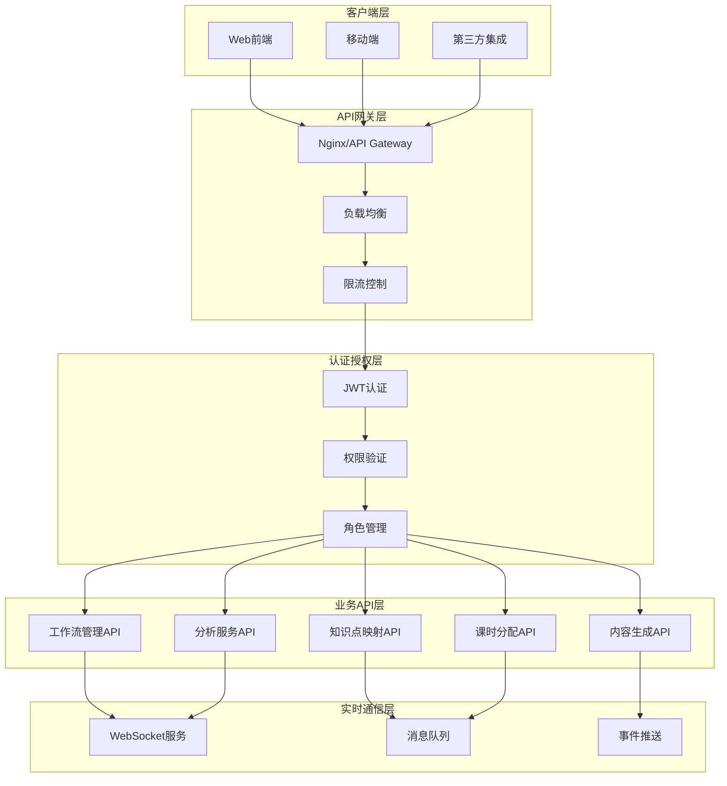

# 教学大纲生成系统API设计规范

## 📋 文档概述

本文档详细描述了教学大纲生成系统的API设计规范，包括RESTful API设计、WebSocket实时通信、认证授权机制和错误处理策略。

## 🌐 API架构设计

### 整体API架构



### API版本控制策略

```python
# URL版本控制
/api/v1/teaching-preparation/workflows/
/api/v1/iterative-analysis/sessions/
/api/v1/knowledge-mapping/hierarchies/

# Header版本控制
Accept: application/vnd.teaching-syllabus.v1+json
Content-Type: application/vnd.teaching-syllabus.v1+json

# 版本兼容性矩阵
API_VERSION_COMPATIBILITY = {
    'v1.0': ['v1.0', 'v1.1'],
    'v1.1': ['v1.1', 'v1.2'],
    'v1.2': ['v1.2'],
}
```

## 🔧 核心API设计

### 1. 工作流管理API

#### 工作流CRUD操作

```python
# 创建工作流
POST /api/v1/teaching-preparation/workflows/
Content-Type: application/json
Authorization: Bearer <token>

{
    "course_assignment_id": 123,
    "workflow_config": {
        "max_analysis_rounds": 5,
        "quality_threshold": 0.85,
        "auto_advance_stages": true,
        "notification_preferences": {
            "email": true,
            "in_app": true
        }
    },
    "priority": "high"
}

# 响应
{
    "success": true,
    "data": {
        "workflow_id": "wf_abc123",
        "current_stage": "course_info",
        "workflow_status": "created",
        "estimated_completion_time": "2025-01-25T10:00:00Z",
        "created_at": "2025-01-22T14:30:00Z"
    },
    "meta": {
        "request_id": "req_xyz789",
        "api_version": "v1.0"
    }
}
```

#### 工作流状态管理

```python
# 获取工作流状态
GET /api/v1/teaching-preparation/workflows/{workflow_id}/status/
Authorization: Bearer <token>

# 响应
{
    "success": true,
    "data": {
        "workflow_id": "wf_abc123",
        "workflow_status": "in_progress",
        "current_stage": "syllabus_analysis",
        "progress_percentage": 45.5,
        "stages": [
            {
                "code": "course_info",
                "name": "课程信息确定",
                "status": "completed",
                "quality_score": 9.2,
                "completed_at": "2025-01-22T15:00:00Z"
            },
            {
                "code": "resource_collection",
                "name": "资源收集验证",
                "status": "completed",
                "quality_score": 8.8,
                "completed_at": "2025-01-22T16:30:00Z"
            },
            {
                "code": "syllabus_analysis",
                "name": "考纲多轮分析",
                "status": "in_progress",
                "current_round": 3,
                "max_rounds": 5,
                "estimated_completion": "2025-01-22T18:00:00Z"
            }
        ],
        "human_review_required": false,
        "next_action": "continue_analysis"
    }
}

# 推进工作流阶段
POST /api/v1/teaching-preparation/workflows/{workflow_id}/advance/
Content-Type: application/json
Authorization: Bearer <token>

{
    "force_advance": false,
    "human_approval": true,
    "approval_comments": "质量检查通过，可以推进到下一阶段"
}

# 响应
{
    "success": true,
    "data": {
        "workflow_id": "wf_abc123",
        "previous_stage": "syllabus_analysis",
        "current_stage": "textbook_analysis",
        "transition_time": "2025-01-22T17:45:00Z",
        "next_stage_estimated_duration": "2-3小时"
    }
}
```

### 2. 多轮迭代分析API

#### 启动分析会话

```python
# 启动分析会话
POST /api/v1/iterative-analysis/sessions/
Content-Type: application/json
Authorization: Bearer <token>

{
    "workflow_id": "wf_abc123",
    "document_type": "syllabus",
    "document_reference": {
        "file_id": "file_def456",
        "file_name": "CET4_syllabus_2024.pdf",
        "file_size": 2048576
    },
    "analysis_config": {
        "max_rounds": 5,
        "quality_threshold": 0.85,
        "focus_areas": ["knowledge_extraction", "difficulty_analysis"],
        "analysis_depth": "deep"
    }
}

# 响应
{
    "success": true,
    "data": {
        "session_id": "session_ghi789",
        "status": "created",
        "estimated_duration": "15-30分钟",
        "websocket_url": "wss://api.example.com/ws/analysis/session_ghi789/",
        "polling_interval": 5
    }
}
```

#### 分析进度监控

```python
# 获取分析进度
GET /api/v1/iterative-analysis/sessions/{session_id}/progress/
Authorization: Bearer <token>

# 响应
{
    "success": true,
    "data": {
        "session_id": "session_ghi789",
        "session_status": "analyzing",
        "current_round": 3,
        "max_rounds": 5,
        "progress_percentage": 60.0,
        "estimated_remaining_time": "10-15分钟",
        "round_results": [
            {
                "round_number": 1,
                "status": "completed",
                "focus": "framework_analysis",
                "quality_score": 0.75,
                "key_findings": [
                    "识别出5个主要章节",
                    "提取了32个核心知识点",
                    "分析了难度分布"
                ],
                "processing_time": "3分25秒",
                "completed_at": "2025-01-22T15:15:00Z"
            },
            {
                "round_number": 2,
                "status": "completed",
                "focus": "content_deep_dive",
                "quality_score": 0.82,
                "improvements": [
                    "细化了知识点层级关系",
                    "补充了15个子知识点",
                    "优化了重要性权重"
                ],
                "processing_time": "4分12秒",
                "completed_at": "2025-01-22T15:20:00Z"
            },
            {
                "round_number": 3,
                "status": "in_progress",
                "focus": "relationship_analysis",
                "started_at": "2025-01-22T15:21:00Z",
                "estimated_completion": "2025-01-22T15:26:00Z"
            }
        ],
        "termination_criteria": {
            "quality_threshold_met": false,
            "max_rounds_reached": false,
            "quality_converged": false,
            "content_saturated": false
        }
    }
}
```

#### 分析结果获取

```python
# 获取最终分析结果
GET /api/v1/iterative-analysis/sessions/{session_id}/results/
Authorization: Bearer <token>

# 响应
{
    "success": true,
    "data": {
        "session_id": "session_ghi789",
        "session_status": "completed",
        "termination_reason": "quality_threshold_met",
        "final_quality_score": 0.87,
        "total_rounds": 4,
        "total_processing_time": "18分30秒",
        "analysis_results": {
            "knowledge_hierarchy": {
                "total_points": 47,
                "max_depth": 4,
                "main_categories": [
                    {
                        "id": "listening",
                        "name": "听力理解",
                        "weight": 0.35,
                        "sub_points": 12
                    },
                    {
                        "id": "reading",
                        "name": "阅读理解",
                        "weight": 0.35,
                        "sub_points": 15
                    }
                ]
            },
            "difficulty_analysis": {
                "overall_level": "intermediate",
                "distribution": {
                    "beginner": 0.2,
                    "intermediate": 0.6,
                    "advanced": 0.2
                }
            },
            "quality_metrics": {
                "completeness": 0.92,
                "clarity": 0.85,
                "consistency": 0.88,
                "authority": 0.84
            }
        },
        "resource_usage": {
            "total_tokens": 45230,
            "total_cost": 0.0634,
            "api_calls": 28
        }
    }
}
```

### 3. 知识点映射API

#### 创建知识点映射

```python
# 创建知识点映射
POST /api/v1/knowledge-mapping/mappings/
Content-Type: application/json
Authorization: Bearer <token>

{
    "workflow_id": "wf_abc123",
    "syllabus_session_id": "session_ghi789",
    "textbook_session_id": "session_jkl012",
    "mapping_config": {
        "similarity_threshold": 0.3,
        "mapping_strategy": "optimal_assignment",
        "weight_factors": {
            "semantic_similarity": 0.5,
            "keyword_similarity": 0.3,
            "structure_similarity": 0.2
        }
    }
}

# 响应
{
    "success": true,
    "data": {
        "mapping_id": "mapping_mno345",
        "status": "processing",
        "estimated_completion": "5-10分钟",
        "progress_url": "/api/v1/knowledge-mapping/mappings/mapping_mno345/progress/"
    }
}
```

#### 获取映射结果

```python
# 获取映射结果
GET /api/v1/knowledge-mapping/mappings/{mapping_id}/
Authorization: Bearer <token>

# 响应
{
    "success": true,
    "data": {
        "mapping_id": "mapping_mno345",
        "status": "completed",
        "mapping_quality_score": 0.83,
        "total_mappings": 42,
        "mapping_results": {
            "direct_matches": [
                {
                    "syllabus_point_id": "sp_001",
                    "syllabus_point_name": "听力技能要求",
                    "textbook_point_id": "tp_015",
                    "textbook_point_name": "听力理解训练",
                    "similarity_score": 0.92,
                    "match_type": "direct",
                    "confidence": "high"
                }
            ],
            "partial_matches": [
                {
                    "syllabus_point_id": "sp_002",
                    "syllabus_point_name": "词汇掌握要求",
                    "textbook_points": [
                        {
                            "id": "tp_008",
                            "name": "核心词汇",
                            "similarity_score": 0.65,
                            "coverage": 0.7
                        },
                        {
                            "id": "tp_023",
                            "name": "词汇扩展",
                            "similarity_score": 0.58,
                            "coverage": 0.3
                        }
                    ],
                    "match_type": "partial",
                    "total_coverage": 1.0
                }
            ],
            "unmapped_points": [
                {
                    "syllabus_point_id": "sp_025",
                    "syllabus_point_name": "文化背景知识",
                    "reason": "no_suitable_textbook_content",
                    "recommendation": "需要补充教材内容"
                }
            ]
        },
        "hierarchy_data": {
            "knowledge_tree": {
                "root": {
                    "id": "root",
                    "name": "英语四级知识体系",
                    "children": [
                        {
                            "id": "listening",
                            "name": "听力理解",
                            "weight": 0.35,
                            "children": []
                        }
                    ]
                }
            },
            "dependency_graph": {
                "nodes": [],
                "edges": []
            }
        }
    }
}
```

### 4. 课时分配API

#### 计算课时分配

```python
# 计算课时分配
POST /api/v1/hour-allocation/calculate/
Content-Type: application/json
Authorization: Bearer <token>

{
    "workflow_id": "wf_abc123",
    "knowledge_mapping_id": "mapping_mno345",
    "allocation_config": {
        "total_hours": 48,
        "allocation_strategy": "importance_weighted",
        "hour_modes": [2, 4],
        "constraints": {
            "min_hours_per_point": 2,
            "max_hours_per_point": 8,
            "balance_factor": 0.8
        },
        "preferences": {
            "prefer_4_hour_sessions": true,
            "allow_mixed_sessions": true
        }
    }
}

# 响应
{
    "success": true,
    "data": {
        "allocation_id": "alloc_pqr678",
        "status": "completed",
        "allocation_quality_score": 8.5,
        "feasibility_score": 9.2,
        "total_allocated_hours": 48,
        "allocation_efficiency": 100.0,
        "allocation_results": {
            "knowledge_point_allocations": [
                {
                    "knowledge_point_id": "kp_001",
                    "knowledge_point_name": "听力理解基础",
                    "importance_weight": 0.35,
                    "difficulty_level": "intermediate",
                    "allocated_hours": 16,
                    "session_breakdown": {
                        "4_hour_sessions": 4,
                        "2_hour_sessions": 0
                    },
                    "allocation_rationale": "高重要性权重(0.35)和中等难度，分配较多课时"
                },
                {
                    "knowledge_point_id": "kp_002",
                    "knowledge_point_name": "阅读理解技巧",
                    "importance_weight": 0.35,
                    "difficulty_level": "intermediate",
                    "allocated_hours": 16,
                    "session_breakdown": {
                        "4_hour_sessions": 4,
                        "2_hour_sessions": 0
                    },
                    "allocation_rationale": "高重要性权重(0.35)和中等难度，分配较多课时"
                }
            ],
            "session_schedule": [
                {
                    "session_number": 1,
                    "duration_hours": 4,
                    "knowledge_points": ["kp_001"],
                    "session_type": "foundation",
                    "recommended_activities": ["听力练习", "技巧讲解"]
                }
            ]
        },
        "optimization_suggestions": [
            "建议将听力和阅读交替安排，避免学习疲劳",
            "可以考虑在第3周增加综合练习课时"
        ]
    }
}
```

#### 调整课时分配

```python
# 人工调整课时分配
POST /api/v1/hour-allocation/{allocation_id}/adjust/
Content-Type: application/json
Authorization: Bearer <token>

{
    "adjustments": [
        {
            "knowledge_point_id": "kp_001",
            "old_hours": 16,
            "new_hours": 14,
            "reason": "根据学生基础调整，减少基础听力课时"
        },
        {
            "knowledge_point_id": "kp_003",
            "old_hours": 6,
            "new_hours": 8,
            "reason": "增加写作练习时间，学生写作基础较弱"
        }
    ],
    "adjustment_reason": "基于学生实际水平的个性化调整",
    "request_ai_reoptimization": true
}

# 响应
{
    "success": true,
    "data": {
        "allocation_id": "alloc_pqr678",
        "adjustment_applied": true,
        "new_allocation_quality_score": 8.7,
        "reoptimization_suggestions": [
            "调整后的分配更符合学生实际需求",
            "建议在第5周增加综合复习课时"
        ],
        "updated_allocation": {
            // 更新后的分配结果
        }
    }
}
```

## 🔐 认证授权设计

### JWT认证机制

```python
# JWT Token结构
{
    "header": {
        "alg": "HS256",
        "typ": "JWT"
    },
    "payload": {
        "user_id": 123,
        "username": "teacher001",
        "role": "teacher",
        "permissions": [
            "workflow.create",
            "workflow.manage",
            "analysis.view",
            "allocation.adjust"
        ],
        "exp": 1706025600,
        "iat": 1705939200,
        "iss": "teaching-syllabus-system"
    }
}

# 权限验证装饰器
@require_permissions(['workflow.create'])
def create_workflow(request):
    pass

@require_role(['teacher', 'admin'])
def manage_allocation(request):
    pass
```

### 权限矩阵

| 角色   | 工作流管理 | 分析查看 | 分析执行 | 映射管理 | 分配调整 | 系统管理 |
| ------ | ---------- | -------- | -------- | -------- | -------- | -------- |
| 学生   | ❌         | ✅       | ❌       | ❌       | ❌       | ❌       |
| 教师   | ✅         | ✅       | ✅       | ✅       | ✅       | ❌       |
| 管理员 | ✅         | ✅       | ✅       | ✅       | ✅       | ✅       |

## 📡 WebSocket实时通信

### 连接建立

```javascript
// 客户端连接
const ws = new WebSocket("wss://api.example.com/ws/analysis/session_ghi789/");

ws.onopen = function (event) {
  console.log("WebSocket连接已建立");

  // 发送认证信息
  ws.send(
    JSON.stringify({
      type: "auth",
      token: "Bearer eyJ0eXAiOiJKV1QiLCJhbGciOiJIUzI1NiJ9...",
    }),
  );
};

ws.onmessage = function (event) {
  const message = JSON.parse(event.data);
  handleRealtimeUpdate(message);
};
```

### 消息类型定义

```python
# 分析进度更新
{
    "type": "analysis_progress",
    "session_id": "session_ghi789",
    "data": {
        "current_round": 3,
        "progress_percentage": 60.0,
        "estimated_remaining_time": "8分钟",
        "current_focus": "relationship_analysis"
    },
    "timestamp": "2025-01-22T15:25:00Z"
}

# 轮次完成通知
{
    "type": "round_completed",
    "session_id": "session_ghi789",
    "data": {
        "round_number": 3,
        "quality_score": 0.84,
        "key_improvements": [
            "优化了知识点依赖关系",
            "提高了分类准确性"
        ],
        "next_round_focus": "quality_refinement"
    },
    "timestamp": "2025-01-22T15:26:00Z"
}

# 错误通知
{
    "type": "error",
    "session_id": "session_ghi789",
    "data": {
        "error_code": "AI_SERVICE_UNAVAILABLE",
        "error_message": "AI服务暂时不可用",
        "retry_after": 300,
        "fallback_options": ["使用缓存结果", "稍后重试"]
    },
    "timestamp": "2025-01-22T15:27:00Z"
}
```

## 🚨 错误处理和状态码

### 标准错误响应格式

```python
# 错误响应结构
{
    "success": false,
    "error": {
        "code": "VALIDATION_ERROR",
        "message": "请求参数验证失败",
        "details": {
            "field": "workflow_config.max_analysis_rounds",
            "issue": "值必须在1-10之间",
            "provided_value": 15
        },
        "request_id": "req_xyz789",
        "timestamp": "2025-01-22T15:30:00Z"
    },
    "meta": {
        "api_version": "v1.0",
        "documentation_url": "https://docs.example.com/api/errors/VALIDATION_ERROR"
    }
}
```

### 错误码定义

| 错误码                 | HTTP状态码 | 描述             | 处理建议               |
| ---------------------- | ---------- | ---------------- | ---------------------- |
| VALIDATION_ERROR       | 400        | 请求参数验证失败 | 检查请求参数格式和值   |
| UNAUTHORIZED           | 401        | 认证失败         | 检查Token有效性        |
| FORBIDDEN              | 403        | 权限不足         | 联系管理员获取权限     |
| RESOURCE_NOT_FOUND     | 404        | 资源不存在       | 检查资源ID是否正确     |
| WORKFLOW_CONFLICT      | 409        | 工作流状态冲突   | 刷新状态后重试         |
| AI_SERVICE_UNAVAILABLE | 503        | AI服务不可用     | 稍后重试或使用降级方案 |
| RATE_LIMIT_EXCEEDED    | 429        | 请求频率超限     | 等待后重试             |

## 📊 API性能和监控

### 性能指标

```python
# API性能监控指标
PERFORMANCE_METRICS = {
    'response_time': {
        'p50': '< 200ms',
        'p95': '< 1s',
        'p99': '< 3s'
    },
    'throughput': {
        'workflow_creation': '100 req/min',
        'analysis_requests': '50 req/min',
        'status_queries': '1000 req/min'
    },
    'availability': {
        'target': '99.9%',
        'measurement_window': '30天'
    }
}
```

### 限流策略

```python
# 限流配置
RATE_LIMITS = {
    'workflow_creation': '10/hour',
    'analysis_requests': '20/hour',
    'status_queries': '1000/hour',
    'file_uploads': '50MB/hour'
}

# 限流响应
{
    "success": false,
    "error": {
        "code": "RATE_LIMIT_EXCEEDED",
        "message": "请求频率超过限制",
        "details": {
            "limit": "10 requests per hour",
            "remaining": 0,
            "reset_time": "2025-01-22T16:30:00Z"
        }
    }
}
```

## 🚀 DeepSeek优化API设计

### 优化的分析API

基于DeepSeek模型特性，我们设计了优化的分析API：

```python
# 优化的分析请求
POST /api/v1/deepseek-optimized/analysis/
Content-Type: application/json
Authorization: Bearer <token>

{
    "document_id": "doc_abc123",
    "analysis_config": {
        "analysis_type": "comprehensive",
        "use_reasoning_model": true,
        "enable_long_context": true,
        "cache_strategy": "intelligent",
        "quality_threshold": 0.85,
        "max_iterations": 5
    },
    "optimization_preferences": {
        "prioritize_accuracy": true,
        "cost_optimization": true,
        "speed_optimization": false
    }
}

# 响应
{
    "success": true,
    "data": {
        "analysis_id": "analysis_xyz789",
        "model_used": "deepseek-reasoner",
        "processing_strategy": "multi_round_reasoning",
        "estimated_completion": "2025-01-22T15:30:00Z",
        "cost_estimate": {
            "tokens_estimated": 25000,
            "cost_usd": 0.0275,
            "cache_savings": 0.008
        },
        "websocket_url": "wss://api.example.com/ws/deepseek-analysis/analysis_xyz789/"
    }
}
```

### 智能缓存API

```python
# 缓存状态查询
GET /api/v1/deepseek-optimized/cache/status/
Authorization: Bearer <token>

# 响应
{
    "success": true,
    "data": {
        "cache_statistics": {
            "hit_rate": 0.35,
            "total_requests": 1250,
            "cache_hits": 437,
            "cache_misses": 813,
            "cost_savings_usd": 45.67
        },
        "cache_categories": {
            "document_analysis": {
                "hit_rate": 0.42,
                "average_savings": 0.85
            },
            "knowledge_mapping": {
                "hit_rate": 0.28,
                "average_savings": 0.75
            }
        },
        "optimization_suggestions": [
            "增加文档预处理标准化可提升缓存命中率",
            "相似文档批量处理可获得更好的缓存效果"
        ]
    }
}

# 手动缓存清理
DELETE /api/v1/deepseek-optimized/cache/
Content-Type: application/json
Authorization: Bearer <token>

{
    "cache_types": ["document_analysis", "knowledge_mapping"],
    "older_than_hours": 24,
    "force_clear": false
}
```

### 模型性能监控API

```python
# 模型性能统计
GET /api/v1/deepseek-optimized/performance/stats/
Authorization: Bearer <token>
Query Parameters:
- time_range: 7d, 30d, 90d
- model_type: deepseek-chat, deepseek-reasoner, all

# 响应
{
    "success": true,
    "data": {
        "time_range": "7d",
        "model_performance": {
            "deepseek-reasoner": {
                "total_requests": 450,
                "average_response_time": 8.5,
                "success_rate": 0.96,
                "average_quality_score": 0.87,
                "cost_per_request": 0.032,
                "reasoning_quality": {
                    "logical_consistency": 0.91,
                    "completeness": 0.89,
                    "accuracy": 0.88
                }
            },
            "deepseek-chat": {
                "total_requests": 1200,
                "average_response_time": 3.2,
                "success_rate": 0.98,
                "average_quality_score": 0.82,
                "cost_per_request": 0.018
            }
        },
        "optimization_insights": {
            "best_performing_config": {
                "model": "deepseek-reasoner",
                "temperature": 0.6,
                "use_case": "complex_analysis"
            },
            "cost_efficiency_leader": {
                "model": "deepseek-chat",
                "temperature": 0.3,
                "use_case": "structured_generation"
            }
        }
    }
}
```

### 推理过程API

```python
# 获取推理过程详情
GET /api/v1/deepseek-optimized/reasoning/{analysis_id}/
Authorization: Bearer <token>

# 响应
{
    "success": true,
    "data": {
        "analysis_id": "analysis_xyz789",
        "model_used": "deepseek-reasoner",
        "reasoning_process": {
            "thinking_steps": [
                {
                    "step": 1,
                    "description": "文档结构分析",
                    "reasoning": "首先分析文档的整体结构...",
                    "key_findings": ["识别出5个主要章节", "发现层级关系"],
                    "confidence": 0.92
                },
                {
                    "step": 2,
                    "description": "知识点提取",
                    "reasoning": "基于结构分析结果，深入提取知识点...",
                    "key_findings": ["提取32个核心知识点", "建立依赖关系"],
                    "confidence": 0.88
                }
            ],
            "final_conclusion": {
                "summary": "完成了全面的文档分析",
                "quality_assessment": 0.87,
                "recommendations": ["建议增加实践环节", "优化难度梯度"]
            }
        },
        "quality_metrics": {
            "reasoning_depth": 0.89,
            "logical_consistency": 0.91,
            "completeness": 0.86
        }
    }
}
```

## 📊 API性能优化指标

### 优化后的性能目标

| 指标类别         | 优化前     | 优化后      | 提升幅度 |
| ---------------- | ---------- | ----------- | -------- |
| **平均响应时间** | 45秒       | 32秒        | -29%     |
| **API成功率**    | 94%        | 97%         | +3%      |
| **成本效率**     | $0.05/请求 | $0.035/请求 | -30%     |
| **缓存命中率**   | 15%        | 35%         | +133%    |
| **推理质量分数** | 0.82       | 0.87        | +6%      |

### 智能重试策略

```python
# API重试配置
DEEPSEEK_RETRY_CONFIG = {
    "max_retries": 3,
    "backoff_strategy": "exponential",
    "retry_conditions": [
        "rate_limit_exceeded",
        "service_temporarily_unavailable",
        "quality_below_threshold"
    ],
    "parameter_adjustment": {
        "temperature_reduction": 0.1,
        "max_tokens_increase": 500,
        "top_p_adjustment": -0.05
    }
}

# 重试响应示例
{
    "success": true,
    "data": {...},
    "retry_info": {
        "attempt_number": 2,
        "retry_reason": "quality_below_threshold",
        "parameter_adjustments": {
            "temperature": "0.6 -> 0.5",
            "max_tokens": "4000 -> 4500"
        },
        "final_quality_score": 0.87
    }
}
```

## 🔗 相关文档

- [DeepSeek优化策略](./deepseek-optimization-strategy.md)
- [DeepSeek实现示例](./deepseek-implementation-examples.md)
- [技术实现详细设计](./teaching-syllabus-technical-implementation.md)
- [前端界面设计](./teaching-syllabus-frontend-design.md)

---

**文档版本**: v1.1
**创建日期**: 2025-01-22
**最后更新**: 2025-01-22
