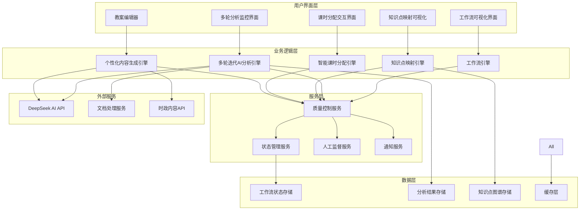

# 教学大纲生成系统架构改进方案

## 📋 文档概述

本文档详细描述了教学大纲生成系统的架构改进方案，包括新架构设计、核心组件规划、技术选型和集成策略。

## 🏗️ 新架构设计

### 整体架构图



### 核心架构原则

1. **分层解耦** - 清晰的分层架构，降低组件间耦合
2. **微服务化** - 核心功能模块化，支持独立部署和扩展
3. **事件驱动** - 基于事件的异步处理，提高系统响应性
4. **状态管理** - 集中式状态管理，支持长时间任务处理
5. **质量优先** - 内置质量控制机制，确保输出质量

## 🔧 核心组件设计

### 1. 工作流引擎 (Workflow Engine)

#### 功能职责

- 管理6阶段教学准备工作流程
- 控制阶段间的流转和依赖关系
- 支持人工干预和审核节点
- 提供工作流状态查询和管理

#### 技术实现

```python
class TeachingPreparationWorkflowEngine:
    """教学准备工作流引擎"""

    def __init__(self):
        self.state_manager = WorkflowStateManager()
        self.stage_processors = {
            'course_info': CourseInfoProcessor(),
            'resource_collection': ResourceCollectionProcessor(),
            'syllabus_analysis': SyllabusAnalysisProcessor(),
            'textbook_analysis': TextbookAnalysisProcessor(),
            'syllabus_generation': SyllabusGenerationProcessor(),
            'lesson_plan_generation': LessonPlanGenerationProcessor(),
        }
        self.quality_gates = QualityGateManager()

    async def start_workflow(self, course_assignment_id: int, config: Dict):
        """启动工作流"""
        workflow = await self._create_workflow(course_assignment_id, config)
        await self._advance_to_first_stage(workflow)
        return workflow

    async def advance_stage(self, workflow_id: int, user_approval: bool = False):
        """推进到下一阶段"""
        workflow = await self.state_manager.get_workflow(workflow_id)

        # 质量门控检查
        if not await self.quality_gates.check_stage_completion(workflow):
            raise WorkflowError("当前阶段质量检查未通过")

        # 人工审核节点
        if self._requires_human_approval(workflow.current_stage):
            if not user_approval:
                raise WorkflowError("需要人工审核确认")

        # 推进到下一阶段
        next_stage = self._get_next_stage(workflow.current_stage)
        await self._transition_to_stage(workflow, next_stage)

    async def _transition_to_stage(self, workflow, stage):
        """阶段转换处理"""
        # 更新工作流状态
        workflow.current_stage = stage
        workflow.stage_start_time = timezone.now()

        # 启动阶段处理器
        processor = self.stage_processors[stage]
        await processor.start_processing(workflow)

        # 保存状态
        await self.state_manager.save_workflow_state(workflow)

        # 发送通知
        await self._notify_stage_transition(workflow, stage)
```

#### 状态管理设计

```python
class WorkflowStateManager:
    """工作流状态管理器"""

    def __init__(self):
        self.redis_client = redis.Redis()
        self.db_manager = DatabaseManager()

    async def save_workflow_state(self, workflow):
        """保存工作流状态"""
        # 持久化到数据库
        await self.db_manager.save_workflow(workflow)

        # 缓存到Redis
        state_key = f"workflow:{workflow.id}:state"
        await self.redis_client.setex(
            state_key,
            3600,  # 1小时过期
            json.dumps(workflow.to_dict())
        )

    async def restore_workflow_state(self, workflow_id):
        """恢复工作流状态"""
        # 先尝试从缓存获取
        state_key = f"workflow:{workflow_id}:state"
        cached_state = await self.redis_client.get(state_key)

        if cached_state:
            return Workflow.from_dict(json.loads(cached_state))

        # 从数据库恢复
        return await self.db_manager.get_workflow(workflow_id)
```

### 2. 多轮迭代AI分析引擎 (Iterative AI Analysis Engine)

#### 功能职责

- 支持3-5轮递归分析
- 基于上下文的智能分析
- 质量驱动的迭代终止
- 分析结果的整合和优化

#### 核心算法设计

```python
class IterativeAnalysisEngine:
    """多轮迭代AI分析引擎"""

    def __init__(self):
        self.ai_service = DeepSeekAPIService()
        self.quality_evaluator = AnalysisQualityEvaluator()
        self.context_builder = AnalysisContextBuilder()

    async def start_analysis_session(self, document, config):
        """启动分析会话"""
        session = AnalysisSession.create(
            document=document,
            max_rounds=config.get('max_rounds', 5),
            quality_threshold=config.get('quality_threshold', 0.85)
        )

        # 第一轮：框架分析
        round1_result = await self._analyze_framework(document)
        session.add_round_result(1, round1_result)

        # 迭代分析循环
        while not self._should_terminate_analysis(session):
            await self._execute_next_round(session, document)

        # 最终整合
        final_result = await self._integrate_analysis_results(session)
        session.mark_completed(final_result)

        return session

    async def _execute_next_round(self, session, document):
        """执行下一轮分析"""
        round_number = session.current_round + 1

        # 构建分析上下文
        context = self.context_builder.build_context(session)

        # 确定分析焦点
        focus_areas = self._determine_focus_areas(session, context)

        # 执行分析
        round_result = await self._analyze_with_context(
            document, context, focus_areas, round_number
        )

        # 质量评估
        quality_score = self.quality_evaluator.evaluate_round(
            session, round_result
        )
        round_result.quality_score = quality_score

        # 添加到会话
        session.add_round_result(round_number, round_result)

    def _should_terminate_analysis(self, session):
        """判断是否终止分析"""
        # 达到最大轮次
        if session.current_round >= session.max_rounds:
            session.termination_reason = 'max_rounds_reached'
            return True

        # 质量阈值满足
        if session.get_latest_quality_score() >= session.quality_threshold:
            session.termination_reason = 'quality_threshold_met'
            return True

        # 质量收敛检查
        if self._is_quality_converged(session):
            session.termination_reason = 'quality_converged'
            return True

        # 内容饱和度检查
        if self._is_content_saturated(session):
            session.termination_reason = 'content_saturated'
            return True

        return False

    def _is_quality_converged(self, session):
        """检查质量是否收敛"""
        if len(session.round_results) < 3:
            return False

        recent_scores = [
            r.quality_score for r in session.round_results[-3:]
        ]

        # 计算质量改进率
        improvement_rate = (recent_scores[-1] - recent_scores[0]) / recent_scores[0]
        return improvement_rate < 0.05  # 改进率低于5%

    def _is_content_saturated(self, session):
        """检查内容是否饱和"""
        if len(session.round_results) < 2:
            return False

        # 计算新增内容比例
        latest_content = session.round_results[-1].extracted_content
        previous_content = session.round_results[-2].extracted_content

        new_content_ratio = self._calculate_new_content_ratio(
            latest_content, previous_content
        )

        return new_content_ratio < 0.1  # 新增内容少于10%
```

### 3. 知识点映射引擎 (Knowledge Mapping Engine)

#### 功能职责

- 考纲与教材的智能匹配
- 知识点层级关系构建
- 重要性权重计算
- 依赖关系分析

#### 映射算法设计

```python
class KnowledgePointMappingEngine:
    """知识点映射引擎"""

    def __init__(self):
        self.similarity_calculator = SemanticSimilarityCalculator()
        self.hierarchy_builder = KnowledgeHierarchyBuilder()
        self.weight_calculator = ImportanceWeightCalculator()

    async def create_knowledge_mapping(self, syllabus_analysis, textbook_analysis):
        """创建知识点映射"""
        # 1. 提取知识点
        syllabus_points = self._extract_knowledge_points(syllabus_analysis)
        textbook_points = self._extract_knowledge_points(textbook_analysis)

        # 2. 计算相似度矩阵
        similarity_matrix = await self._calculate_similarity_matrix(
            syllabus_points, textbook_points
        )

        # 3. 执行最优匹配
        optimal_matches = self._find_optimal_matches(similarity_matrix)

        # 4. 构建层级关系
        hierarchy = self.hierarchy_builder.build_hierarchy(
            syllabus_points, textbook_points, optimal_matches
        )

        # 5. 计算重要性权重
        importance_weights = self.weight_calculator.calculate_weights(
            hierarchy, syllabus_analysis.importance_indicators
        )

        # 6. 分析依赖关系
        dependencies = self._analyze_dependencies(hierarchy)

        return KnowledgeMapping(
            hierarchy=hierarchy,
            matches=optimal_matches,
            weights=importance_weights,
            dependencies=dependencies
        )

    async def _calculate_similarity_matrix(self, syllabus_points, textbook_points):
        """计算语义相似度矩阵"""
        matrix = np.zeros((len(syllabus_points), len(textbook_points)))

        for i, s_point in enumerate(syllabus_points):
            for j, t_point in enumerate(textbook_points):
                # 使用多种相似度计算方法
                semantic_sim = await self.similarity_calculator.semantic_similarity(
                    s_point.content, t_point.content
                )
                keyword_sim = self.similarity_calculator.keyword_similarity(
                    s_point.keywords, t_point.keywords
                )
                structure_sim = self.similarity_calculator.structure_similarity(
                    s_point.structure, t_point.structure
                )

                # 加权组合
                combined_sim = (
                    semantic_sim * 0.5 +
                    keyword_sim * 0.3 +
                    structure_sim * 0.2
                )

                matrix[i][j] = combined_sim

        return matrix

    def _find_optimal_matches(self, similarity_matrix):
        """寻找最优匹配"""
        # 使用匈牙利算法或贪心算法
        from scipy.optimize import linear_sum_assignment

        row_indices, col_indices = linear_sum_assignment(-similarity_matrix)

        matches = []
        for i, j in zip(row_indices, col_indices):
            if similarity_matrix[i][j] > 0.3:  # 相似度阈值
                matches.append({
                    'syllabus_point_id': i,
                    'textbook_point_id': j,
                    'similarity_score': similarity_matrix[i][j],
                    'match_type': self._determine_match_type(similarity_matrix[i][j])
                })

        return matches
```

### 4. 智能课时分配引擎 (Smart Hour Allocation Engine)

#### 功能职责

- 基于知识点重要性的课时分配
- 支持多种分配策略
- 课时模式约束处理
- 人工调整和AI重新优化

#### 分配算法设计

```python
class SmartHourAllocationEngine:
    """智能课时分配引擎"""

    def __init__(self):
        self.allocation_strategies = {
            'importance_weighted': ImportanceWeightedStrategy(),
            'difficulty_adjusted': DifficultyAdjustedStrategy(),
            'balanced': BalancedStrategy(),
            'custom': CustomStrategy()
        }

    async def calculate_optimal_allocation(self, knowledge_mapping, course_config):
        """计算最优课时分配"""
        total_hours = course_config['total_hours']
        strategy_name = course_config.get('allocation_strategy', 'importance_weighted')
        hour_modes = course_config.get('hour_modes', [2, 4])

        # 1. 基础分配计算
        strategy = self.allocation_strategies[strategy_name]
        base_allocation = strategy.calculate_base_allocation(
            knowledge_mapping, total_hours
        )

        # 2. 应用约束条件
        constrained_allocation = self._apply_constraints(
            base_allocation, hour_modes, course_config
        )

        # 3. 优化调整
        optimized_allocation = self._optimize_allocation(
            constrained_allocation, knowledge_mapping
        )

        # 4. 生成分配依据
        allocation_rationale = self._generate_rationale(
            optimized_allocation, knowledge_mapping
        )

        return CourseHourAllocation(
            allocation_data=optimized_allocation,
            rationale=allocation_rationale,
            strategy=strategy_name,
            quality_score=self._evaluate_allocation_quality(optimized_allocation)
        )

    def _apply_constraints(self, base_allocation, hour_modes, config):
        """应用约束条件"""
        constrained = base_allocation.copy()

        for knowledge_point in constrained['knowledge_points']:
            original_hours = knowledge_point['allocated_hours']

            # 应用最小课时约束
            min_hours = knowledge_point.get('min_hours', 2)
            adjusted_hours = max(original_hours, min_hours)

            # 应用课时模式约束
            mode_adjusted_hours = self._adjust_to_hour_modes(
                adjusted_hours, hour_modes
            )

            knowledge_point['final_hours'] = mode_adjusted_hours
            knowledge_point['adjustment_reason'] = self._get_adjustment_reason(
                original_hours, mode_adjusted_hours
            )

        # 重新平衡总课时
        self._rebalance_total_hours(constrained, config['total_hours'])

        return constrained

    def _adjust_to_hour_modes(self, target_hours, available_modes):
        """调整到可用的课时模式"""
        best_combination = None
        min_difference = float('inf')

        # 动态规划寻找最优组合
        for combination in self._generate_hour_combinations(target_hours, available_modes):
            total_hours = sum(mode * count for mode, count in combination.items())
            difference = abs(total_hours - target_hours)

            if difference < min_difference:
                min_difference = difference
                best_combination = combination

        return best_combination

    def _generate_hour_combinations(self, target_hours, available_modes):
        """生成可能的课时组合"""
        combinations = []
        max_sessions = int(target_hours / min(available_modes)) + 1

        def backtrack(current_combination, remaining_hours, mode_index):
            if mode_index >= len(available_modes):
                if remaining_hours >= 0:
                    combinations.append(current_combination.copy())
                return

            mode = available_modes[mode_index]
            max_count = int(remaining_hours / mode) + 1

            for count in range(max_count):
                current_combination[mode] = count
                backtrack(
                    current_combination,
                    remaining_hours - mode * count,
                    mode_index + 1
                )

        backtrack({}, target_hours, 0)
        return combinations
```

## 🔗 组件集成策略

### 1. 事件驱动集成

```python
class SystemEventBus:
    """系统事件总线"""

    def __init__(self):
        self.subscribers = defaultdict(list)

    def subscribe(self, event_type, handler):
        """订阅事件"""
        self.subscribers[event_type].append(handler)

    async def publish(self, event):
        """发布事件"""
        handlers = self.subscribers[event.type]
        await asyncio.gather(*[handler(event) for handler in handlers])

# 事件定义
class WorkflowStageCompletedEvent:
    def __init__(self, workflow_id, stage, result):
        self.type = 'workflow_stage_completed'
        self.workflow_id = workflow_id
        self.stage = stage
        self.result = result
        self.timestamp = timezone.now()

# 事件处理器
class AnalysisEventHandler:
    async def handle_stage_completed(self, event):
        if event.stage == 'syllabus_analysis':
            # 启动教材分析
            await self.start_textbook_analysis(event.workflow_id)
```

### 2. 服务间通信

```python
class ServiceCommunicationManager:
    """服务间通信管理器"""

    def __init__(self):
        self.service_registry = ServiceRegistry()
        self.message_queue = MessageQueue()

    async def call_service(self, service_name, method, params):
        """调用服务"""
        service_endpoint = self.service_registry.get_endpoint(service_name)

        try:
            response = await self._make_service_call(service_endpoint, method, params)
            return response
        except ServiceUnavailableError:
            # 降级处理
            return await self._handle_service_degradation(service_name, method, params)

    async def _handle_service_degradation(self, service_name, method, params):
        """服务降级处理"""
        if service_name == 'ai_analysis_service':
            # 使用缓存结果或简化分析
            return await self._get_cached_analysis_result(params)
        elif service_name == 'quality_control_service':
            # 使用基础质量检查
            return await self._basic_quality_check(params)
```

## 📊 性能和扩展性设计

### 1. 缓存策略

```python
class CacheManager:
    """缓存管理器"""

    def __init__(self):
        self.redis_client = redis.Redis()
        self.local_cache = {}

    async def get_analysis_result(self, document_hash, analysis_config):
        """获取分析结果缓存"""
        cache_key = f"analysis:{document_hash}:{hash(str(analysis_config))}"

        # L1缓存：本地内存
        if cache_key in self.local_cache:
            return self.local_cache[cache_key]

        # L2缓存：Redis
        cached_result = await self.redis_client.get(cache_key)
        if cached_result:
            result = json.loads(cached_result)
            self.local_cache[cache_key] = result
            return result

        return None

    async def cache_analysis_result(self, document_hash, analysis_config, result):
        """缓存分析结果"""
        cache_key = f"analysis:{document_hash}:{hash(str(analysis_config))}"

        # 缓存到Redis（24小时过期）
        await self.redis_client.setex(
            cache_key,
            86400,
            json.dumps(result, default=str)
        )

        # 缓存到本地内存
        self.local_cache[cache_key] = result
```

### 2. 异步任务处理

```python
from celery import Celery

app = Celery('teaching_syllabus_system')

@app.task(bind=True, max_retries=3)
def process_iterative_analysis(self, document_id, analysis_config):
    """异步处理多轮迭代分析"""
    try:
        engine = IterativeAnalysisEngine()
        result = asyncio.run(
            engine.start_analysis_session(document_id, analysis_config)
        )
        return result
    except Exception as exc:
        # 重试机制
        if self.request.retries < self.max_retries:
            raise self.retry(countdown=60 * (2 ** self.request.retries))
        else:
            # 记录失败并通知
            logger.error(f"Analysis failed after {self.max_retries} retries: {exc}")
            raise
```

## 🔗 相关文档

- [技术实现详细设计](./teaching-syllabus-technical-implementation.md)
- [数据模型设计文档](./teaching-syllabus-data-models.md)
- [API设计规范](./teaching-syllabus-api-design.md)

---

**文档版本**: v1.0  
**创建日期**: 2025-01-22  
**最后更新**: 2025-01-22
