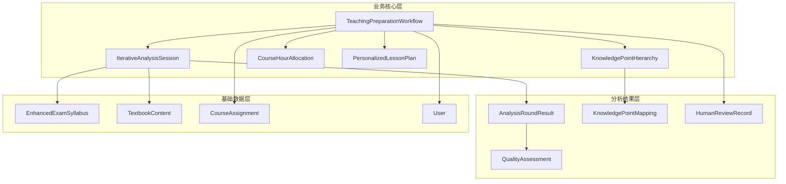
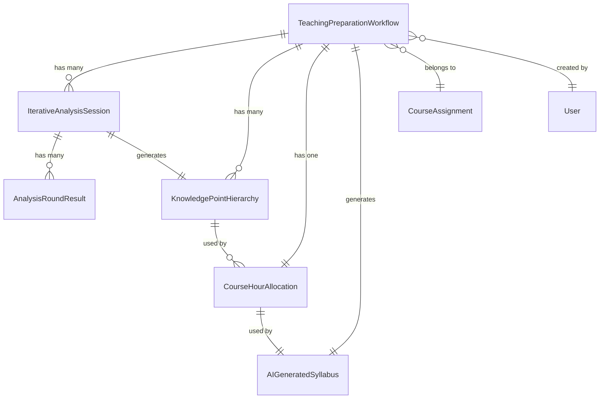

# 教学大纲生成系统数据模型设计

## 📋 文档概述

本文档详细描述了教学大纲生成系统的数据模型设计，包括新增模型、现有模型扩展、数据关系设计和数据库优化策略。

## 🗄️ 数据模型架构

### 模型分层设计



## 🆕 新增核心模型

### 1. 教学准备工作流模型

```python
class TeachingPreparationWorkflow(BaseModel, UserRelatedModel, StatusTrackingModel):
    """教学准备工作流 - 管理6阶段处理流程"""

    STAGE_CHOICES = [
        ('course_info', '课程信息确定'),
        ('resource_collection', '资源收集验证'),
        ('syllabus_analysis', '考纲多轮分析'),
        ('textbook_analysis', '教材多轮分析'),
        ('syllabus_generation', '智能大纲生成'),
        ('lesson_plan_generation', '个性化教案生成'),
    ]

    WORKFLOW_STATUS_CHOICES = [
        ('created', '已创建'),
        ('in_progress', '进行中'),
        ('paused', '已暂停'),
        ('completed', '已完成'),
        ('failed', '失败'),
        ('cancelled', '已取消'),
    ]

    # 关联字段
    course_assignment = models.OneToOneField(
        'learning.CourseAssignment',
        on_delete=models.CASCADE,
        verbose_name="课程分配",
        related_name="preparation_workflow"
    )

    # 工作流状态
    workflow_status = models.CharField(
        max_length=20,
        choices=WORKFLOW_STATUS_CHOICES,
        default='created',
        verbose_name="工作流状态",
        db_index=True
    )
    current_stage = models.CharField(
        max_length=30,
        choices=STAGE_CHOICES,
        default='course_info',
        verbose_name="当前阶段",
        db_index=True
    )

    # 阶段状态跟踪
    stage_status = models.JSONField(
        default=dict,
        verbose_name="各阶段状态",
        help_text="记录每个阶段的完成状态和时间"
    )
    stage_results = models.JSONField(
        default=dict,
        verbose_name="各阶段结果",
        help_text="存储每个阶段的输出结果"
    )
    quality_scores = models.JSONField(
        default=dict,
        verbose_name="质量评分",
        help_text="各阶段的质量评分记录"
    )

    # 人工监督记录
    human_review_points = models.JSONField(
        default=list,
        verbose_name="人工审核记录",
        help_text="记录人工干预和审核的节点"
    )

    # 配置参数
    workflow_config = models.JSONField(
        default=dict,
        verbose_name="工作流配置",
        help_text="工作流执行的配置参数"
    )

    # 时间跟踪
    started_at = models.DateTimeField(
        null=True, blank=True,
        verbose_name="开始时间"
    )
    completed_at = models.DateTimeField(
        null=True, blank=True,
        verbose_name="完成时间"
    )
    estimated_completion_time = models.DateTimeField(
        null=True, blank=True,
        verbose_name="预计完成时间"
    )

    # 错误处理
    error_log = models.JSONField(
        default=list,
        verbose_name="错误日志",
        help_text="记录处理过程中的错误信息"
    )

    class Meta:
        db_table = "teaching_preparation_workflows"
        verbose_name = "教学准备工作流"
        verbose_name_plural = "教学准备工作流"
        indexes = [
            models.Index(fields=["user", "workflow_status"]),
            models.Index(fields=["current_stage", "created_at"]),
            models.Index(fields=["course_assignment", "workflow_status"]),
        ]
        ordering = ["-created_at"]

    def __str__(self):
        return f"工作流-{self.course_assignment.course.name}-{self.get_current_stage_display()}"

    def get_stage_completion_percentage(self):
        """获取整体完成百分比"""
        total_stages = len(self.STAGE_CHOICES)
        completed_stages = sum(
            1 for stage_code, _ in self.STAGE_CHOICES
            if self.stage_status.get(stage_code, {}).get('status') == 'completed'
        )
        return (completed_stages / total_stages) * 100

    def can_advance_to_next_stage(self):
        """检查是否可以推进到下一阶段"""
        current_stage_status = self.stage_status.get(self.current_stage, {})
        return current_stage_status.get('status') == 'completed'

    def get_next_stage(self):
        """获取下一阶段"""
        stage_codes = [code for code, _ in self.STAGE_CHOICES]
        current_index = stage_codes.index(self.current_stage)

        if current_index < len(stage_codes) - 1:
            return stage_codes[current_index + 1]
        return None

    def mark_stage_completed(self, stage, result_data, quality_score=None):
        """标记阶段完成"""
        self.stage_status[stage] = {
            'status': 'completed',
            'completed_at': timezone.now().isoformat(),
            'quality_score': quality_score
        }
        self.stage_results[stage] = result_data

        if quality_score:
            self.quality_scores[stage] = quality_score

        self.save()

    def add_human_review(self, stage, reviewer, decision, comments):
        """添加人工审核记录"""
        review_record = {
            'stage': stage,
            'reviewer_id': reviewer.id,
            'reviewer_name': reviewer.get_full_name(),
            'decision': decision,  # 'approved', 'rejected', 'needs_revision'
            'comments': comments,
            'review_time': timezone.now().isoformat()
        }
        self.human_review_points.append(review_record)
        self.save()
```

### 2. 迭代分析会话模型

```python
class IterativeAnalysisSession(BaseModel, JSONDataMixin):
    """迭代分析会话 - 管理多轮AI分析过程"""

    DOCUMENT_TYPE_CHOICES = [
        ('syllabus', '考试大纲'),
        ('textbook', '教材内容'),
        ('reference', '参考资料'),
    ]

    SESSION_STATUS_CHOICES = [
        ('created', '已创建'),
        ('analyzing', '分析中'),
        ('paused', '已暂停'),
        ('completed', '已完成'),
        ('failed', '失败'),
        ('terminated', '已终止'),
    ]

    TERMINATION_REASON_CHOICES = [
        ('quality_threshold_met', '质量阈值达到'),
        ('max_rounds_reached', '达到最大轮次'),
        ('quality_converged', '质量收敛'),
        ('content_saturated', '内容饱和'),
        ('manual_termination', '人工终止'),
        ('error_occurred', '发生错误'),
    ]

    # 关联字段
    workflow = models.ForeignKey(
        TeachingPreparationWorkflow,
        on_delete=models.CASCADE,
        verbose_name="所属工作流",
        related_name="analysis_sessions"
    )

    # 分析配置
    document_type = models.CharField(
        max_length=20,
        choices=DOCUMENT_TYPE_CHOICES,
        verbose_name="文档类型",
        db_index=True
    )
    document_reference = models.JSONField(
        default=dict,
        verbose_name="文档引用",
        help_text="存储文档的引用信息"
    )

    # 会话状态
    session_status = models.CharField(
        max_length=20,
        choices=SESSION_STATUS_CHOICES,
        default='created',
        verbose_name="会话状态",
        db_index=True
    )
    current_round = models.PositiveIntegerField(
        default=0,
        verbose_name="当前轮次"
    )
    max_rounds = models.PositiveIntegerField(
        default=5,
        verbose_name="最大轮次"
    )

    # 分析配置
    analysis_config = models.JSONField(
        default=dict,
        verbose_name="分析配置",
        help_text="分析参数和配置选项"
    )
    quality_threshold = models.FloatField(
        default=0.85,
        verbose_name="质量阈值",
        validators=[MinValueValidator(0.0), MaxValueValidator(1.0)]
    )

    # 上下文数据
    context_data = models.JSONField(
        default=dict,
        verbose_name="上下文数据",
        help_text="分析过程中积累的上下文信息"
    )

    # 终止条件
    termination_reason = models.CharField(
        max_length=30,
        choices=TERMINATION_REASON_CHOICES,
        blank=True,
        verbose_name="终止原因"
    )
    termination_details = models.JSONField(
        default=dict,
        verbose_name="终止详情",
        help_text="终止时的详细信息"
    )

    # 时间跟踪
    started_at = models.DateTimeField(
        null=True, blank=True,
        verbose_name="开始时间"
    )
    completed_at = models.DateTimeField(
        null=True, blank=True,
        verbose_name="完成时间"
    )
    estimated_remaining_time = models.DurationField(
        null=True, blank=True,
        verbose_name="预计剩余时间"
    )

    # 资源使用统计
    total_tokens_used = models.PositiveIntegerField(
        default=0,
        verbose_name="总Token使用量"
    )
    total_cost = models.DecimalField(
        max_digits=10, decimal_places=4,
        default=0,
        verbose_name="总成本"
    )

    class Meta:
        db_table = "iterative_analysis_sessions"
        verbose_name = "迭代分析会话"
        verbose_name_plural = "迭代分析会话"
        indexes = [
            models.Index(fields=["workflow", "document_type"]),
            models.Index(fields=["session_status", "created_at"]),
            models.Index(fields=["current_round", "max_rounds"]),
        ]
        ordering = ["-created_at"]

    def __str__(self):
        return f"分析会话-{self.get_document_type_display()}-第{self.current_round}轮"

    def get_progress_percentage(self):
        """获取分析进度百分比"""
        if self.max_rounds == 0:
            return 0
        return min((self.current_round / self.max_rounds) * 100, 100)

    def get_latest_quality_score(self):
        """获取最新的质量评分"""
        latest_round = self.round_results.order_by('-round_number').first()
        return latest_round.quality_score if latest_round else 0

    def can_continue_analysis(self):
        """检查是否可以继续分析"""
        return (
            self.session_status == 'analyzing' and
            self.current_round < self.max_rounds and
            not self.termination_reason
        )

    def estimate_remaining_time(self):
        """估算剩余时间"""
        if self.current_round == 0:
            return timedelta(minutes=30)  # 默认估算

        # 基于已完成轮次的平均时间估算
        completed_rounds = self.round_results.filter(status='completed')
        if completed_rounds.exists():
            avg_time_per_round = sum(
                (r.completed_at - r.started_at).total_seconds()
                for r in completed_rounds
            ) / completed_rounds.count()

            remaining_rounds = self.max_rounds - self.current_round
            return timedelta(seconds=avg_time_per_round * remaining_rounds)

        return timedelta(minutes=20)  # 默认估算
```

### 3. 分析轮次结果模型

```python
class AnalysisRoundResult(BaseModel, JSONDataMixin):
    """分析轮次结果 - 存储每轮分析的详细结果"""

    ROUND_STATUS_CHOICES = [
        ('pending', '待处理'),
        ('processing', '处理中'),
        ('completed', '已完成'),
        ('failed', '失败'),
        ('skipped', '已跳过'),
    ]

    ANALYSIS_FOCUS_CHOICES = [
        ('framework', '框架分析'),
        ('content_deep_dive', '内容深度分析'),
        ('knowledge_extraction', '知识点提取'),
        ('relationship_analysis', '关系分析'),
        ('quality_refinement', '质量优化'),
    ]

    # 关联字段
    analysis_session = models.ForeignKey(
        IterativeAnalysisSession,
        on_delete=models.CASCADE,
        verbose_name="分析会话",
        related_name="round_results"
    )

    # 轮次信息
    round_number = models.PositiveIntegerField(
        verbose_name="轮次编号",
        db_index=True
    )
    round_status = models.CharField(
        max_length=20,
        choices=ROUND_STATUS_CHOICES,
        default='pending',
        verbose_name="轮次状态"
    )
    analysis_focus = models.CharField(
        max_length=30,
        choices=ANALYSIS_FOCUS_CHOICES,
        verbose_name="分析焦点"
    )

    # 输入数据
    input_context = models.JSONField(
        default=dict,
        verbose_name="输入上下文",
        help_text="本轮分析的输入上下文数据"
    )
    focus_areas = models.JSONField(
        default=list,
        verbose_name="焦点领域",
        help_text="本轮重点分析的领域"
    )

    # 分析结果
    extracted_content = models.JSONField(
        default=dict,
        verbose_name="提取内容",
        help_text="本轮分析提取的结构化内容"
    )
    analysis_insights = models.JSONField(
        default=list,
        verbose_name="分析洞察",
        help_text="本轮分析产生的关键洞察"
    )
    improvements_identified = models.JSONField(
        default=list,
        verbose_name="识别的改进点",
        help_text="相比前轮的改进和优化点"
    )

    # 质量评估
    quality_score = models.FloatField(
        default=0.0,
        verbose_name="质量评分",
        validators=[MinValueValidator(0.0), MaxValueValidator(1.0)]
    )
    quality_metrics = models.JSONField(
        default=dict,
        verbose_name="质量指标",
        help_text="详细的质量评估指标"
    )

    # AI调用信息
    ai_model_used = models.CharField(
        max_length=50,
        default='deepseek-chat',
        verbose_name="使用的AI模型"
    )
    tokens_used = models.PositiveIntegerField(
        default=0,
        verbose_name="Token使用量"
    )
    processing_cost = models.DecimalField(
        max_digits=8, decimal_places=4,
        default=0,
        verbose_name="处理成本"
    )

    # 时间跟踪
    started_at = models.DateTimeField(
        null=True, blank=True,
        verbose_name="开始时间"
    )
    completed_at = models.DateTimeField(
        null=True, blank=True,
        verbose_name="完成时间"
    )
    processing_duration = models.DurationField(
        null=True, blank=True,
        verbose_name="处理时长"
    )

    # 错误信息
    error_message = models.TextField(
        blank=True,
        verbose_name="错误信息"
    )
    error_details = models.JSONField(
        default=dict,
        verbose_name="错误详情"
    )

    class Meta:
        db_table = "analysis_round_results"
        verbose_name = "分析轮次结果"
        verbose_name_plural = "分析轮次结果"
        indexes = [
            models.Index(fields=["analysis_session", "round_number"]),
            models.Index(fields=["round_status", "created_at"]),
            models.Index(fields=["quality_score", "round_number"]),
        ]
        unique_together = [["analysis_session", "round_number"]]
        ordering = ["analysis_session", "round_number"]

    def __str__(self):
        return f"第{self.round_number}轮-{self.get_analysis_focus_display()}"

    def get_processing_time(self):
        """获取处理时间"""
        if self.started_at and self.completed_at:
            return self.completed_at - self.started_at
        return None

    def calculate_improvement_rate(self):
        """计算相比前轮的改进率"""
        previous_round = AnalysisRoundResult.objects.filter(
            analysis_session=self.analysis_session,
            round_number=self.round_number - 1
        ).first()

        if previous_round and previous_round.quality_score > 0:
            return (self.quality_score - previous_round.quality_score) / previous_round.quality_score
        return 0

    def get_new_content_ratio(self):
        """获取新增内容比例"""
        previous_round = AnalysisRoundResult.objects.filter(
            analysis_session=self.analysis_session,
            round_number=self.round_number - 1
        ).first()

        if not previous_round:
            return 1.0  # 第一轮全是新内容

        # 计算新增内容的比例（简化实现）
        current_content_size = len(str(self.extracted_content))
        previous_content_size = len(str(previous_round.extracted_content))

        if previous_content_size == 0:
            return 1.0

        return max(0, (current_content_size - previous_content_size) / previous_content_size)
```

### 4. 知识点层级结构模型

```python
class KnowledgePointHierarchy(BaseModel, JSONDataMixin):
    """知识点层级结构 - 存储知识点关系和权重"""

    HIERARCHY_TYPE_CHOICES = [
        ('syllabus', '考纲知识点'),
        ('textbook', '教材知识点'),
        ('integrated', '整合知识点'),
    ]

    # 关联字段
    workflow = models.ForeignKey(
        TeachingPreparationWorkflow,
        on_delete=models.CASCADE,
        verbose_name="所属工作流",
        related_name="knowledge_hierarchies"
    )
    source_analysis_session = models.ForeignKey(
        IterativeAnalysisSession,
        on_delete=models.CASCADE,
        verbose_name="源分析会话",
        related_name="generated_hierarchies"
    )

    # 层级信息
    hierarchy_type = models.CharField(
        max_length=20,
        choices=HIERARCHY_TYPE_CHOICES,
        verbose_name="层级类型",
        db_index=True
    )
    hierarchy_version = models.CharField(
        max_length=20,
        default='1.0',
        verbose_name="层级版本"
    )

    # 层级数据
    hierarchy_data = models.JSONField(
        default=dict,
        verbose_name="层级结构数据",
        help_text="完整的知识点层级结构"
    )
    knowledge_points = models.JSONField(
        default=list,
        verbose_name="知识点列表",
        help_text="扁平化的知识点列表"
    )

    # 权重和关系
    importance_weights = models.JSONField(
        default=dict,
        verbose_name="重要性权重",
        help_text="各知识点的重要性权重"
    )
    dependency_graph = models.JSONField(
        default=dict,
        verbose_name="依赖关系图",
        help_text="知识点间的依赖关系"
    )
    difficulty_levels = models.JSONField(
        default=dict,
        verbose_name="难度等级",
        help_text="各知识点的难度等级"
    )

    # 统计信息
    total_knowledge_points = models.PositiveIntegerField(
        default=0,
        verbose_name="知识点总数"
    )
    max_depth = models.PositiveIntegerField(
        default=0,
        verbose_name="最大层级深度"
    )
    coverage_score = models.FloatField(
        default=0.0,
        verbose_name="覆盖度评分",
        validators=[MinValueValidator(0.0), MaxValueValidator(1.0)]
    )

    # 质量评估
    hierarchy_quality_score = models.FloatField(
        default=0.0,
        verbose_name="层级质量评分",
        validators=[MinValueValidator(0.0), MaxValueValidator(1.0)]
    )
    validation_results = models.JSONField(
        default=dict,
        verbose_name="验证结果",
        help_text="层级结构的验证结果"
    )

    class Meta:
        db_table = "knowledge_point_hierarchies"
        verbose_name = "知识点层级结构"
        verbose_name_plural = "知识点层级结构"
        indexes = [
            models.Index(fields=["workflow", "hierarchy_type"]),
            models.Index(fields=["hierarchy_quality_score", "created_at"]),
            models.Index(fields=["total_knowledge_points", "max_depth"]),
        ]
        ordering = ["-created_at"]

    def __str__(self):
        return f"{self.get_hierarchy_type_display()}-{self.total_knowledge_points}个知识点"

    def get_knowledge_point_by_id(self, point_id):
        """根据ID获取知识点"""
        for point in self.knowledge_points:
            if point.get('id') == point_id:
                return point
        return None

    def get_children_points(self, parent_id):
        """获取子知识点"""
        children = []
        for point in self.knowledge_points:
            if point.get('parent_id') == parent_id:
                children.append(point)
        return children

    def calculate_point_weight(self, point_id):
        """计算知识点权重"""
        base_weight = self.importance_weights.get(point_id, 0.5)

        # 考虑子节点权重
        children = self.get_children_points(point_id)
        if children:
            children_weight = sum(
                self.importance_weights.get(child['id'], 0.5)
                for child in children
            ) / len(children)
            # 父节点权重 = 自身权重 * 0.6 + 子节点平均权重 * 0.4
            return base_weight * 0.6 + children_weight * 0.4

        return base_weight

    def get_learning_path(self, target_point_id):
        """获取到目标知识点的学习路径"""
        path = []
        current_id = target_point_id

        while current_id:
            point = self.get_knowledge_point_by_id(current_id)
            if not point:
                break

            path.insert(0, point)
            current_id = point.get('parent_id')

        return path
```

### 5. 课时分配方案模型

```python
class CourseHourAllocation(BaseModel, JSONDataMixin):
    """课时分配方案 - 智能课时分配结果"""

    ALLOCATION_STRATEGY_CHOICES = [
        ('importance_weighted', '重要性权重分配'),
        ('difficulty_adjusted', '难度调整分配'),
        ('balanced', '平衡分配'),
        ('custom', '自定义分配'),
    ]

    ALLOCATION_STATUS_CHOICES = [
        ('draft', '草稿'),
        ('calculated', '已计算'),
        ('reviewed', '已审核'),
        ('approved', '已批准'),
        ('implemented', '已实施'),
    ]

    # 关联字段
    workflow = models.OneToOneField(
        TeachingPreparationWorkflow,
        on_delete=models.CASCADE,
        verbose_name="所属工作流",
        related_name="hour_allocation"
    )
    knowledge_hierarchy = models.ForeignKey(
        KnowledgePointHierarchy,
        on_delete=models.CASCADE,
        verbose_name="知识点层级",
        related_name="hour_allocations"
    )

    # 分配策略
    allocation_strategy = models.CharField(
        max_length=30,
        choices=ALLOCATION_STRATEGY_CHOICES,
        verbose_name="分配策略",
        db_index=True
    )
    allocation_status = models.CharField(
        max_length=20,
        choices=ALLOCATION_STATUS_CHOICES,
        default='draft',
        verbose_name="分配状态"
    )

    # 课程配置
    total_hours = models.PositiveIntegerField(
        verbose_name="总课时数"
    )
    available_hour_modes = models.JSONField(
        default=list,
        verbose_name="可用课时模式",
        help_text="如[2, 4]表示支持2课时和4课时模式"
    )
    course_constraints = models.JSONField(
        default=dict,
        verbose_name="课程约束",
        help_text="课程相关的约束条件"
    )

    # 分配结果
    hour_distribution = models.JSONField(
        default=dict,
        verbose_name="课时分配详情",
        help_text="详细的课时分配结果"
    )
    session_breakdown = models.JSONField(
        default=list,
        verbose_name="课次分解",
        help_text="按课次的详细分解"
    )

    # 分配依据
    allocation_rationale = models.JSONField(
        default=dict,
        verbose_name="分配依据",
        help_text="分配决策的详细依据"
    )
    weight_factors = models.JSONField(
        default=dict,
        verbose_name="权重因子",
        help_text="影响分配的各种权重因子"
    )

    # 人工调整
    manual_adjustments = models.JSONField(
        default=list,
        verbose_name="人工调整记录",
        help_text="人工调整的历史记录"
    )
    adjustment_reasons = models.JSONField(
        default=dict,
        verbose_name="调整原因",
        help_text="人工调整的原因说明"
    )

    # 质量评估
    allocation_quality_score = models.FloatField(
        default=0.0,
        verbose_name="分配质量评分",
        validators=[MinValueValidator(0.0), MaxValueValidator(10.0)]
    )
    feasibility_score = models.FloatField(
        default=0.0,
        verbose_name="可行性评分",
        validators=[MinValueValidator(0.0), MaxValueValidator(10.0)]
    )
    teacher_satisfaction_score = models.FloatField(
        null=True, blank=True,
        verbose_name="教师满意度评分",
        validators=[MinValueValidator(0.0), MaxValueValidator(10.0)]
    )

    # 实施跟踪
    implementation_progress = models.JSONField(
        default=dict,
        verbose_name="实施进度",
        help_text="课时分配的实际实施进度"
    )
    actual_hours_used = models.JSONField(
        default=dict,
        verbose_name="实际使用课时",
        help_text="实际教学中使用的课时记录"
    )

    class Meta:
        db_table = "course_hour_allocations"
        verbose_name = "课时分配方案"
        verbose_name_plural = "课时分配方案"
        indexes = [
            models.Index(fields=["workflow", "allocation_status"]),
            models.Index(fields=["allocation_strategy", "created_at"]),
            models.Index(fields=["allocation_quality_score", "feasibility_score"]),
        ]
        ordering = ["-created_at"]

    def __str__(self):
        return f"课时分配-{self.total_hours}课时-{self.get_allocation_strategy_display()}"

    def get_total_allocated_hours(self):
        """获取总分配课时"""
        total = 0
        for knowledge_point in self.hour_distribution.get('knowledge_points', []):
            total += knowledge_point.get('final_hours', 0)
        return total

    def get_allocation_efficiency(self):
        """获取分配效率"""
        allocated = self.get_total_allocated_hours()
        if self.total_hours == 0:
            return 0
        return (allocated / self.total_hours) * 100

    def add_manual_adjustment(self, knowledge_point_id, old_hours, new_hours, reason, adjuster):
        """添加人工调整记录"""
        adjustment = {
            'knowledge_point_id': knowledge_point_id,
            'old_hours': old_hours,
            'new_hours': new_hours,
            'reason': reason,
            'adjuster_id': adjuster.id,
            'adjuster_name': adjuster.get_full_name(),
            'adjustment_time': timezone.now().isoformat()
        }
        self.manual_adjustments.append(adjustment)

        # 更新分配结果
        for kp in self.hour_distribution.get('knowledge_points', []):
            if kp.get('id') == knowledge_point_id:
                kp['final_hours'] = new_hours
                kp['manually_adjusted'] = True
                break

        self.save()

    def calculate_variance_from_optimal(self):
        """计算与最优分配的方差"""
        variances = []
        for kp in self.hour_distribution.get('knowledge_points', []):
            optimal_hours = kp.get('optimal_hours', 0)
            final_hours = kp.get('final_hours', 0)
            if optimal_hours > 0:
                variance = abs(final_hours - optimal_hours) / optimal_hours
                variances.append(variance)

        return sum(variances) / len(variances) if variances else 0
```

## 🔄 现有模型扩展

### 扩展 EnhancedExamSyllabus 模型

```python
# 在现有模型基础上添加字段
class EnhancedExamSyllabus(BaseModel, UserRelatedModel, StatusTrackingModel, JSONDataMixin):
    # ... 现有字段 ...

    # 新增：多轮分析支持
    analysis_sessions_count = models.PositiveIntegerField(
        default=0,
        verbose_name="分析会话数量"
    )
    latest_analysis_session = models.ForeignKey(
        'IterativeAnalysisSession',
        on_delete=models.SET_NULL,
        null=True, blank=True,
        verbose_name="最新分析会话",
        related_name="+"
    )

    # 新增：知识点层级关联
    knowledge_hierarchy = models.OneToOneField(
        'KnowledgePointHierarchy',
        on_delete=models.SET_NULL,
        null=True, blank=True,
        verbose_name="知识点层级",
        related_name="source_syllabus"
    )

    # 新增：分析历史
    analysis_history = models.JSONField(
        default=list,
        verbose_name="分析历史",
        help_text="历次分析的摘要信息"
    )

    # 新增：版本控制
    is_current_version = models.BooleanField(
        default=True,
        verbose_name="是否当前版本",
        db_index=True
    )
    previous_version = models.ForeignKey(
        'self',
        on_delete=models.SET_NULL,
        null=True, blank=True,
        verbose_name="前一版本",
        related_name="next_versions"
    )
```

### 扩展 AIGeneratedSyllabus 模型

```python
# 在现有模型基础上添加字段
class AIGeneratedSyllabus(UserRelatedModel, StatusTrackingModel):
    # ... 现有字段 ...

    # 新增：工作流关联
    preparation_workflow = models.OneToOneField(
        'TeachingPreparationWorkflow',
        on_delete=models.CASCADE,
        null=True, blank=True,
        verbose_name="准备工作流",
        related_name="generated_syllabus"
    )

    # 新增：知识点映射
    knowledge_mapping = models.JSONField(
        default=dict,
        verbose_name="知识点映射",
        help_text="考纲与教材的知识点映射关系"
    )

    # 新增：课时分配关联
    hour_allocation = models.OneToOneField(
        'CourseHourAllocation',
        on_delete=models.SET_NULL,
        null=True, blank=True,
        verbose_name="课时分配",
        related_name="syllabus"
    )

    # 新增：生成质量评估
    content_completeness_score = models.FloatField(
        default=0.0,
        verbose_name="内容完整性评分",
        validators=[MinValueValidator(0.0), MaxValueValidator(10.0)]
    )
    practical_usability_score = models.FloatField(
        default=0.0,
        verbose_name="实用性评分",
        validators=[MinValueValidator(0.0), MaxValueValidator(10.0)]
    )

    # 新增：个性化配置
    personalization_config = models.JSONField(
        default=dict,
        verbose_name="个性化配置",
        help_text="个性化生成的配置参数"
    )

    # 新增：使用反馈
    teacher_feedback = models.JSONField(
        default=dict,
        verbose_name="教师反馈",
        help_text="教师对生成大纲的反馈"
    )
    usage_statistics = models.JSONField(
        default=dict,
        verbose_name="使用统计",
        help_text="大纲的使用统计信息"
    )
```

## 📊 数据关系设计

### 核心关系图



### 索引优化策略

```python
# 复合索引设计
class Meta:
    indexes = [
        # 工作流查询优化
        models.Index(fields=["user", "workflow_status", "current_stage"]),
        models.Index(fields=["course_assignment", "workflow_status"]),

        # 分析会话查询优化
        models.Index(fields=["workflow", "document_type", "session_status"]),
        models.Index(fields=["current_round", "max_rounds", "session_status"]),

        # 时间范围查询优化
        models.Index(fields=["created_at", "workflow_status"]),
        models.Index(fields=["started_at", "completed_at"]),

        # 质量评分查询优化
        models.Index(fields=["quality_score", "round_number"]),
        models.Index(fields=["allocation_quality_score", "feasibility_score"]),
    ]
```

## 🗃️ 数据库迁移策略

### 迁移计划

1. **第一阶段：核心模型创建**

   ```python
   # 0001_create_core_workflow_models.py
   - TeachingPreparationWorkflow
   - IterativeAnalysisSession
   - AnalysisRoundResult
   ```

2. **第二阶段：知识点和分配模型**

   ```python
   # 0002_create_knowledge_allocation_models.py
   - KnowledgePointHierarchy
   - CourseHourAllocation
   ```

3. **第三阶段：现有模型扩展**
   ```python
   # 0003_extend_existing_models.py
   - 扩展 EnhancedExamSyllabus
   - 扩展 AIGeneratedSyllabus
   ```

### 数据迁移脚本

```python
# data_migration_script.py
def migrate_existing_data():
    """迁移现有数据到新模型"""

    # 1. 为现有课程分配创建工作流
    for assignment in CourseAssignment.objects.all():
        if not hasattr(assignment, 'preparation_workflow'):
            workflow = TeachingPreparationWorkflow.objects.create(
                course_assignment=assignment,
                user=assignment.teacher,
                workflow_status='created',
                current_stage='course_info'
            )

    # 2. 迁移现有分析结果
    for syllabus in EnhancedExamSyllabus.objects.all():
        if syllabus.ai_analysis_result:
            # 创建分析会话记录
            session = IterativeAnalysisSession.objects.create(
                workflow=syllabus.workflow,
                document_type='syllabus',
                session_status='completed',
                current_round=1,
                max_rounds=1
            )

            # 创建轮次结果
            AnalysisRoundResult.objects.create(
                analysis_session=session,
                round_number=1,
                round_status='completed',
                analysis_focus='framework',
                extracted_content=syllabus.ai_analysis_result,
                quality_score=syllabus.content_quality_score / 10
            )
```

## 🔧 数据库优化配置

### PostgreSQL 优化设置

```sql
-- 针对大量JSON查询的优化
CREATE INDEX CONCURRENTLY idx_workflow_stage_results_gin
ON teaching_preparation_workflows USING GIN (stage_results);

CREATE INDEX CONCURRENTLY idx_analysis_extracted_content_gin
ON analysis_round_results USING GIN (extracted_content);

CREATE INDEX CONCURRENTLY idx_knowledge_hierarchy_data_gin
ON knowledge_point_hierarchies USING GIN (hierarchy_data);

-- 针对时间范围查询的优化
CREATE INDEX CONCURRENTLY idx_workflow_time_range
ON teaching_preparation_workflows (started_at, completed_at)
WHERE workflow_status IN ('in_progress', 'completed');

-- 针对质量评分查询的优化
CREATE INDEX CONCURRENTLY idx_quality_scores_range
ON analysis_round_results (quality_score DESC, created_at DESC)
WHERE quality_score > 0.8;
```

### 缓存策略

```python
# Redis 缓存键设计
CACHE_KEYS = {
    'workflow_status': 'workflow:{workflow_id}:status',
    'analysis_progress': 'analysis:{session_id}:progress',
    'knowledge_hierarchy': 'knowledge:{hierarchy_id}:data',
    'hour_allocation': 'allocation:{allocation_id}:data',
}

# 缓存过期时间设计
CACHE_TIMEOUTS = {
    'workflow_status': 300,      # 5分钟
    'analysis_progress': 60,     # 1分钟
    'knowledge_hierarchy': 3600, # 1小时
    'hour_allocation': 1800,     # 30分钟
}
```

## 🔗 相关文档

- [API设计规范](./teaching-syllabus-api-design.md)
- [技术实现详细设计](./teaching-syllabus-technical-implementation.md)
- [前端界面设计](./teaching-syllabus-frontend-design.md)

---

**文档版本**: v1.0
**创建日期**: 2025-01-22
**最后更新**: 2025-01-22
