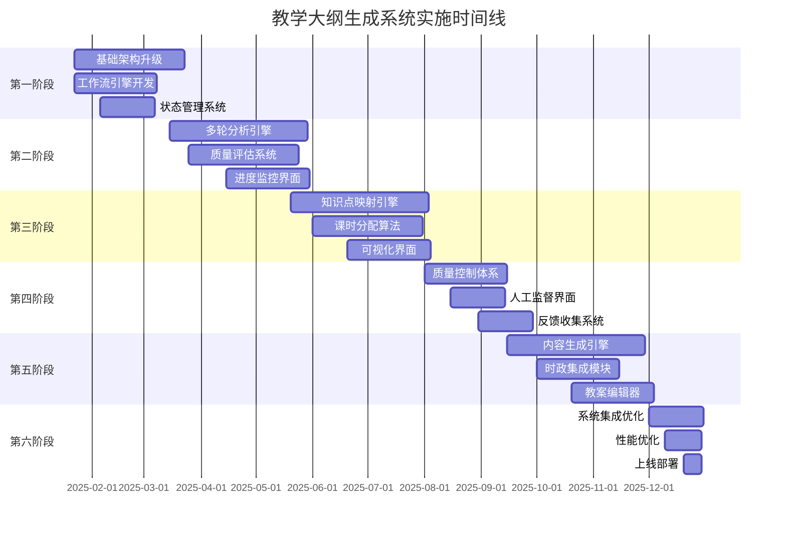
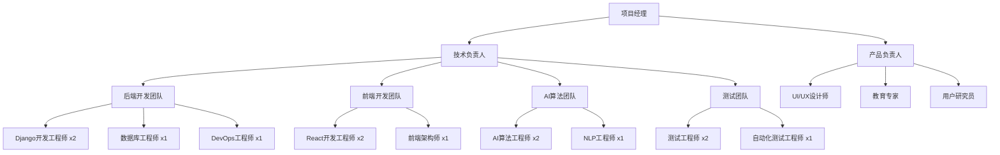

# 教学大纲生成系统实施计划和里程碑

## 📋 文档概述

本文档详细描述了教学大纲生成系统的分阶段实施计划，包括详细的时间安排、里程碑定义、资源分配和风险管理策略。

## 🎯 总体实施策略

### 实施原则

1. **渐进式交付** - 分阶段实施，每个阶段都有可交付的价值
2. **风险优先** - 优先解决高风险和高价值的功能
3. **用户反馈驱动** - 每个阶段都包含用户测试和反馈收集
4. **质量保证** - 每个阶段都有严格的质量门控
5. **向后兼容** - 确保新功能不影响现有系统稳定性

### 实施时间线



## 📅 详细实施计划

### 第一阶段：基础架构升级 (2025年1月22日 - 3月22日)

#### 阶段目标

- 建立支持多轮迭代的基础架构
- 实现工作流状态管理
- 升级前端界面支持阶段化显示

#### 主要任务

**Week 1-2: 数据模型设计和创建**

```python
# 任务清单
- [ ] 设计新数据模型 (TeachingPreparationWorkflow, IterativeAnalysisSession等)
- [ ] 创建数据库迁移脚本
- [ ] 编写数据迁移程序
- [ ] 执行数据库结构升级
- [ ] 验证数据完整性

# 交付物
- 完整的数据模型定义
- 数据库迁移脚本
- 数据迁移验证报告
```

**Week 3-4: 工作流引擎核心开发**

```python
# 任务清单
- [ ] 实现 TeachingPreparationWorkflowEngine 类
- [ ] 开发阶段转换逻辑
- [ ] 实现状态持久化机制
- [ ] 创建工作流事件系统
- [ ] 编写单元测试

# 交付物
- 工作流引擎核心代码
- 状态管理API
- 单元测试覆盖率 > 90%
```

**Week 5-6: 状态管理和缓存系统**

```python
# 任务清单
- [ ] 实现 WorkflowStateManager
- [ ] 集成 Redis 缓存系统
- [ ] 开发状态恢复机制
- [ ] 实现分布式锁
- [ ] 性能测试和优化

# 交付物
- 状态管理服务
- 缓存策略实现
- 性能测试报告
```

**Week 7-8: 前端界面升级**

```typescript
// 任务清单
- [ ] 设计工作流进度可视化组件
- [ ] 实现阶段状态显示
- [ ] 开发用户交互界面
- [ ] 集成实时状态更新
- [ ] 用户体验测试

// 交付物
- 工作流可视化界面
- 用户交互组件
- UI/UX测试报告
```

#### 里程碑和验收标准

**里程碑 M1.1: 数据模型升级完成 (Week 2)**

- ✅ 所有新数据模型创建完成
- ✅ 数据库迁移成功执行
- ✅ 现有数据完整性验证通过
- ✅ 性能影响评估完成

**里程碑 M1.2: 工作流引擎核心功能 (Week 4)**

- ✅ 6阶段工作流状态管理
- ✅ 阶段间转换逻辑正确
- ✅ 状态持久化和恢复
- ✅ 单元测试覆盖率 > 90%

**里程碑 M1.3: 前端界面升级 (Week 8)**

- ✅ 工作流进度可视化
- ✅ 实时状态更新
- ✅ 用户交互体验良好
- ✅ 响应时间 < 200ms

#### 风险和缓解措施

| 风险         | 概率 | 影响 | 缓解措施                     |
| ------------ | ---- | ---- | ---------------------------- |
| 数据迁移失败 | 中   | 高   | 详细测试、备份策略、回滚方案 |
| 性能下降     | 中   | 中   | 性能监控、优化策略、负载测试 |
| 用户接受度低 | 低   | 中   | 用户参与设计、渐进式发布     |

### 第二阶段：多轮迭代分析引擎 (2025年3月15日 - 6月15日)

#### 阶段目标

- 实现核心的多轮AI分析能力
- 建立质量评估和终止机制
- 开发实时分析监控界面

#### 主要任务

**Week 1-3: 迭代分析引擎核心**

```python
# 任务清单
- [ ] 实现 IterativeAnalysisEngine 类
- [ ] 开发上下文构建器
- [ ] 实现焦点策略算法
- [ ] 创建AI提示词优化器
- [ ] 集成DeepSeek API调用

# 交付物
- 迭代分析引擎
- 上下文管理系统
- AI调用优化器
```

**Week 4-6: 质量评估系统**

```python
# 任务清单
- [ ] 实现 AnalysisQualityEvaluator
- [ ] 开发多维度质量指标
- [ ] 创建终止条件检测器
- [ ] 实现质量趋势分析
- [ ] 建立质量基准数据

# 交付物
- 质量评估引擎
- 质量指标体系
- 终止条件算法
```

**Week 7-9: 分析监控界面**

```typescript
// 任务清单
- [ ] 设计分析进度监控界面
- [ ] 实现实时进度更新
- [ ] 开发轮次结果展示
- [ ] 创建质量趋势图表
- [ ] 集成WebSocket通信

// 交付物
- 分析监控界面
- 实时通信系统
- 数据可视化组件
```

**Week 10-11: 集成测试和优化**

```python
# 任务清单
- [ ] 端到端集成测试
- [ ] 性能压力测试
- [ ] AI调用成本优化
- [ ] 错误处理完善
- [ ] 用户验收测试

# 交付物
- 集成测试报告
- 性能优化报告
- 用户验收报告
```

#### 里程碑和验收标准

**里程碑 M2.1: 迭代分析引擎 (Week 3)**

- ✅ 支持3-5轮迭代分析
- ✅ 基于上下文的智能分析
- ✅ AI调用成功率 > 95%
- ✅ 分析质量持续改进

**里程碑 M2.2: 质量评估系统 (Week 6)**

- ✅ 5维度质量评估指标
- ✅ 智能终止条件检测
- ✅ 质量评分准确性 > 85%
- ✅ 终止条件准确率 > 90%

**里程碑 M2.3: 监控界面完成 (Week 9)**

- ✅ 实时分析进度显示
- ✅ 轮次结果可视化
- ✅ WebSocket连接稳定性 > 99%
- ✅ 界面响应时间 < 100ms

**里程碑 M2.4: 阶段验收 (Week 11)**

- ✅ 端到端功能测试通过
- ✅ 性能指标达标
- ✅ 用户满意度 > 80%
- ✅ 系统稳定性 > 99%

### 第三阶段：知识点映射和课时分配 (2025年5月20日 - 8月20日)

#### 阶段目标

- 实现智能知识点映射算法
- 开发智能课时分配引擎
- 建立可视化展示界面

#### 主要任务

**Week 1-3: 知识点映射引擎**

```python
# 任务清单
- [ ] 实现语义相似度计算
- [ ] 开发最优匹配算法
- [ ] 创建层级关系构建器
- [ ] 实现依赖关系分析
- [ ] 集成嵌入向量服务

# 交付物
- 知识点映射引擎
- 相似度计算算法
- 层级构建器
```

**Week 4-6: 课时分配算法**

```python
# 任务清单
- [ ] 实现重要性权重计算
- [ ] 开发多策略分配算法
- [ ] 创建约束条件处理器
- [ ] 实现学习路径优化
- [ ] 开发人工调整接口

# 交付物
- 课时分配引擎
- 多策略算法库
- 优化算法实现
```

**Week 7-9: 可视化界面开发**

```typescript
// 任务清单
- [ ] 设计知识点映射可视化
- [ ] 实现课时分配交互界面
- [ ] 开发拖拽调整功能
- [ ] 创建分配结果图表
- [ ] 集成实时计算更新

// 交付物
- 知识点图谱界面
- 课时分配交互界面
- 数据可视化组件
```

**Week 10-12: 算法优化和测试**

```python
# 任务清单
- [ ] 算法性能优化
- [ ] 准确性验证测试
- [ ] 大数据量压力测试
- [ ] 用户体验优化
- [ ] 专家评估验证

# 交付物
- 算法优化报告
- 准确性验证报告
- 专家评估报告
```

#### 里程碑和验收标准

**里程碑 M3.1: 映射引擎完成 (Week 3)**

- ✅ 语义相似度计算准确率 > 85%
- ✅ 映射匹配准确率 > 80%
- ✅ 处理速度 < 30秒/文档
- ✅ 支持多种文档格式

**里程碑 M3.2: 分配算法完成 (Week 6)**

- ✅ 多策略分配算法实现
- ✅ 分配合理性评分 > 8.0
- ✅ 约束条件满足率 100%
- ✅ 人工调整响应时间 < 1秒

**里程碑 M3.3: 可视化界面 (Week 9)**

- ✅ 知识点图谱清晰展示
- ✅ 交互操作流畅性
- ✅ 实时更新响应时间 < 500ms
- ✅ 用户操作成功率 > 95%

**里程碑 M3.4: 阶段验收 (Week 12)**

- ✅ 算法准确性验证通过
- ✅ 性能指标达标
- ✅ 专家评估满意度 > 85%
- ✅ 系统集成测试通过

### 第四阶段：质量控制和人工监督 (2025年8月1日 - 9月30日)

#### 阶段目标

- 完善质量控制体系
- 实现人工监督机制
- 建立专家反馈系统

#### 主要任务

**Week 1-2: 质量门控系统**

```python
# 任务清单
- [ ] 实现质量门控检查器
- [ ] 开发自动质量评估
- [ ] 创建质量报告生成器
- [ ] 实现质量趋势分析
- [ ] 建立质量基准库

# 交付物
- 质量门控系统
- 质量评估引擎
- 质量报告模板
```

**Week 3-4: 人工监督界面**

```typescript
// 任务清单
- [ ] 设计专家审核界面
- [ ] 实现审核工作流
- [ ] 开发批注和反馈功能
- [ ] 创建审核历史记录
- [ ] 集成通知提醒系统

// 交付物
- 专家审核界面
- 审核工作流系统
- 反馈收集机制
```

**Week 5-6: 反馈学习系统**

```python
# 任务清单
- [ ] 实现反馈数据收集
- [ ] 开发模型优化机制
- [ ] 创建学习效果评估
- [ ] 实现自动调优
- [ ] 建立知识库更新

# 交付物
- 反馈学习引擎
- 模型优化系统
- 知识库管理器
```

**Week 7-8: 集成测试和部署**

```python
# 任务清单
- [ ] 完整系统集成测试
- [ ] 专家用户验收测试
- [ ] 性能和稳定性测试
- [ ] 安全性测试
- [ ] 生产环境部署准备

# 交付物
- 集成测试报告
- 用户验收报告
- 部署准备文档
```

### 第五阶段：个性化内容生成 (2025年9月15日 - 12月15日)

#### 阶段目标

- 实现高质量个性化教案生成
- 集成时政热点内容
- 开发教案编辑和定制功能

#### 主要任务

**Week 1-3: 内容生成引擎**

```python
# 任务清单
- [ ] 实现个性化内容生成器
- [ ] 开发模板管理系统
- [ ] 创建内容质量评估器
- [ ] 实现多样化生成策略
- [ ] 集成教学资源库

# 交付物
- 内容生成引擎
- 模板管理系统
- 质量评估器
```

**Week 4-6: 时政内容集成**

```python
# 任务清单
- [ ] 实现时政内容爬取器
- [ ] 开发内容筛选算法
- [ ] 创建相关性匹配器
- [ ] 实现内容更新机制
- [ ] 建立内容审核流程

# 交付物
- 时政内容集成模块
- 内容筛选算法
- 自动更新系统
```

**Week 7-9: 教案编辑器**

```typescript
// 任务清单
- [ ] 设计富文本编辑器
- [ ] 实现模板定制功能
- [ ] 开发协作编辑功能
- [ ] 创建版本管理系统
- [ ] 集成导出功能

// 交付物
- 教案编辑器界面
- 协作编辑系统
- 版本管理功能
```

**Week 10-12: 优化和测试**

```python
# 任务清单
- [ ] 内容生成质量优化
- [ ] 用户体验优化
- [ ] 性能和稳定性测试
- [ ] 教师用户验收测试
- [ ] 系统文档完善

# 交付物
- 优化报告
- 用户验收报告
- 系统文档
```

### 第六阶段：系统集成和上线 (2025年12月1日 - 12月31日)

#### 阶段目标

- 完成系统整体集成优化
- 执行生产环境部署
- 建立运维监控体系

#### 主要任务

**Week 1-2: 系统集成优化**

```python
# 任务清单
- [ ] 端到端系统集成测试
- [ ] 性能瓶颈识别和优化
- [ ] 内存和CPU使用优化
- [ ] 数据库查询优化
- [ ] 缓存策略优化

# 交付物
- 系统集成报告
- 性能优化报告
- 资源使用优化方案
```

**Week 3: 生产环境部署**

```bash
# 任务清单
- [ ] 生产环境配置
- [ ] 数据库迁移执行
- [ ] 服务部署和配置
- [ ] 负载均衡配置
- [ ] SSL证书配置

# 交付物
- 部署脚本
- 环境配置文档
- 部署验证报告
```

**Week 4: 监控和文档**

```python
# 任务清单
- [ ] 监控系统配置
- [ ] 日志收集和分析
- [ ] 告警机制设置
- [ ] 用户培训材料准备
- [ ] 运维文档编写

# 交付物
- 监控配置
- 运维手册
- 用户培训材料
```

## 📊 资源分配和团队组织

### 团队结构



### 人力资源分配

| 阶段     | 后端开发 | 前端开发 | AI算法  | 测试    | 设计    | 专家    | 总人天   |
| -------- | -------- | -------- | ------- | ------- | ------- | ------- | -------- |
| 第一阶段 | 240      | 120      | 60      | 80      | 40      | 20      | 560      |
| 第二阶段 | 300      | 150      | 180     | 120     | 60      | 40      | 850      |
| 第三阶段 | 360      | 180      | 240     | 150     | 80      | 60      | 1070     |
| 第四阶段 | 180      | 90       | 120     | 100     | 40      | 80      | 610      |
| 第五阶段 | 360      | 240      | 180     | 150     | 100     | 60      | 1090     |
| 第六阶段 | 120      | 60       | 60      | 80      | 20      | 20      | 360      |
| **总计** | **1560** | **840**  | **840** | **680** | **340** | **280** | **4540** |

## 🚨 风险管理和应急预案

### 主要风险识别

| 风险类型 | 风险描述           | 概率 | 影响 | 风险等级 |
| -------- | ------------------ | ---- | ---- | -------- |
| 技术风险 | AI分析质量不达预期 | 中   | 高   | 🔴 高    |
| 技术风险 | 性能无法满足需求   | 中   | 中   | 🟡 中    |
| 资源风险 | 关键人员离职       | 低   | 高   | 🟡 中    |
| 时间风险 | 开发进度延期       | 中   | 中   | 🟡 中    |
| 质量风险 | 用户接受度不高     | 低   | 中   | 🟢 低    |

### 应急预案

**AI分析质量风险应急预案**

```python
# 风险触发条件
- 分析准确率 < 80%
- 用户满意度 < 70%
- 专家评估分数 < 7.0

# 应急措施
1. 立即启动算法优化小组
2. 增加训练数据和优化提示词
3. 引入人工审核机制作为后备
4. 调整质量阈值和终止条件
5. 必要时回退到简化版本

# 预防措施
- 建立质量监控仪表板
- 定期进行算法效果评估
- 维护高质量的训练数据集
- 建立专家反馈收集机制
```

**性能风险应急预案**

```python
# 风险触发条件
- 响应时间 > 5秒
- 系统可用性 < 95%
- 并发处理能力不足

# 应急措施
1. 启动性能优化专项小组
2. 实施缓存策略和数据库优化
3. 增加服务器资源和负载均衡
4. 优化算法复杂度
5. 实施降级服务策略

# 预防措施
- 建立性能监控系统
- 定期进行压力测试
- 制定容量规划方案
- 建立自动扩容机制
```

## 📈 成功指标和验收标准

### 技术指标

| 指标类别 | 指标名称    | 目标值      | 测量方法     |
| -------- | ----------- | ----------- | ------------ |
| 性能指标 | API响应时间 | < 2秒       | 自动化监控   |
| 性能指标 | 系统可用性  | > 99%       | 监控系统统计 |
| 质量指标 | 分析准确率  | > 85%       | 专家评估     |
| 质量指标 | 用户满意度  | > 80%       | 用户调研     |
| 效率指标 | 处理速度    | < 30秒/文档 | 性能测试     |

### 业务指标

| 指标类别 | 指标名称         | 目标值 | 测量方法       |
| -------- | ---------------- | ------ | -------------- |
| 使用指标 | 月活跃用户       | > 100  | 用户行为分析   |
| 效果指标 | 教学准备时间节省 | > 50%  | 用户反馈调研   |
| 质量指标 | 生成内容采用率   | > 70%  | 使用数据统计   |
| 满意度   | 教师满意度       | > 85%  | 定期满意度调研 |

## 🔗 相关文档

- [系统架构改进方案](./teaching-syllabus-architecture-improvement.md)
- [技术实现详细设计](./teaching-syllabus-technical-implementation.md)
- [测试策略和质量保证](./teaching-syllabus-testing-strategy.md)

---

**文档版本**: v1.0  
**创建日期**: 2025-01-22  
**最后更新**: 2025-01-22
