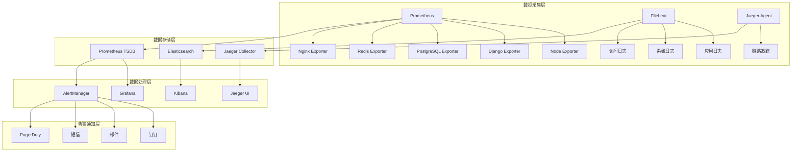

# 英语四级智能训练系统监控优化方案

## 📊 概述

本文档基于《英语四级智能训练系统全面技术架构审查报告》和《英语四级智能训练系统深度符合性审查报告》的发现，针对系统监控体系的不足，提出全面的监控优化方案。旨在建立完整的系统可观测性，提升运维效率和系统稳定性。

---

## 🎯 优化目标

### 核心目标

- **全面可观测性**: 建立完整的监控、日志、链路追踪体系
- **主动运维**: 从被动响应转向主动预防
- **智能告警**: 减少告警噪音，提高告警准确性
- **性能洞察**: 深入了解系统性能瓶颈和优化机会
- **业务监控**: 关注业务指标和用户体验

### 量化指标

- 系统可用性: 99.9% → 99.95%
- 故障发现时间: 30分钟 → 5分钟
- 故障恢复时间: 2小时 → 30分钟
- 告警准确率: 60% → 90%
- 监控覆盖率: 70% → 95%

---

## 📈 当前监控现状分析

### 现有监控能力

```yaml
基础设施监控:
  - 服务器资源监控: ✅ 已实现
  - 数据库监控: ⚠️ 部分实现
  - 网络监控: ❌ 缺失
  - 存储监控: ⚠️ 基础监控

应用监控:
  - API性能监控: ⚠️ 基础指标
  - 错误率监控: ⚠️ 简单统计
  - 用户体验监控: ❌ 缺失
  - 业务指标监控: ❌ 缺失

日志管理:
  - 日志收集: ⚠️ 分散存储
  - 日志分析: ❌ 缺失
  - 日志告警: ❌ 缺失
  - 日志归档: ⚠️ 简单备份

告警系统:
  - 告警规则: ⚠️ 基础规则
  - 告警渠道: ⚠️ 单一渠道
  - 告警升级: ❌ 缺失
  - 告警抑制: ❌ 缺失
```

### 主要问题

1. **监控孤岛**: 各组件监控独立，缺乏统一视图
2. **告警风暴**: 缺乏智能告警和抑制机制
3. **可观测性不足**: 缺乏链路追踪和深度分析
4. **业务监控缺失**: 只关注技术指标，忽视业务指标
5. **响应机制不完善**: 缺乏自动化响应和故障自愈

---

## 🏗️ 监控架构设计

### 整体架构



### 技术栈选择

```yaml
监控指标:
  - 时序数据库: Prometheus + VictoriaMetrics
  - 可视化: Grafana
  - 告警: AlertManager
  - 导出器: 各类Exporter

日志管理:
  - 收集: Filebeat + Fluentd
  - 存储: Elasticsearch
  - 分析: Kibana + Logstash
  - 告警: ElastAlert

链路追踪:
  - 收集: Jaeger Agent
  - 存储: Jaeger Collector + Elasticsearch
  - 分析: Jaeger UI
  - SDK: OpenTelemetry

业务监控:
  - 自定义指标: Prometheus Client
  - 用户体验: Real User Monitoring
  - 业务大盘: Grafana Dashboard
```

---

## 🔧 核心监控组件实现

### 1. 应用性能监控(APM)

```python
# monitoring/apm.py
import time
import functools
from typing import Dict, Any, Optional
from django.conf import settings
from prometheus_client import Counter, Histogram, Gauge
import opentelemetry.trace as trace
from opentelemetry import trace
from opentelemetry.exporter.jaeger.thrift import JaegerExporter
from opentelemetry.sdk.trace import TracerProvider
from opentelemetry.sdk.trace.export import BatchSpanProcessor

class APMMetrics:
    """应用性能监控指标"""

    def __init__(self):
        # HTTP请求指标
        self.http_requests_total = Counter(
            'http_requests_total',
            'Total HTTP requests',
            ['method', 'endpoint', 'status_code']
        )

        self.http_request_duration = Histogram(
            'http_request_duration_seconds',
            'HTTP request duration',
            ['method', 'endpoint']
        )

        # 数据库查询指标
        self.db_queries_total = Counter(
            'db_queries_total',
            'Total database queries',
            ['operation', 'table']
        )

        self.db_query_duration = Histogram(
            'db_query_duration_seconds',
            'Database query duration',
            ['operation', 'table']
        )

        # AI服务调用指标
        self.ai_requests_total = Counter(
            'ai_requests_total',
            'Total AI service requests',
            ['service', 'model', 'status']
        )

        self.ai_request_duration = Histogram(
            'ai_request_duration_seconds',
            'AI service request duration',
            ['service', 'model']
        )

        self.ai_token_usage = Counter(
            'ai_token_usage_total',
            'Total AI tokens used',
            ['service', 'model', 'type']
        )

        # 业务指标
        self.active_users = Gauge(
            'active_users_total',
            'Number of active users',
            ['time_window']
        )

        self.learning_sessions = Counter(
            'learning_sessions_total',
            'Total learning sessions',
            ['user_type', 'subject']
        )

        self.exercise_completions = Counter(
            'exercise_completions_total',
            'Total exercise completions',
            ['exercise_type', 'difficulty', 'result']
        )

    def record_http_request(self, method: str, endpoint: str,
                          status_code: int, duration: float):
        """记录HTTP请求指标"""
        self.http_requests_total.labels(
            method=method,
            endpoint=endpoint,
            status_code=status_code
        ).inc()

        self.http_request_duration.labels(
            method=method,
            endpoint=endpoint
        ).observe(duration)

    def record_db_query(self, operation: str, table: str, duration: float):
        """记录数据库查询指标"""
        self.db_queries_total.labels(
            operation=operation,
            table=table
        ).inc()

        self.db_query_duration.labels(
            operation=operation,
            table=table
        ).observe(duration)

    def record_ai_request(self, service: str, model: str,
                         status: str, duration: float,
                         input_tokens: int = 0, output_tokens: int = 0):
        """记录AI服务调用指标"""
        self.ai_requests_total.labels(
            service=service,
            model=model,
            status=status
        ).inc()

        self.ai_request_duration.labels(
            service=service,
            model=model
        ).observe(duration)

        if input_tokens > 0:
            self.ai_token_usage.labels(
                service=service,
                model=model,
                type='input'
            ).inc(input_tokens)

        if output_tokens > 0:
            self.ai_token_usage.labels(
                service=service,
                model=model,
                type='output'
            ).inc(output_tokens)

# 全局指标实例
apm_metrics = APMMetrics()

class PerformanceMonitor:
    """性能监控装饰器"""

    @staticmethod
    def monitor_api(endpoint_name: Optional[str] = None):
        """API性能监控装饰器"""
        def decorator(func):
            @functools.wraps(func)
            def wrapper(request, *args, **kwargs):
                start_time = time.time()
                endpoint = endpoint_name or func.__name__

                try:
                    response = func(request, *args, **kwargs)
                    status_code = getattr(response, 'status_code', 200)

                    # 记录成功请求
                    apm_metrics.record_http_request(
                        method=request.method,
                        endpoint=endpoint,
                        status_code=status_code,
                        duration=time.time() - start_time
                    )

                    return response

                except Exception as e:
                    # 记录失败请求
                    apm_metrics.record_http_request(
                        method=request.method,
                        endpoint=endpoint,
                        status_code=500,
                        duration=time.time() - start_time
                    )
                    raise

            return wrapper
        return decorator

    @staticmethod
    def monitor_db_query(operation: str, table: str):
        """数据库查询监控装饰器"""
        def decorator(func):
            @functools.wraps(func)
            def wrapper(*args, **kwargs):
                start_time = time.time()

                try:
                    result = func(*args, **kwargs)

                    # 记录查询指标
                    apm_metrics.record_db_query(
                        operation=operation,
                        table=table,
                        duration=time.time() - start_time
                    )

                    return result

                except Exception as e:
                    # 记录失败查询
                    apm_metrics.record_db_query(
                        operation=f"{operation}_error",
                        table=table,
                        duration=time.time() - start_time
                    )
                    raise

            return wrapper
        return decorator

    @staticmethod
    def monitor_ai_service(service: str, model: str):
        """AI服务监控装饰器"""
        def decorator(func):
            @functools.wraps(func)
            def wrapper(*args, **kwargs):
                start_time = time.time()

                try:
                    result = func(*args, **kwargs)

                    # 提取token使用信息
                    input_tokens = getattr(result, 'input_tokens', 0)
                    output_tokens = getattr(result, 'output_tokens', 0)

                    # 记录成功调用
                    apm_metrics.record_ai_request(
                        service=service,
                        model=model,
                        status='success',
                        duration=time.time() - start_time,
                        input_tokens=input_tokens,
                        output_tokens=output_tokens
                    )

                    return result

                except Exception as e:
                    # 记录失败调用
                    apm_metrics.record_ai_request(
                        service=service,
                        model=model,
                        status='error',
                        duration=time.time() - start_time
                    )
                    raise

            return wrapper
        return decorator

class TracingManager:
    """链路追踪管理器"""

    def __init__(self):
        # 配置Jaeger
        trace.set_tracer_provider(TracerProvider())

        jaeger_exporter = JaegerExporter(
            agent_host_name=settings.JAEGER_AGENT_HOST,
            agent_port=settings.JAEGER_AGENT_PORT,
        )

        span_processor = BatchSpanProcessor(jaeger_exporter)
        trace.get_tracer_provider().add_span_processor(span_processor)

        self.tracer = trace.get_tracer(__name__)

    def trace_function(self, operation_name: str, tags: Dict[str, Any] = None):
        """函数追踪装饰器"""
        def decorator(func):
            @functools.wraps(func)
            def wrapper(*args, **kwargs):
                with self.tracer.start_as_current_span(operation_name) as span:
                    # 添加标签
                    if tags:
                        for key, value in tags.items():
                            span.set_attribute(key, str(value))

                    # 添加函数信息
                    span.set_attribute("function.name", func.__name__)
                    span.set_attribute("function.module", func.__module__)

                    try:
                        result = func(*args, **kwargs)
                        span.set_attribute("success", True)
                        return result
                    except Exception as e:
                        span.set_attribute("success", False)
                        span.set_attribute("error.message", str(e))
                        span.set_attribute("error.type", type(e).__name__)
                        raise

            return wrapper
        return decorator

# 全局追踪管理器
tracing_manager = TracingManager()
```

### 2. 业务监控系统

```python
# monitoring/business_metrics.py
from typing import Dict, List, Any
from datetime import datetime, timedelta
from django.db.models import Count, Avg, Sum
from django.contrib.auth import get_user_model
from django.utils import timezone
from prometheus_client import Gauge, Counter
import redis
import json

User = get_user_model()

class BusinessMetricsCollector:
    """业务指标收集器"""

    def __init__(self):
        self.redis_client = redis.Redis(
            host=settings.REDIS_HOST,
            port=settings.REDIS_PORT,
            db=settings.REDIS_DB
        )

        # 业务指标
        self.daily_active_users = Gauge(
            'daily_active_users',
            'Daily active users count'
        )

        self.monthly_active_users = Gauge(
            'monthly_active_users',
            'Monthly active users count'
        )

        self.learning_completion_rate = Gauge(
            'learning_completion_rate',
            'Learning completion rate',
            ['course_type', 'difficulty']
        )

        self.average_session_duration = Gauge(
            'average_session_duration_minutes',
            'Average learning session duration in minutes',
            ['user_type']
        )

        self.ai_service_cost = Counter(
            'ai_service_cost_total',
            'Total AI service cost',
            ['service', 'model']
        )

        self.user_satisfaction_score = Gauge(
            'user_satisfaction_score',
            'User satisfaction score',
            ['feature', 'user_type']
        )

    def collect_user_metrics(self):
        """收集用户相关指标"""
        now = timezone.now()

        # 日活跃用户
        dau = User.objects.filter(
            last_login__gte=now - timedelta(days=1)
        ).count()
        self.daily_active_users.set(dau)

        # 月活跃用户
        mau = User.objects.filter(
            last_login__gte=now - timedelta(days=30)
        ).count()
        self.monthly_active_users.set(mau)

        # 缓存指标
        self.redis_client.setex(
            'metrics:dau',
            3600,  # 1小时过期
            json.dumps({
                'value': dau,
                'timestamp': now.isoformat()
            })
        )

    def collect_learning_metrics(self):
        """收集学习相关指标"""
        from learning.models import LearningSession, Exercise

        # 学习完成率
        completion_stats = LearningSession.objects.filter(
            created_at__gte=timezone.now() - timedelta(days=7)
        ).values(
            'course__type',
            'course__difficulty'
        ).annotate(
            total_sessions=Count('id'),
            completed_sessions=Count('id', filter=models.Q(status='completed'))
        )

        for stat in completion_stats:
            completion_rate = (
                stat['completed_sessions'] / stat['total_sessions']
                if stat['total_sessions'] > 0 else 0
            )

            self.learning_completion_rate.labels(
                course_type=stat['course__type'],
                difficulty=stat['course__difficulty']
            ).set(completion_rate)

        # 平均学习时长
        session_duration_stats = LearningSession.objects.filter(
            created_at__gte=timezone.now() - timedelta(days=7),
            duration__isnull=False
        ).values(
            'user__user_type'
        ).annotate(
            avg_duration=Avg('duration')
        )

        for stat in session_duration_stats:
            avg_minutes = stat['avg_duration'].total_seconds() / 60
            self.average_session_duration.labels(
                user_type=stat['user__user_type']
            ).set(avg_minutes)

    def collect_ai_cost_metrics(self):
        """收集AI服务成本指标"""
        from ai_services.models import AIServiceUsage

        # 获取最近24小时的AI服务使用成本
        cost_stats = AIServiceUsage.objects.filter(
            created_at__gte=timezone.now() - timedelta(hours=24)
        ).values(
            'service_name',
            'model_name'
        ).annotate(
            total_cost=Sum('cost')
        )

        for stat in cost_stats:
            self.ai_service_cost.labels(
                service=stat['service_name'],
                model=stat['model_name']
            ).inc(float(stat['total_cost'] or 0))

    def collect_satisfaction_metrics(self):
        """收集用户满意度指标"""
        from feedback.models import UserFeedback

        # 获取最近7天的用户反馈
        satisfaction_stats = UserFeedback.objects.filter(
            created_at__gte=timezone.now() - timedelta(days=7),
            rating__isnull=False
        ).values(
            'feature',
            'user__user_type'
        ).annotate(
            avg_rating=Avg('rating')
        )

        for stat in satisfaction_stats:
            self.user_satisfaction_score.labels(
                feature=stat['feature'],
                user_type=stat['user__user_type']
            ).set(float(stat['avg_rating']))

    def collect_all_metrics(self):
        """收集所有业务指标"""
        try:
            self.collect_user_metrics()
            self.collect_learning_metrics()
            self.collect_ai_cost_metrics()
            self.collect_satisfaction_metrics()
        except Exception as e:
            print(f"业务指标收集失败: {e}")

class RealTimeMetrics:
    """实时指标监控"""

    def __init__(self):
        self.redis_client = redis.Redis(
            host=settings.REDIS_HOST,
            port=settings.REDIS_PORT,
            db=settings.REDIS_DB
        )

    def track_user_action(self, user_id: int, action: str,
                         metadata: Dict[str, Any] = None):
        """追踪用户行为"""
        event = {
            'user_id': user_id,
            'action': action,
            'timestamp': timezone.now().isoformat(),
            'metadata': metadata or {}
        }

        # 存储到Redis流
        self.redis_client.xadd(
            'user_actions',
            event,
            maxlen=10000  # 保留最近10000条记录
        )

        # 更新实时计数器
        key = f"action_count:{action}:{timezone.now().strftime('%Y%m%d%H')}"
        self.redis_client.incr(key)
        self.redis_client.expire(key, 86400)  # 24小时过期

    def get_real_time_stats(self) -> Dict[str, Any]:
        """获取实时统计数据"""
        now = timezone.now()
        current_hour = now.strftime('%Y%m%d%H')

        stats = {}

        # 获取当前小时的行为统计
        action_keys = self.redis_client.keys(f"action_count:*:{current_hour}")
        for key in action_keys:
            action = key.decode().split(':')[1]
            count = int(self.redis_client.get(key) or 0)
            stats[f"hourly_{action}_count"] = count

        # 获取在线用户数
        online_users = self.redis_client.scard('online_users')
        stats['online_users'] = online_users

        return stats

    def update_online_users(self, user_id: int):
        """更新在线用户"""
        self.redis_client.sadd('online_users', user_id)
        self.redis_client.expire('online_users', 300)  # 5分钟过期

# 全局业务指标收集器
business_metrics = BusinessMetricsCollector()
real_time_metrics = RealTimeMetrics()
```

### 3. 智能告警系统

```python
# monitoring/alerting.py
import json
import requests
from typing import Dict, List, Any, Optional
from datetime import datetime, timedelta
from django.conf import settings
from django.core.mail import send_mail
from dataclasses import dataclass
from enum import Enum
import redis

class AlertSeverity(Enum):
    """告警严重程度"""
    CRITICAL = "critical"
    HIGH = "high"
    MEDIUM = "medium"
    LOW = "low"
    INFO = "info"

class AlertStatus(Enum):
    """告警状态"""
    FIRING = "firing"
    RESOLVED = "resolved"
    SUPPRESSED = "suppressed"
    ACKNOWLEDGED = "acknowledged"

@dataclass
class Alert:
    """告警信息"""
    id: str
    title: str
    description: str
    severity: AlertSeverity
    status: AlertStatus
    source: str
    timestamp: datetime
    labels: Dict[str, str]
    annotations: Dict[str, str]
    resolved_at: Optional[datetime] = None

class AlertManager:
    """告警管理器"""

    def __init__(self):
        self.redis_client = redis.Redis(
            host=settings.REDIS_HOST,
            port=settings.REDIS_PORT,
            db=settings.REDIS_DB
        )

        self.notification_channels = {
            'dingtalk': self._send_dingtalk_notification,
            'email': self._send_email_notification,
            'sms': self._send_sms_notification,
            'webhook': self._send_webhook_notification
        }

        # 告警抑制规则
        self.suppression_rules = [
            {
                'name': 'maintenance_window',
                'condition': self._is_maintenance_window,
                'suppress_severities': [AlertSeverity.LOW, AlertSeverity.MEDIUM]
            },
            {
                'name': 'duplicate_alerts',
                'condition': self._is_duplicate_alert,
                'suppress_severities': [AlertSeverity.LOW]
            }
        ]

    def fire_alert(self, alert: Alert) -> bool:
        """触发告警"""
        try:
            # 检查告警抑制
            if self._should_suppress_alert(alert):
                alert.status = AlertStatus.SUPPRESSED
                self._store_alert(alert)
                return False

            # 存储告警
            alert.status = AlertStatus.FIRING
            self._store_alert(alert)

            # 发送通知
            self._send_notifications(alert)

            # 记录告警指标
            self._record_alert_metrics(alert)

            return True

        except Exception as e:
            print(f"告警触发失败: {e}")
            return False

    def resolve_alert(self, alert_id: str) -> bool:
        """解决告警"""
        try:
            alert_data = self.redis_client.hget('alerts', alert_id)
            if not alert_data:
                return False

            alert_dict = json.loads(alert_data)
            alert = Alert(**alert_dict)

            alert.status = AlertStatus.RESOLVED
            alert.resolved_at = datetime.now()

            self._store_alert(alert)
            self._send_resolution_notification(alert)

            return True

        except Exception as e:
            print(f"告警解决失败: {e}")
            return False

    def acknowledge_alert(self, alert_id: str, user: str) -> bool:
        """确认告警"""
        try:
            alert_data = self.redis_client.hget('alerts', alert_id)
            if not alert_data:
                return False

            alert_dict = json.loads(alert_data)
            alert = Alert(**alert_dict)

            alert.status = AlertStatus.ACKNOWLEDGED
            alert.annotations['acknowledged_by'] = user
            alert.annotations['acknowledged_at'] = datetime.now().isoformat()

            self._store_alert(alert)

            return True

        except Exception as e:
            print(f"告警确认失败: {e}")
            return False

    def _should_suppress_alert(self, alert: Alert) -> bool:
        """检查是否应该抑制告警"""
        for rule in self.suppression_rules:
            if (alert.severity in rule['suppress_severities'] and
                rule['condition'](alert)):
                return True
        return False

    def _is_maintenance_window(self, alert: Alert) -> bool:
        """检查是否在维护窗口"""
        # 检查Redis中的维护窗口配置
        maintenance_window = self.redis_client.get('maintenance_window')
        if not maintenance_window:
            return False

        window_data = json.loads(maintenance_window)
        start_time = datetime.fromisoformat(window_data['start'])
        end_time = datetime.fromisoformat(window_data['end'])

        return start_time <= datetime.now() <= end_time

    def _is_duplicate_alert(self, alert: Alert) -> bool:
        """检查是否为重复告警"""
        # 检查最近5分钟内是否有相同的告警
        recent_alerts = self._get_recent_alerts(minutes=5)

        for recent_alert in recent_alerts:
            if (recent_alert.title == alert.title and
                recent_alert.source == alert.source and
                recent_alert.status == AlertStatus.FIRING):
                return True

        return False

    def _get_recent_alerts(self, minutes: int = 60) -> List[Alert]:
        """获取最近的告警"""
        cutoff_time = datetime.now() - timedelta(minutes=minutes)
        alerts = []

        alert_ids = self.redis_client.hkeys('alerts')
        for alert_id in alert_ids:
            alert_data = self.redis_client.hget('alerts', alert_id)
            if alert_data:
                alert_dict = json.loads(alert_data)
                alert_time = datetime.fromisoformat(alert_dict['timestamp'])

                if alert_time >= cutoff_time:
                    alerts.append(Alert(**alert_dict))

        return sorted(alerts, key=lambda x: x.timestamp, reverse=True)

    def _store_alert(self, alert: Alert):
        """存储告警"""
        alert_dict = {
            'id': alert.id,
            'title': alert.title,
            'description': alert.description,
            'severity': alert.severity.value,
            'status': alert.status.value,
            'source': alert.source,
            'timestamp': alert.timestamp.isoformat(),
            'labels': alert.labels,
            'annotations': alert.annotations,
            'resolved_at': alert.resolved_at.isoformat() if alert.resolved_at else None
        }

        self.redis_client.hset('alerts', alert.id, json.dumps(alert_dict))

        # 设置过期时间（30天）
        self.redis_client.expire('alerts', 30 * 24 * 3600)

    def _send_notifications(self, alert: Alert):
        """发送告警通知"""
        # 根据严重程度选择通知渠道
        channels = self._get_notification_channels(alert.severity)

        for channel in channels:
            if channel in self.notification_channels:
                try:
                    self.notification_channels[channel](alert)
                except Exception as e:
                    print(f"通知发送失败 ({channel}): {e}")

    def _get_notification_channels(self, severity: AlertSeverity) -> List[str]:
        """根据严重程度获取通知渠道"""
        channel_map = {
            AlertSeverity.CRITICAL: ['dingtalk', 'email', 'sms'],
            AlertSeverity.HIGH: ['dingtalk', 'email'],
            AlertSeverity.MEDIUM: ['dingtalk'],
            AlertSeverity.LOW: ['dingtalk'],
            AlertSeverity.INFO: []
        }

        return channel_map.get(severity, [])

    def _send_dingtalk_notification(self, alert: Alert):
        """发送钉钉通知"""
        webhook_url = settings.DINGTALK_WEBHOOK_URL

        severity_colors = {
            AlertSeverity.CRITICAL: '#FF0000',
            AlertSeverity.HIGH: '#FF8C00',
            AlertSeverity.MEDIUM: '#FFD700',
            AlertSeverity.LOW: '#32CD32',
            AlertSeverity.INFO: '#87CEEB'
        }

        message = {
            "msgtype": "markdown",
            "markdown": {
                "title": f"🚨 {alert.title}",
                "text": f"""
### 🚨 系统告警

**告警标题**: {alert.title}

**严重程度**: <font color="{severity_colors[alert.severity]}">{alert.severity.value.upper()}</font>

**告警描述**: {alert.description}

**告警来源**: {alert.source}

**触发时间**: {alert.timestamp.strftime('%Y-%m-%d %H:%M:%S')}

**标签信息**:
{self._format_labels(alert.labels)}

---
请及时处理此告警！
                """
            }
        }

        response = requests.post(webhook_url, json=message, timeout=10)
        response.raise_for_status()

    def _send_email_notification(self, alert: Alert):
        """发送邮件通知"""
        subject = f"[{alert.severity.value.upper()}] {alert.title}"

        message = f"""
系统告警通知

告警标题: {alert.title}
严重程度: {alert.severity.value.upper()}
告警描述: {alert.description}
告警来源: {alert.source}
触发时间: {alert.timestamp.strftime('%Y-%m-%d %H:%M:%S')}

标签信息:
{self._format_labels(alert.labels)}

请及时登录系统查看详细信息并处理此告警。
        """

        send_mail(
            subject=subject,
            message=message,
            from_email=settings.DEFAULT_FROM_EMAIL,
            recipient_list=settings.ALERT_EMAIL_RECIPIENTS,
            fail_silently=False
        )

    def _send_sms_notification(self, alert: Alert):
        """发送短信通知"""
        # 这里需要集成短信服务提供商的API
        message = f"[{alert.severity.value.upper()}] {alert.title} - {alert.timestamp.strftime('%H:%M')}"

        # 示例：集成阿里云短信服务
        # 实际实现需要根据具体的短信服务商API
        pass

    def _send_webhook_notification(self, alert: Alert):
        """发送Webhook通知"""
        webhook_url = settings.ALERT_WEBHOOK_URL
        if not webhook_url:
            return

        payload = {
            'alert_id': alert.id,
            'title': alert.title,
            'description': alert.description,
            'severity': alert.severity.value,
            'status': alert.status.value,
            'source': alert.source,
            'timestamp': alert.timestamp.isoformat(),
            'labels': alert.labels,
            'annotations': alert.annotations
        }

        response = requests.post(webhook_url, json=payload, timeout=10)
        response.raise_for_status()

    def _send_resolution_notification(self, alert: Alert):
        """发送告警解决通知"""
        # 发送钉钉解决通知
        webhook_url = settings.DINGTALK_WEBHOOK_URL

        message = {
            "msgtype": "markdown",
            "markdown": {
                "title": f"✅ 告警已解决: {alert.title}",
                "text": f"""
### ✅ 告警已解决

**告警标题**: {alert.title}

**解决时间**: {alert.resolved_at.strftime('%Y-%m-%d %H:%M:%S')}

**持续时长**: {self._calculate_duration(alert.timestamp, alert.resolved_at)}

---
告警已自动解决。
                """
            }
        }

        requests.post(webhook_url, json=message, timeout=10)

    def _format_labels(self, labels: Dict[str, str]) -> str:
        """格式化标签信息"""
        if not labels:
            return "无"

        return "\n".join([f"- {k}: {v}" for k, v in labels.items()])

    def _calculate_duration(self, start: datetime, end: datetime) -> str:
        """计算持续时长"""
        duration = end - start

        hours = duration.seconds // 3600
        minutes = (duration.seconds % 3600) // 60
        seconds = duration.seconds % 60

        if hours > 0:
            return f"{hours}小时{minutes}分钟"
        elif minutes > 0:
            return f"{minutes}分钟{seconds}秒"
        else:
            return f"{seconds}秒"

    def _record_alert_metrics(self, alert: Alert):
        """记录告警指标"""
        from monitoring.apm import apm_metrics

        # 这里可以记录告警相关的Prometheus指标
        # 例如：告警数量、告警频率等
        pass

# 全局告警管理器
alert_manager = AlertManager()
```

---

## 📊 监控大盘配置

### 1. Grafana仪表板配置

```json
{
  "dashboard": {
    "id": null,
    "title": "英语四级智能训练系统 - 系统概览",
    "tags": ["english-training", "overview"],
    "timezone": "browser",
    "panels": [
      {
        "id": 1,
        "title": "系统健康状态",
        "type": "stat",
        "targets": [
          {
            "expr": "up{job=\"django-app\"}",
            "legendFormat": "应用状态"
          },
          {
            "expr": "up{job=\"postgresql\"}",
            "legendFormat": "数据库状态"
          },
          {
            "expr": "up{job=\"redis\"}",
            "legendFormat": "缓存状态"
          }
        ],
        "fieldConfig": {
          "defaults": {
            "color": {
              "mode": "thresholds"
            },
            "thresholds": {
              "steps": [
                { "color": "red", "value": 0 },
                { "color": "green", "value": 1 }
              ]
            }
          }
        }
      },
      {
        "id": 2,
        "title": "API请求量",
        "type": "graph",
        "targets": [
          {
            "expr": "rate(http_requests_total[5m])",
            "legendFormat": "{{method}} {{endpoint}}"
          }
        ],
        "yAxes": [
          {
            "label": "请求/秒",
            "min": 0
          }
        ]
      },
      {
        "id": 3,
        "title": "API响应时间",
        "type": "graph",
        "targets": [
          {
            "expr": "histogram_quantile(0.95, rate(http_request_duration_seconds_bucket[5m]))",
            "legendFormat": "95th percentile"
          },
          {
            "expr": "histogram_quantile(0.50, rate(http_request_duration_seconds_bucket[5m]))",
            "legendFormat": "50th percentile"
          }
        ],
        "yAxes": [
          {
            "label": "响应时间(秒)",
            "min": 0
          }
        ]
      },
      {
        "id": 4,
        "title": "错误率",
        "type": "stat",
        "targets": [
          {
            "expr": "rate(http_requests_total{status_code=~\"5..\"}[5m]) / rate(http_requests_total[5m]) * 100",
            "legendFormat": "5xx错误率"
          },
          {
            "expr": "rate(http_requests_total{status_code=~\"4..\"}[5m]) / rate(http_requests_total[5m]) * 100",
            "legendFormat": "4xx错误率"
          }
        ],
        "fieldConfig": {
          "defaults": {
            "unit": "percent",
            "thresholds": {
              "steps": [
                { "color": "green", "value": 0 },
                { "color": "yellow", "value": 1 },
                { "color": "red", "value": 5 }
              ]
            }
          }
        }
      },
      {
        "id": 5,
        "title": "数据库性能",
        "type": "graph",
        "targets": [
          {
            "expr": "rate(db_queries_total[5m])",
            "legendFormat": "查询/秒"
          },
          {
            "expr": "histogram_quantile(0.95, rate(db_query_duration_seconds_bucket[5m]))",
            "legendFormat": "95th查询时间"
          }
        ]
      },
      {
        "id": 6,
        "title": "AI服务使用情况",
        "type": "graph",
        "targets": [
          {
            "expr": "rate(ai_requests_total[5m])",
            "legendFormat": "{{service}} {{model}}"
          },
          {
            "expr": "rate(ai_token_usage_total[5m])",
            "legendFormat": "Token使用率"
          }
        ]
      },
      {
        "id": 7,
        "title": "业务指标",
        "type": "stat",
        "targets": [
          {
            "expr": "daily_active_users",
            "legendFormat": "日活用户"
          },
          {
            "expr": "monthly_active_users",
            "legendFormat": "月活用户"
          },
          {
            "expr": "avg(learning_completion_rate)",
            "legendFormat": "平均完成率"
          }
        ]
      },
      {
        "id": 8,
        "title": "系统资源使用",
        "type": "graph",
        "targets": [
          {
            "expr": "(1 - rate(node_cpu_seconds_total{mode=\"idle\"}[5m])) * 100",
            "legendFormat": "CPU使用率"
          },
          {
            "expr": "(1 - node_memory_MemAvailable_bytes / node_memory_MemTotal_bytes) * 100",
            "legendFormat": "内存使用率"
          },
          {
            "expr": "(1 - node_filesystem_avail_bytes / node_filesystem_size_bytes) * 100",
            "legendFormat": "磁盘使用率"
          }
        ],
        "yAxes": [
          {
            "label": "使用率(%)",
            "min": 0,
            "max": 100
          }
        ]
      }
    ],
    "time": {
      "from": "now-1h",
      "to": "now"
    },
    "refresh": "30s"
  }
}
```

### 2. 告警规则配置

```yaml
# alerting_rules.yml
groups:
  - name: system_alerts
    rules:
      - alert: HighCPUUsage
        expr: (1 - rate(node_cpu_seconds_total{mode="idle"}[5m])) * 100 > 80
        for: 5m
        labels:
          severity: warning
          service: system
        annotations:
          summary: "CPU使用率过高"
          description: "CPU使用率已超过80%，当前值: {{ $value }}%"

      - alert: HighMemoryUsage
        expr: (1 - node_memory_MemAvailable_bytes / node_memory_MemTotal_bytes) * 100 > 85
        for: 5m
        labels:
          severity: warning
          service: system
        annotations:
          summary: "内存使用率过高"
          description: "内存使用率已超过85%，当前值: {{ $value }}%"

      - alert: DiskSpaceLow
        expr: (1 - node_filesystem_avail_bytes / node_filesystem_size_bytes) * 100 > 90
        for: 5m
        labels:
          severity: critical
          service: system
        annotations:
          summary: "磁盘空间不足"
          description: "磁盘使用率已超过90%，当前值: {{ $value }}%"

  - name: application_alerts
    rules:
      - alert: HighErrorRate
        expr: rate(http_requests_total{status_code=~"5.."}[5m]) / rate(http_requests_total[5m]) * 100 > 5
        for: 2m
        labels:
          severity: critical
          service: application
        annotations:
          summary: "应用错误率过高"
          description: "5xx错误率已超过5%，当前值: {{ $value }}%"

      - alert: SlowAPIResponse
        expr: histogram_quantile(0.95, rate(http_request_duration_seconds_bucket[5m])) > 2
        for: 5m
        labels:
          severity: warning
          service: application
        annotations:
          summary: "API响应时间过慢"
          description: "95%的请求响应时间超过2秒，当前值: {{ $value }}秒"

      - alert: DatabaseConnectionHigh
        expr: pg_stat_activity_count > 80
        for: 5m
        labels:
          severity: warning
          service: database
        annotations:
          summary: "数据库连接数过高"
          description: "数据库连接数已超过80，当前值: {{ $value }}"

  - name: business_alerts
    rules:
      - alert: LowDailyActiveUsers
        expr: daily_active_users < 100
        for: 30m
        labels:
          severity: warning
          service: business
        annotations:
          summary: "日活用户数偏低"
          description: "日活用户数低于100，当前值: {{ $value }}"

      - alert: HighAICost
        expr: increase(ai_service_cost_total[1h]) > 50
        for: 0m
        labels:
          severity: warning
          service: business
        annotations:
          summary: "AI服务成本过高"
          description: "过去1小时AI服务成本超过50元，当前值: {{ $value }}元"

      - alert: LowLearningCompletionRate
        expr: avg(learning_completion_rate) < 0.6
        for: 1h
        labels:
          severity: warning
          service: business
        annotations:
          summary: "学习完成率偏低"
          description: "平均学习完成率低于60%，当前值: {{ $value }}"
```

---

## 📅 实施计划

### 阶段一：基础监控搭建 (2周)

**目标**: 建立基础的监控和告警体系

| 任务               | 负责人     | 工期 | 验收标准         |
| ------------------ | ---------- | ---- | ---------------- |
| Prometheus部署配置 | 运维工程师 | 2天  | 监控数据正常采集 |
| Grafana仪表板搭建  | 运维工程师 | 3天  | 基础大盘可用     |
| AlertManager配置   | 运维工程师 | 2天  | 告警规则生效     |
| 应用指标集成       | 后端开发   | 4天  | APM指标正常上报  |
| 基础告警规则       | 运维工程师 | 3天  | 关键告警可触发   |

### 阶段二：日志和链路追踪 (2周)

**目标**: 完善日志管理和分布式追踪

| 任务           | 负责人     | 工期 | 验收标准           |
| -------------- | ---------- | ---- | ------------------ |
| ELK Stack部署  | 运维工程师 | 3天  | 日志正常收集和查询 |
| 应用日志集成   | 后端开发   | 3天  | 结构化日志输出     |
| Jaeger部署配置 | 运维工程师 | 2天  | 链路追踪正常工作   |
| 链路追踪集成   | 后端开发   | 4天  | 关键流程可追踪     |

### 阶段三：业务监控和智能告警 (2周)

**目标**: 建立业务监控和智能告警系统

| 任务         | 负责人   | 工期 | 验收标准         |
| ------------ | -------- | ---- | ---------------- |
| 业务指标定义 | 产品经理 | 2天  | 业务指标清单确定 |
| 业务监控开发 | 后端开发 | 5天  | 业务指标正常采集 |
| 智能告警系统 | 后端开发 | 4天  | 告警抑制和升级   |
| 告警通知集成 | 后端开发 | 3天  | 多渠道通知正常   |

### 阶段四：优化和自动化 (2周)

**目标**: 优化监控性能，实现自动化运维

| 任务         | 负责人     | 工期 | 验收标准         |
| ------------ | ---------- | ---- | ---------------- |
| 监控性能优化 | 运维工程师 | 3天  | 监控系统稳定运行 |
| 自动化响应   | DevOps     | 4天  | 自动故障处理     |
| 监控文档完善 | 技术写作   | 2天  | 完整操作手册     |
| 团队培训     | 项目经理   | 3天  | 团队掌握监控工具 |

---

## ✅ 验收标准

### 功能验收

- [ ] **指标采集**: 系统、应用、业务指标正常采集
- [ ] **可视化**: Grafana仪表板完整展示
- [ ] **告警系统**: 智能告警和多渠道通知
- [ ] **日志管理**: 结构化日志收集和分析
- [ ] **链路追踪**: 关键业务流程可追踪
- [ ] **自动化**: 自动故障检测和响应

### 性能验收

- [ ] **监控延迟**: 指标采集延迟<30秒
- [ ] **查询性能**: Grafana查询响应<3秒
- [ ] **存储效率**: 监控数据压缩率>70%
- [ ] **系统开销**: 监控系统资源消耗<5%

### 可用性验收

- [ ] **监控可用性**: 监控系统可用性>99.9%
- [ ] **告警及时性**: 故障告警延迟<5分钟
- [ ] **告警准确性**: 告警准确率>90%
- [ ] **故障恢复**: 监控系统故障自动恢复

---

## 📊 成功指标

### 运维效率指标

```yaml
故障处理:
  - 故障发现时间: 30分钟 → 5分钟
  - 故障定位时间: 1小时 → 15分钟
  - 故障恢复时间: 2小时 → 30分钟
  - 重复故障率: 30% → 10%

监控质量:
  - 监控覆盖率: 70% → 95%
  - 告警准确率: 60% → 90%
  - 误报率: 40% → 10%
  - 漏报率: 20% → 5%

运维自动化:
  - 自动化处理率: 20% → 70%
  - 人工干预次数: 减少60%
  - 运维响应时间: 减少50%
```

### 业务影响指标

```yaml
系统稳定性:
  - 系统可用性: 99.9% → 99.95%
  - 平均故障时间: 2小时 → 30分钟
  - 用户体验评分: 4.2 → 4.6

成本效益:
  - 运维成本: 降低30%
  - 故障损失: 减少70%
  - 监控ROI: >300
```

---

## 📚 相关文档

- [技术架构优化指南](./01-技术架构优化指南.md)
- [性能优化实施方案](./02-性能优化实施方案.md)
- [代码质量提升计划](./03-代码质量提升计划.md)
- [安全性增强方案](./04-安全性增强方案.md)

---

**文档维护**: 项目经理  
**技术审核**: 运维架构师  
**最后更新**: 2025年1月22日
