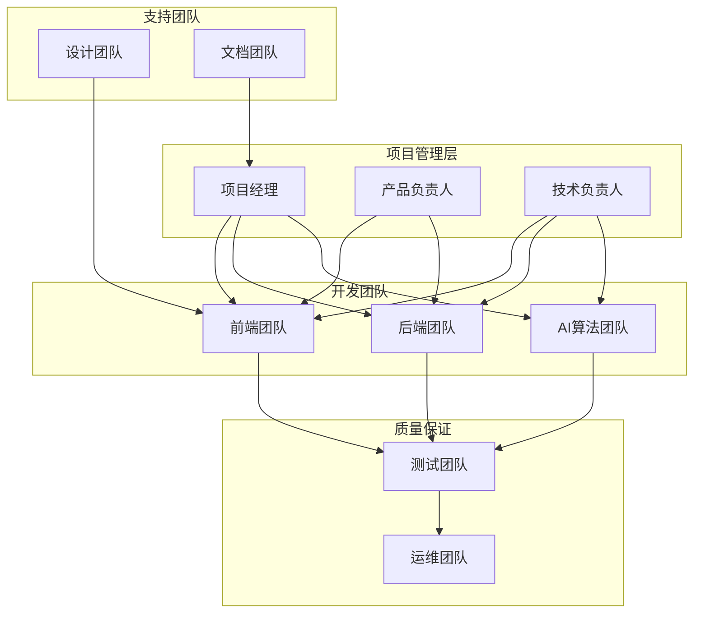

# 英语四级智能训练系统团队协作优化方案

## 📋 概述

本文档基于《英语四级智能训练系统全面技术架构审查报告》和《英语四级智能训练系统深度符合性审查报告》的发现，针对当前团队协作中存在的沟通效率、知识管理、流程规范等问题，提出全面的团队协作优化方案。旨在建立高效、透明、协作的团队工作模式，提升项目交付质量和团队满意度。

---

## 🎯 优化目标

### 核心目标

- **沟通效率**: 建立高效的团队沟通机制和渠道
- **知识共享**: 构建完善的知识管理和传承体系
- **流程规范**: 标准化开发、测试、部署流程
- **质量保证**: 建立多层次的质量保证机制
- **团队成长**: 促进团队成员技能发展和职业成长

### 量化指标

- 沟通响应时间: 4小时 → 1小时
- 知识文档覆盖率: 60% → 90%
- 流程标准化率: 70% → 95%
- 代码审查覆盖率: 80% → 100%
- 团队满意度: 3.5/5 → 4.5/5

---

## 📊 当前团队协作现状

### 团队结构分析

```yaml
团队组成:
  项目管理: 1人 (项目经理)
  产品设计: 2人 (产品经理、UI/UX设计师)
  前端开发: 3人 (React/Next.js开发工程师)
  后端开发: 4人 (Django/Python开发工程师)
  AI算法: 2人 (机器学习工程师)
  测试质量: 2人 (测试工程师、QA工程师)
  运维部署: 2人 (DevOps工程师、运维工程师)

总计: 16人
```

### 协作问题分析

```yaml
沟通问题:
  - ❌ 跨团队沟通不及时
  - ❌ 需求变更传达滞后
  - ❌ 技术决策缺乏透明度
  - ❌ 会议效率低下

知识管理:
  - ❌ 文档分散且不完整
  - ❌ 技术知识传承困难
  - ❌ 最佳实践未沉淀
  - ❌ 新人上手周期长

流程规范:
  - ❌ 开发流程不统一
  - ❌ 代码审查标准不一致
  - ❌ 测试流程不完善
  - ❌ 发布流程缺乏标准

质量保证:
  - ❌ 质量标准不明确
  - ❌ 缺陷跟踪不及时
  - ❌ 性能监控不完善
  - ❌ 用户反馈处理滞后
```

---

## 🏗️ 团队协作架构设计

### 组织架构优化



### 沟通协作模型

```yaml
沟通层级:
  战略层: 项目愿景、里程碑规划
  战术层: Sprint规划、任务分配
  操作层: 日常开发、问题解决

沟通频率:
  每日: 站会、即时沟通
  每周: Sprint评审、技术分享
  每月: 项目回顾、团队建设
  每季度: 战略规划、绩效评估

沟通工具:
  即时通讯: Slack/Teams
  视频会议: Zoom/Teams
  项目管理: Jira/Azure DevOps
  文档协作: Confluence/Notion
  代码协作: GitHub/GitLab
```

---

## 🔧 核心协作机制

### 1. 敏捷开发流程

```python
# scripts/agile_process_manager.py
from typing import List, Dict, Any, Optional
from dataclasses import dataclass
from datetime import datetime, timedelta
from enum import Enum

class TaskStatus(Enum):
    """任务状态"""
    BACKLOG = "backlog"
    TODO = "todo"
    IN_PROGRESS = "in_progress"
    CODE_REVIEW = "code_review"
    TESTING = "testing"
    DONE = "done"

class Priority(Enum):
    """优先级"""
    CRITICAL = "critical"
    HIGH = "high"
    MEDIUM = "medium"
    LOW = "low"

@dataclass
class Task:
    """任务"""
    id: str
    title: str
    description: str
    assignee: str
    reporter: str
    status: TaskStatus
    priority: Priority
    story_points: int
    sprint_id: Optional[str] = None
    created_at: datetime = datetime.now()
    updated_at: datetime = datetime.now()
    due_date: Optional[datetime] = None
    labels: List[str] = None

    def __post_init__(self):
        if self.labels is None:
            self.labels = []

@dataclass
class Sprint:
    """Sprint"""
    id: str
    name: str
    goal: str
    start_date: datetime
    end_date: datetime
    capacity: int  # 团队容量（故事点）
    tasks: List[Task] = None

    def __post_init__(self):
        if self.tasks is None:
            self.tasks = []

    @property
    def duration_days(self) -> int:
        return (self.end_date - self.start_date).days

    @property
    def committed_points(self) -> int:
        return sum(task.story_points for task in self.tasks)

    @property
    def completed_points(self) -> int:
        return sum(
            task.story_points for task in self.tasks
            if task.status == TaskStatus.DONE
        )

    @property
    def completion_rate(self) -> float:
        if self.committed_points == 0:
            return 0.0
        return self.completed_points / self.committed_points

class AgileProcessManager:
    """敏捷流程管理器"""

    def __init__(self):
        self.sprints: List[Sprint] = []
        self.backlog: List[Task] = []
        self.team_velocity: List[int] = []  # 历史速度

    def create_sprint(self, name: str, goal: str, duration_weeks: int = 2) -> Sprint:
        """创建Sprint"""
        start_date = datetime.now()
        end_date = start_date + timedelta(weeks=duration_weeks)

        # 基于历史速度计算容量
        capacity = self._calculate_team_capacity()

        sprint = Sprint(
            id=f"sprint-{len(self.sprints) + 1}",
            name=name,
            goal=goal,
            start_date=start_date,
            end_date=end_date,
            capacity=capacity
        )

        self.sprints.append(sprint)
        return sprint

    def plan_sprint(self, sprint: Sprint) -> bool:
        """Sprint规划"""
        # 按优先级排序待办事项
        sorted_backlog = sorted(
            self.backlog,
            key=lambda t: (t.priority.value, t.created_at)
        )

        committed_points = 0
        selected_tasks = []

        for task in sorted_backlog:
            if committed_points + task.story_points <= sprint.capacity:
                task.sprint_id = sprint.id
                task.status = TaskStatus.TODO
                selected_tasks.append(task)
                committed_points += task.story_points
            else:
                break

        sprint.tasks = selected_tasks

        # 从待办事项中移除已选择的任务
        for task in selected_tasks:
            if task in self.backlog:
                self.backlog.remove(task)

        return True

    def daily_standup(self, sprint: Sprint) -> Dict[str, Any]:
        """每日站会数据"""
        team_members = set(task.assignee for task in sprint.tasks)

        standup_data = {
            'sprint_info': {
                'name': sprint.name,
                'days_remaining': (sprint.end_date - datetime.now()).days,
                'completion_rate': sprint.completion_rate
            },
            'team_updates': {},
            'blockers': [],
            'burndown': self._calculate_burndown(sprint)
        }

        for member in team_members:
            member_tasks = [t for t in sprint.tasks if t.assignee == member]

            standup_data['team_updates'][member] = {
                'yesterday': [t for t in member_tasks if t.status == TaskStatus.DONE],
                'today': [t for t in member_tasks if t.status == TaskStatus.IN_PROGRESS],
                'blockers': [t for t in member_tasks if 'blocked' in t.labels]
            }

        return standup_data

    def sprint_review(self, sprint: Sprint) -> Dict[str, Any]:
        """Sprint评审"""
        review_data = {
            'sprint_summary': {
                'name': sprint.name,
                'goal': sprint.goal,
                'committed_points': sprint.committed_points,
                'completed_points': sprint.completed_points,
                'completion_rate': sprint.completion_rate
            },
            'completed_tasks': [t for t in sprint.tasks if t.status == TaskStatus.DONE],
            'incomplete_tasks': [t for t in sprint.tasks if t.status != TaskStatus.DONE],
            'velocity': sprint.completed_points,
            'demo_items': [t for t in sprint.tasks if 'demo' in t.labels and t.status == TaskStatus.DONE]
        }

        # 更新团队速度
        self.team_velocity.append(sprint.completed_points)

        return review_data

    def sprint_retrospective(self, sprint: Sprint,
                           feedback: Dict[str, List[str]]) -> Dict[str, Any]:
        """Sprint回顾"""
        retrospective_data = {
            'sprint_metrics': {
                'velocity': sprint.completed_points,
                'completion_rate': sprint.completion_rate,
                'average_task_cycle_time': self._calculate_average_cycle_time(sprint)
            },
            'team_feedback': feedback,
            'action_items': self._generate_action_items(feedback),
            'improvement_suggestions': self._analyze_improvement_opportunities(sprint)
        }

        return retrospective_data

    def _calculate_team_capacity(self) -> int:
        """计算团队容量"""
        if not self.team_velocity:
            return 40  # 默认容量

        # 使用最近3个Sprint的平均速度
        recent_velocity = self.team_velocity[-3:]
        return int(sum(recent_velocity) / len(recent_velocity))

    def _calculate_burndown(self, sprint: Sprint) -> List[Dict[str, Any]]:
        """计算燃尽图数据"""
        # 简化实现，实际应该基于任务完成的历史数据
        days_elapsed = (datetime.now() - sprint.start_date).days
        total_days = sprint.duration_days

        ideal_remaining = sprint.committed_points * (total_days - days_elapsed) / total_days
        actual_remaining = sprint.committed_points - sprint.completed_points

        return [
            {
                'day': days_elapsed,
                'ideal_remaining': max(0, ideal_remaining),
                'actual_remaining': actual_remaining
            }
        ]

    def _calculate_average_cycle_time(self, sprint: Sprint) -> float:
        """计算平均周期时间"""
        completed_tasks = [t for t in sprint.tasks if t.status == TaskStatus.DONE]

        if not completed_tasks:
            return 0.0

        total_cycle_time = sum(
            (t.updated_at - t.created_at).days for t in completed_tasks
        )

        return total_cycle_time / len(completed_tasks)

    def _generate_action_items(self, feedback: Dict[str, List[str]]) -> List[str]:
        """生成行动项"""
        action_items = []

        # 基于反馈生成行动项
        if 'stop' in feedback:
            for item in feedback['stop']:
                action_items.append(f"停止: {item}")

        if 'start' in feedback:
            for item in feedback['start']:
                action_items.append(f"开始: {item}")

        if 'continue' in feedback:
            for item in feedback['continue']:
                action_items.append(f"继续: {item}")

        return action_items

    def _analyze_improvement_opportunities(self, sprint: Sprint) -> List[str]:
        """分析改进机会"""
        suggestions = []

        if sprint.completion_rate < 0.8:
            suggestions.append("考虑减少Sprint承诺或提高估算准确性")

        if sprint.completion_rate > 1.0:
            suggestions.append("团队容量可能被低估，考虑增加Sprint承诺")

        incomplete_tasks = [t for t in sprint.tasks if t.status != TaskStatus.DONE]
        if len(incomplete_tasks) > len(sprint.tasks) * 0.3:
            suggestions.append("关注任务分解粒度，避免任务过大")

        return suggestions

# 使用示例
if __name__ == "__main__":
    # 创建敏捷流程管理器
    agile_manager = AgileProcessManager()

    # 创建Sprint
    sprint = agile_manager.create_sprint(
        name="Sprint 1 - 用户认证模块",
        goal="完成用户注册、登录、权限管理功能"
    )

    # 添加任务到待办事项
    tasks = [
        Task(
            id="task-1",
            title="用户注册API开发",
            description="实现用户注册接口",
            assignee="张三",
            reporter="产品经理",
            status=TaskStatus.BACKLOG,
            priority=Priority.HIGH,
            story_points=5
        ),
        Task(
            id="task-2",
            title="登录页面开发",
            description="实现用户登录界面",
            assignee="李四",
            reporter="产品经理",
            status=TaskStatus.BACKLOG,
            priority=Priority.HIGH,
            story_points=3
        )
    ]

    agile_manager.backlog.extend(tasks)

    # Sprint规划
    agile_manager.plan_sprint(sprint)

    print(f"Sprint '{sprint.name}' 规划完成")
    print(f"承诺故事点: {sprint.committed_points}")
    print(f"选择任务数: {len(sprint.tasks)}")
```

### 2. 代码审查流程

```python
# scripts/code_review_manager.py
from typing import List, Dict, Any, Optional
from dataclasses import dataclass
from datetime import datetime
from enum import Enum

class ReviewStatus(Enum):
    """审查状态"""
    PENDING = "pending"
    IN_REVIEW = "in_review"
    APPROVED = "approved"
    CHANGES_REQUESTED = "changes_requested"
    REJECTED = "rejected"

class ReviewType(Enum):
    """审查类型"""
    FEATURE = "feature"
    BUGFIX = "bugfix"
    HOTFIX = "hotfix"
    REFACTOR = "refactor"
    DOCS = "docs"

@dataclass
class ReviewComment:
    """审查评论"""
    id: str
    reviewer: str
    content: str
    file_path: str
    line_number: int
    severity: str  # info, warning, error
    created_at: datetime = datetime.now()
    resolved: bool = False

@dataclass
class PullRequest:
    """拉取请求"""
    id: str
    title: str
    description: str
    author: str
    branch: str
    target_branch: str
    review_type: ReviewType
    status: ReviewStatus
    reviewers: List[str]
    comments: List[ReviewComment]
    created_at: datetime = datetime.now()
    updated_at: datetime = datetime.now()

    def __post_init__(self):
        if not self.reviewers:
            self.reviewers = []
        if not self.comments:
            self.comments = []

class CodeReviewManager:
    """代码审查管理器"""

    def __init__(self):
        self.pull_requests: List[PullRequest] = []
        self.review_rules = self._load_review_rules()
        self.team_members = self._load_team_members()

    def create_pull_request(self, title: str, description: str,
                          author: str, branch: str,
                          review_type: ReviewType) -> PullRequest:
        """创建拉取请求"""
        pr_id = f"pr-{len(self.pull_requests) + 1}"

        # 自动分配审查者
        reviewers = self._assign_reviewers(author, review_type)

        pr = PullRequest(
            id=pr_id,
            title=title,
            description=description,
            author=author,
            branch=branch,
            target_branch="main",
            review_type=review_type,
            status=ReviewStatus.PENDING,
            reviewers=reviewers
        )

        self.pull_requests.append(pr)

        # 发送审查通知
        self._notify_reviewers(pr)

        return pr

    def submit_review(self, pr_id: str, reviewer: str,
                     comments: List[ReviewComment],
                     decision: ReviewStatus) -> bool:
        """提交审查"""
        pr = self._find_pr(pr_id)
        if not pr:
            return False

        # 添加评论
        pr.comments.extend(comments)

        # 更新状态
        if decision == ReviewStatus.APPROVED:
            # 检查是否所有审查者都已批准
            if self._all_reviewers_approved(pr):
                pr.status = ReviewStatus.APPROVED
                self._notify_approval(pr)
        elif decision == ReviewStatus.CHANGES_REQUESTED:
            pr.status = ReviewStatus.CHANGES_REQUESTED
            self._notify_changes_requested(pr)

        pr.updated_at = datetime.now()
        return True

    def get_review_metrics(self, days: int = 30) -> Dict[str, Any]:
        """获取审查指标"""
        cutoff_date = datetime.now() - timedelta(days=days)
        recent_prs = [
            pr for pr in self.pull_requests
            if pr.created_at >= cutoff_date
        ]

        if not recent_prs:
            return {}

        # 计算各种指标
        total_prs = len(recent_prs)
        approved_prs = len([pr for pr in recent_prs if pr.status == ReviewStatus.APPROVED])

        # 平均审查时间
        review_times = []
        for pr in recent_prs:
            if pr.status == ReviewStatus.APPROVED:
                review_time = (pr.updated_at - pr.created_at).total_seconds() / 3600
                review_times.append(review_time)

        avg_review_time = sum(review_times) / len(review_times) if review_times else 0

        # 审查者参与度
        reviewer_stats = {}
        for pr in recent_prs:
            for reviewer in pr.reviewers:
                if reviewer not in reviewer_stats:
                    reviewer_stats[reviewer] = {'assigned': 0, 'completed': 0}
                reviewer_stats[reviewer]['assigned'] += 1

                # 检查是否完成审查
                reviewer_comments = [c for c in pr.comments if c.reviewer == reviewer]
                if reviewer_comments:
                    reviewer_stats[reviewer]['completed'] += 1

        return {
            'total_pull_requests': total_prs,
            'approval_rate': approved_prs / total_prs if total_prs > 0 else 0,
            'average_review_time_hours': avg_review_time,
            'reviewer_participation': reviewer_stats,
            'review_quality_score': self._calculate_review_quality_score(recent_prs)
        }

    def generate_review_checklist(self, review_type: ReviewType) -> List[str]:
        """生成审查检查清单"""
        base_checklist = [
            "代码符合团队编码规范",
            "没有明显的安全漏洞",
            "代码逻辑清晰易懂",
            "适当的错误处理",
            "必要的单元测试",
            "文档和注释完整"
        ]

        type_specific = {
            ReviewType.FEATURE: [
                "新功能符合需求规格",
                "用户界面友好",
                "性能影响可接受",
                "向后兼容性"
            ],
            ReviewType.BUGFIX: [
                "修复了报告的问题",
                "没有引入新的问题",
                "包含回归测试"
            ],
            ReviewType.HOTFIX: [
                "修复关键问题",
                "最小化变更范围",
                "紧急部署就绪"
            ],
            ReviewType.REFACTOR: [
                "保持功能不变",
                "提高代码质量",
                "性能优化效果"
            ]
        }

        return base_checklist + type_specific.get(review_type, [])

    def _assign_reviewers(self, author: str, review_type: ReviewType) -> List[str]:
        """分配审查者"""
        # 排除作者本人
        available_reviewers = [m for m in self.team_members if m != author]

        # 根据审查类型和规则选择审查者
        if review_type == ReviewType.HOTFIX:
            # 热修复需要高级开发者审查
            senior_reviewers = [m for m in available_reviewers if self._is_senior(m)]
            return senior_reviewers[:1] if senior_reviewers else available_reviewers[:1]
        else:
            # 常规审查需要2个审查者
            return available_reviewers[:2]

    def _find_pr(self, pr_id: str) -> Optional[PullRequest]:
        """查找拉取请求"""
        for pr in self.pull_requests:
            if pr.id == pr_id:
                return pr
        return None

    def _all_reviewers_approved(self, pr: PullRequest) -> bool:
        """检查所有审查者是否都已批准"""
        # 简化实现，实际应该检查每个审查者的具体审查状态
        approved_reviewers = set()
        for comment in pr.comments:
            if "LGTM" in comment.content or "approved" in comment.content.lower():
                approved_reviewers.add(comment.reviewer)

        return len(approved_reviewers) >= len(pr.reviewers)

    def _calculate_review_quality_score(self, prs: List[PullRequest]) -> float:
        """计算审查质量评分"""
        if not prs:
            return 0.0

        total_score = 0
        for pr in prs:
            # 基于评论数量和质量计算分数
            comment_score = min(len(pr.comments) * 10, 100)

            # 基于审查时间计算分数
            review_time_hours = (pr.updated_at - pr.created_at).total_seconds() / 3600
            time_score = 100 if review_time_hours <= 24 else max(50, 100 - review_time_hours)

            pr_score = (comment_score + time_score) / 2
            total_score += pr_score

        return total_score / len(prs)

    def _load_review_rules(self) -> Dict[str, Any]:
        """加载审查规则"""
        return {
            'min_reviewers': 2,
            'require_senior_for_hotfix': True,
            'max_review_time_hours': 48,
            'required_checks': ['tests', 'linting', 'security']
        }

    def _load_team_members(self) -> List[str]:
        """加载团队成员"""
        return [
            "张三", "李四", "王五", "赵六", "钱七", "孙八"
        ]

    def _is_senior(self, member: str) -> bool:
        """判断是否为高级开发者"""
        # 简化实现，实际应该基于成员技能等级
        senior_members = ["张三", "李四"]
        return member in senior_members

    def _notify_reviewers(self, pr: PullRequest):
        """通知审查者"""
        # 实际实现应该发送邮件或即时消息
        print(f"通知审查者 {pr.reviewers} 审查PR: {pr.title}")

    def _notify_approval(self, pr: PullRequest):
        """通知批准"""
        print(f"PR {pr.title} 已获得批准，可以合并")

    def _notify_changes_requested(self, pr: PullRequest):
        """通知需要修改"""
        print(f"PR {pr.title} 需要修改，请查看审查意见")

# 使用示例
if __name__ == "__main__":
    review_manager = CodeReviewManager()

    # 创建拉取请求
    pr = review_manager.create_pull_request(
        title="添加用户认证功能",
        description="实现JWT认证和权限控制",
        author="张三",
        branch="feature/user-auth",
        review_type=ReviewType.FEATURE
    )

    # 提交审查
    comments = [
        ReviewComment(
            id="comment-1",
            reviewer="李四",
            content="代码逻辑清晰，LGTM",
            file_path="auth.py",
            line_number=50,
            severity="info"
        )
    ]

    review_manager.submit_review(
        pr.id, "李四", comments, ReviewStatus.APPROVED
    )

    # 获取审查指标
    metrics = review_manager.get_review_metrics()
    print(f"审查指标: {metrics}")
```

### 3. 知识管理系统

```python
# scripts/knowledge_management.py
from typing import List, Dict, Any, Optional
from dataclasses import dataclass
from datetime import datetime
from enum import Enum
import json

class DocumentType(Enum):
    """文档类型"""
    TECHNICAL_SPEC = "technical_spec"
    API_DOCS = "api_docs"
    USER_GUIDE = "user_guide"
    TROUBLESHOOTING = "troubleshooting"
    BEST_PRACTICES = "best_practices"
    MEETING_NOTES = "meeting_notes"
    DECISION_RECORD = "decision_record"

class DocumentStatus(Enum):
    """文档状态"""
    DRAFT = "draft"
    REVIEW = "review"
    PUBLISHED = "published"
    ARCHIVED = "archived"

@dataclass
class Document:
    """文档"""
    id: str
    title: str
    content: str
    author: str
    doc_type: DocumentType
    status: DocumentStatus
    tags: List[str]
    version: str = "1.0"
    created_at: datetime = datetime.now()
    updated_at: datetime = datetime.now()
    reviewers: List[str] = None

    def __post_init__(self):
        if self.reviewers is None:
            self.reviewers = []

@dataclass
class KnowledgeItem:
    """知识条目"""
    id: str
    title: str
    description: str
    category: str
    difficulty_level: str  # beginner, intermediate, advanced
    related_documents: List[str]
    code_examples: List[str]
    created_by: str
    created_at: datetime = datetime.now()

    def __post_init__(self):
        if self.related_documents is None:
            self.related_documents = []
        if self.code_examples is None:
            self.code_examples = []

class KnowledgeManagementSystem:
    """知识管理系统"""

    def __init__(self):
        self.documents: List[Document] = []
        self.knowledge_items: List[KnowledgeItem] = []
        self.search_index = {}
        self.access_logs = []

    def create_document(self, title: str, content: str, author: str,
                       doc_type: DocumentType, tags: List[str]) -> Document:
        """创建文档"""
        doc_id = f"doc-{len(self.documents) + 1}"

        document = Document(
            id=doc_id,
            title=title,
            content=content,
            author=author,
            doc_type=doc_type,
            status=DocumentStatus.DRAFT,
            tags=tags
        )

        self.documents.append(document)
        self._update_search_index(document)

        return document

    def publish_document(self, doc_id: str, reviewers: List[str]) -> bool:
        """发布文档"""
        document = self._find_document(doc_id)
        if not document:
            return False

        document.reviewers = reviewers
        document.status = DocumentStatus.REVIEW

        # 通知审查者
        self._notify_reviewers(document)

        return True

    def approve_document(self, doc_id: str, reviewer: str) -> bool:
        """批准文档"""
        document = self._find_document(doc_id)
        if not document or reviewer not in document.reviewers:
            return False

        # 简化实现：假设一个审查者批准即可发布
        document.status = DocumentStatus.PUBLISHED
        document.updated_at = datetime.now()

        return True

    def search_documents(self, query: str, doc_type: Optional[DocumentType] = None) -> List[Document]:
        """搜索文档"""
        results = []
        query_lower = query.lower()

        for document in self.documents:
            if document.status != DocumentStatus.PUBLISHED:
                continue

            if doc_type and document.doc_type != doc_type:
                continue

            # 简单的文本匹配
            if (query_lower in document.title.lower() or
                query_lower in document.content.lower() or
                any(query_lower in tag.lower() for tag in document.tags)):
                results.append(document)

        # 记录搜索日志
        self._log_access("search", query)

        return results

    def create_knowledge_item(self, title: str, description: str,
                            category: str, difficulty_level: str,
                            created_by: str) -> KnowledgeItem:
        """创建知识条目"""
        item_id = f"knowledge-{len(self.knowledge_items) + 1}"

        knowledge_item = KnowledgeItem(
            id=item_id,
            title=title,
            description=description,
            category=category,
            difficulty_level=difficulty_level,
            created_by=created_by
        )

        self.knowledge_items.append(knowledge_item)

        return knowledge_item

    def get_onboarding_materials(self, role: str) -> List[Document]:
        """获取入职材料"""
        role_specific_tags = {
            'frontend': ['react', 'nextjs', 'typescript', 'ui'],
            'backend': ['django', 'python', 'api', 'database'],
            'ai': ['machine-learning', 'deepseek', 'nlp'],
            'devops': ['kubernetes', 'docker', 'ci-cd'],
            'qa': ['testing', 'automation', 'quality']
        }

        relevant_tags = role_specific_tags.get(role.lower(), [])
        onboarding_docs = []

        for document in self.documents:
            if document.status == DocumentStatus.PUBLISHED:
                if (document.doc_type in [DocumentType.USER_GUIDE, DocumentType.BEST_PRACTICES] or
                    any(tag in document.tags for tag in relevant_tags)):
                    onboarding_docs.append(document)

        return onboarding_docs

    def generate_knowledge_report(self) -> Dict[str, Any]:
        """生成知识管理报告"""
        total_docs = len(self.documents)
        published_docs = len([d for d in self.documents if d.status == DocumentStatus.PUBLISHED])

        # 按类型统计文档
        doc_type_stats = {}
        for doc_type in DocumentType:
            count = len([d for d in self.documents if d.doc_type == doc_type])
            doc_type_stats[doc_type.value] = count

        # 按作者统计
        author_stats = {}
        for document in self.documents:
            author = document.author
            if author not in author_stats:
                author_stats[author] = 0
            author_stats[author] += 1

        # 最受欢迎的文档（基于访问日志）
        popular_docs = self._get_popular_documents()

        return {
            'total_documents': total_docs,
            'published_documents': published_docs,
            'publication_rate': published_docs / total_docs if total_docs > 0 else 0,
            'documents_by_type': doc_type_stats,
            'documents_by_author': author_stats,
            'popular_documents': popular_docs,
            'knowledge_items_count': len(self.knowledge_items),
            'coverage_analysis': self._analyze_knowledge_coverage()
        }

    def suggest_documentation_gaps(self) -> List[str]:
        """建议文档缺口"""
        gaps = []

        # 检查各类型文档的覆盖情况
        required_docs = {
            DocumentType.API_DOCS: "API文档",
            DocumentType.USER_GUIDE: "用户指南",
            DocumentType.TROUBLESHOOTING: "故障排查",
            DocumentType.BEST_PRACTICES: "最佳实践"
        }

        for doc_type, description in required_docs.items():
            count = len([d for d in self.documents
                        if d.doc_type == doc_type and d.status == DocumentStatus.PUBLISHED])
            if count == 0:
                gaps.append(f"缺少{description}文档")
            elif count < 3:
                gaps.append(f"{description}文档数量不足（当前{count}个）")

        # 检查技术栈覆盖
        tech_stack = ['django', 'nextjs', 'postgresql', 'redis', 'kubernetes']
        for tech in tech_stack:
            tech_docs = [d for d in self.documents
                        if tech in d.tags and d.status == DocumentStatus.PUBLISHED]
            if not tech_docs:
                gaps.append(f"缺少{tech}相关文档")

        return gaps

    def _find_document(self, doc_id: str) -> Optional[Document]:
        """查找文档"""
        for document in self.documents:
            if document.id == doc_id:
                return document
        return None

    def _update_search_index(self, document: Document):
        """更新搜索索引"""
        # 简化实现，实际应该使用专业的搜索引擎
        words = document.title.lower().split() + document.content.lower().split()
        for word in words:
            if word not in self.search_index:
                self.search_index[word] = []
            if document.id not in self.search_index[word]:
                self.search_index[word].append(document.id)

    def _notify_reviewers(self, document: Document):
        """通知审查者"""
        print(f"通知审查者 {document.reviewers} 审查文档: {document.title}")

    def _log_access(self, action: str, target: str):
        """记录访问日志"""
        self.access_logs.append({
            'action': action,
            'target': target,
            'timestamp': datetime.now()
        })

    def _get_popular_documents(self, limit: int = 5) -> List[Dict[str, Any]]:
        """获取热门文档"""
        # 基于访问日志统计
        doc_access_count = {}
        for log in self.access_logs:
            if log['action'] == 'view':
                doc_id = log['target']
                doc_access_count[doc_id] = doc_access_count.get(doc_id, 0) + 1

        # 排序并返回前N个
        sorted_docs = sorted(doc_access_count.items(), key=lambda x: x[1], reverse=True)

        popular_docs = []
        for doc_id, access_count in sorted_docs[:limit]:
            document = self._find_document(doc_id)
            if document:
                popular_docs.append({
                    'title': document.title,
                    'access_count': access_count,
                    'author': document.author
                })

        return popular_docs

    def _analyze_knowledge_coverage(self) -> Dict[str, Any]:
        """分析知识覆盖情况"""
        # 按技术栈分析覆盖情况
        tech_coverage = {}
        tech_stack = ['django', 'nextjs', 'postgresql', 'redis', 'kubernetes', 'ai']

        for tech in tech_stack:
            tech_docs = [d for d in self.documents
                        if tech in d.tags and d.status == DocumentStatus.PUBLISHED]
            tech_coverage[tech] = {
                'document_count': len(tech_docs),
                'coverage_score': min(len(tech_docs) * 20, 100)  # 每个文档20分，最高100分
            }

        return {
            'technology_coverage': tech_coverage,
            'overall_coverage_score': sum(tc['coverage_score'] for tc in tech_coverage.values()) / len(tech_coverage)
        }

# 使用示例
if __name__ == "__main__":
    km_system = KnowledgeManagementSystem()

    # 创建技术文档
    api_doc = km_system.create_document(
        title="用户认证API文档",
        content="详细的API接口说明...",
        author="张三",
        doc_type=DocumentType.API_DOCS,
        tags=["api", "authentication", "django"]
    )

    # 发布文档
    km_system.publish_document(api_doc.id, ["李四", "王五"])
    km_system.approve_document(api_doc.id, "李四")

    # 搜索文档
    results = km_system.search_documents("认证")
    print(f"搜索结果: {len(results)} 个文档")

    # 生成报告
    report = km_system.generate_knowledge_report()
    print(f"知识管理报告: {report}")

    # 获取文档缺口建议
    gaps = km_system.suggest_documentation_gaps()
    print(f"文档缺口: {gaps}")
```

---

## 📅 实施计划

### 阶段一：基础协作机制建立 (2周)

**目标**: 建立基本的团队协作流程和工具

| 任务             | 负责人       | 工期 | 验收标准         |
| ---------------- | ------------ | ---- | ---------------- |
| 敏捷流程培训     | 项目经理     | 2天  | 团队理解敏捷方法 |
| 工具平台搭建     | DevOps工程师 | 3天  | 协作工具正常运行 |
| 代码审查规范制定 | 技术负责人   | 2天  | 审查标准明确     |
| 沟通渠道建立     | 项目经理     | 1天  | 沟通机制运行     |
| 团队角色定义     | 项目经理     | 2天  | 职责分工明确     |

### 阶段二：知识管理体系 (2周)

**目标**: 建立完善的知识管理和文档体系

| 任务         | 负责人         | 工期 | 验收标准         |
| ------------ | -------------- | ---- | ---------------- |
| 文档模板制定 | 技术文档工程师 | 3天  | 模板标准化       |
| 知识库搭建   | DevOps工程师   | 4天  | 知识库可用       |
| 文档迁移整理 | 全体成员       | 5天  | 现有文档整理完成 |
| 搜索功能实现 | 前端工程师     | 2天  | 搜索功能正常     |

### 阶段三：质量保证机制 (2周)

**目标**: 完善代码质量和项目质量保证机制

| 任务           | 负责人       | 工期 | 验收标准       |
| -------------- | ------------ | ---- | -------------- |
| 自动化测试完善 | 测试工程师   | 5天  | 测试覆盖率>90% |
| 代码质量门禁   | DevOps工程师 | 3天  | 质量检查自动化 |
| 性能监控集成   | 运维工程师   | 4天  | 性能监控完善   |
| 缺陷跟踪优化   | QA工程师     | 2天  | 缺陷管理规范   |

### 阶段四：持续改进机制 (1周)

**目标**: 建立团队持续改进和学习机制

| 任务         | 负责人     | 工期 | 验收标准       |
| ------------ | ---------- | ---- | -------------- |
| 指标监控系统 | 项目经理   | 3天  | 指标收集自动化 |
| 反馈机制建立 | 项目经理   | 2天  | 反馈渠道畅通   |
| 培训计划制定 | 技术负责人 | 2天  | 培训体系完整   |

---

## ✅ 验收标准

### 协作效率验收

```yaml
沟通协作:
  - ✅ 团队沟通响应时间 <1小时
  - ✅ 会议效率提升 >50%
  - ✅ 跨团队协作顺畅
  - ✅ 决策透明度 >90%

流程规范:
  - ✅ 开发流程标准化率 >95%
  - ✅ 代码审查覆盖率 100%
  - ✅ 测试流程自动化率 >80%
  - ✅ 发布流程标准化

知识管理:
  - ✅ 文档覆盖率 >90%
  - ✅ 知识搜索准确率 >85%
  - ✅ 新人上手时间 <3天
  - ✅ 知识更新及时性 >90%
```

### 质量保证验收

```yaml
代码质量:
  - 代码审查覆盖率: 100%
  - 代码质量评分: >8.0/10
  - 技术债务控制: <10%
  - 代码重复率: <5%

项目质量:
  - 缺陷逃逸率: <2%
  - 测试覆盖率: >90%
  - 性能指标达标率: >95%
  - 用户满意度: >4.5/5

团队效能:
  - 团队速度稳定性: 变化<20%
  - 任务完成率: >95%
  - 团队满意度: >4.5/5
  - 知识分享频率: 每周>2次
```

---

## 📊 成功指标

### 团队协作指标

```typescript
interface TeamCollaborationMetrics {
  // 沟通效率
  communicationResponseTime: number; // 沟通响应时间 (小时)
  meetingEfficiency: number; // 会议效率评分 (1-10)
  decisionMakingSpeed: number; // 决策制定速度 (天)
  crossTeamCollaboration: number; // 跨团队协作评分 (1-10)

  // 知识管理
  documentationCoverage: number; // 文档覆盖率 (%)
  knowledgeSharingFrequency: number; // 知识分享频率 (次/周)
  onboardingTime: number; // 新人上手时间 (天)
  knowledgeSearchAccuracy: number; // 知识搜索准确率 (%)

  // 流程效率
  processStandardization: number; // 流程标准化率 (%)
  codeReviewCoverage: number; // 代码审查覆盖率 (%)
  automationLevel: number; // 自动化水平 (%)
  qualityGateCompliance: number; // 质量门禁合规率 (%)

  // 团队满意度
  teamSatisfaction: number; // 团队满意度 (1-5)
  workLifeBalance: number; // 工作生活平衡 (1-5)
  careerDevelopment: number; // 职业发展满意度 (1-5)
  toolSatisfaction: number; // 工具满意度 (1-5)
}
```

### 业务价值指标

```typescript
interface BusinessValueMetrics {
  // 交付效率
  featureDeliverySpeed: number; // 功能交付速度 (个/月)
  timeToMarket: number; // 上市时间 (天)
  customerSatisfaction: number; // 客户满意度 (1-5)
  defectRate: number; // 缺陷率 (%)

  // 创新能力
  innovationProjects: number; // 创新项目数量 (个/季度)
  technicalDebtReduction: number; // 技术债务减少 (%)
  processImprovement: number; // 流程改进数量 (个/月)
  bestPracticesAdoption: number; // 最佳实践采用率 (%)

  // 团队成长
  skillDevelopment: number; // 技能发展指数
  knowledgeRetention: number; // 知识保留率 (%)
  teamStability: number; // 团队稳定性 (%)
  leadershipDevelopment: number; // 领导力发展指数
}
```

---

## 🔄 持续改进

### 定期评估机制

1. **每日站会**: 同步进度，识别阻碍
2. **每周回顾**: 评估协作效果，调整流程
3. **每月总结**: 分析指标趋势，制定改进计划
4. **季度评估**: 全面评估协作成效，规划下季度目标

### 改进建议

1. **工具优化**: 持续评估和优化协作工具
2. **流程精简**: 定期审查和简化工作流程
3. **技能提升**: 制定个人和团队技能发展计划
4. **文化建设**: 营造开放、协作、学习的团队文化
5. **创新激励**: 鼓励团队成员提出创新想法和改进建议

---

## 📚 相关文档

- [敏捷开发实践指南](./agile-development-guide.md)
- [代码审查标准](./code-review-standards.md)
- [知识管理手册](./knowledge-management-handbook.md)
- [团队沟通规范](./team-communication-guidelines.md)
- [质量保证流程](./quality-assurance-process.md)
- [持续改进机制](./continuous-improvement-framework.md)

---

**文档版本**: v1.0  
**创建日期**: 2025-01-22  
**最后更新**: 2025-01-22  
**维护人员**: 项目管理团队
