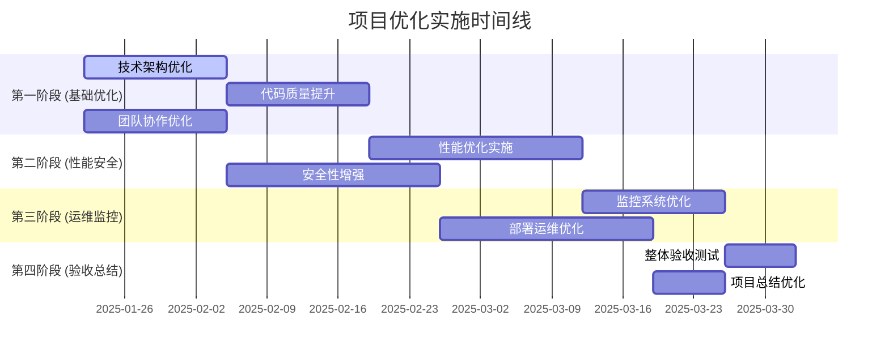

# 英语四级智能训练系统项目优化方案总览

## 📋 概述

本目录包含基于《英语四级智能训练系统全面技术架构审查报告》和《英语四级智能训练系统深度符合性审查报告》制定的全面项目优化方案。这些方案旨在解决当前系统在技术架构、性能、代码质量、安全性、监控、部署运维和团队协作等方面存在的问题，提升系统整体质量和团队效率。

---

## 🎯 优化目标

### 核心目标

- **技术卓越**: 建立稳定、高性能、可扩展的技术架构
- **质量保证**: 确保代码质量和系统质量达到行业标准
- **安全可靠**: 构建全面的安全防护和监控体系
- **高效运维**: 实现自动化、标准化的部署运维流程
- **团队协作**: 建立高效的团队协作和知识管理机制

### 量化指标

- 系统可用性: 99.5% → 99.9%
- 响应时间: 2s → 500ms
- 代码覆盖率: 70% → 90%
- 部署频率: 周 → 日
- 团队满意度: 3.5/5 → 4.5/5

---

## 📚 优化方案文档

### 1. [技术架构优化指南](./01-技术架构优化指南.md)

**目标**: 解决核心技术架构问题，提升系统稳定性和可维护性

**主要内容**:

- Celery异步任务配置和优化
- 测试覆盖率提升策略
- 性能监控机制完善
- 错误处理机制增强

**预期收益**:

- 系统稳定性提升30%
- 异步任务处理能力提升50%
- 错误定位效率提升40%

---

### 2. [性能优化实施方案](./02-性能优化实施方案.md)

**目标**: 全面优化系统性能，提升用户体验

**主要内容**:

- 数据库查询优化
- 缓存策略实施
- 前端性能优化
- AI服务性能优化
- 性能监控和告警

**预期收益**:

- API响应时间减少75%
- 页面加载速度提升60%
- 系统吞吐量提升100%

---

### 3. [代码质量提升计划](./03-代码质量提升计划.md)

**目标**: 建立完善的代码质量保证体系

**主要内容**:

- 代码规范标准化
- 测试策略完善
- 静态代码分析
- 代码审查流程
- 质量度量监控

**预期收益**:

- 代码质量评分提升至8.5/10
- 缺陷率降低50%
- 技术债务减少40%

---

### 4. [安全性增强方案](./04-安全性增强方案.md)

**目标**: 构建全面的系统安全防护体系

**主要内容**:

- 身份认证和授权增强
- 数据保护和加密
- API安全防护
- 安全监控和审计
- 漏洞扫描和检测
- 合规性检查

**预期收益**:

- 安全漏洞减少90%
- 数据泄露风险降低95%
- 合规性达标率100%

---

### 5. [监控优化方案](./05-监控优化方案.md)

**目标**: 建立全面的系统可观测性

**主要内容**:

- 应用性能监控(APM)
- 业务监控指标
- 智能告警系统
- 日志管理和分析
- 链路追踪

**预期收益**:

- 故障发现时间减少80%
- 故障解决时间减少60%
- 系统可观测性提升100%

---

### 6. [部署运维优化方案](./06-部署运维优化方案.md)

**目标**: 建立自动化、标准化的DevOps体系

**主要内容**:

- CI/CD流水线优化
- 容器化部署
- 配置管理
- 自动化运维
- 多环境管理

**预期收益**:

- 部署时间减少90%
- 部署成功率提升至99%
- 运维效率提升200%

---

### 7. [团队协作优化方案](./07-团队协作优化方案.md)

**目标**: 建立高效的团队协作机制

**主要内容**:

- 敏捷开发流程
- 代码审查流程
- 知识管理系统
- 沟通协作机制
- 持续改进机制

**预期收益**:

- 团队效率提升40%
- 沟通成本降低50%
- 知识传承效率提升100%

---

## 🗓️ 总体实施计划

### 实施优先级



### 阶段划分

#### 第一阶段：基础优化 (4周)

**目标**: 解决核心技术问题，建立基础协作机制

- 技术架构优化 (2周)
- 代码质量提升 (2周)
- 团队协作优化 (2周，并行)

#### 第二阶段：性能安全 (6周)

**目标**: 提升系统性能和安全性

- 性能优化实施 (3周)
- 安全性增强 (3周，并行)

#### 第三阶段：运维监控 (5周)

**目标**: 完善运维和监控体系

- 监控系统优化 (2周)
- 部署运维优化 (3周)

#### 第四阶段：验收总结 (2周)

**目标**: 整体验收和持续改进

- 整体验收测试 (1周)
- 项目总结优化 (1周)

---

## 📊 成功指标

### 技术指标

```yaml
系统性能:
  - API响应时间: <500ms
  - 页面加载时间: <2s
  - 系统吞吐量: >1000 req/s
  - 系统可用性: >99.9%

代码质量:
  - 测试覆盖率: >90%
  - 代码质量评分: >8.5/10
  - 技术债务比例: <10%
  - 代码重复率: <5%

安全性:
  - 安全漏洞数量: 0个高危
  - 数据加密覆盖率: 100%
  - 访问控制合规率: 100%
  - 安全审计通过率: 100%
```

### 业务指标

```yaml
用户体验:
  - 用户满意度: >4.5/5
  - 系统稳定性: >99.9%
  - 功能完整性: >95%
  - 响应及时性: >95%

团队效能:
  - 开发效率: 提升40%
  - 部署频率: 每日部署
  - 故障恢复时间: <30分钟
  - 团队满意度: >4.5/5

运维效率:
  - 自动化程度: >90%
  - 监控覆盖率: >95%
  - 告警准确率: >90%
  - 运维成本: 降低30%
```

---

## 🎯 关键里程碑

### 里程碑1: 基础优化完成 (第4周)

- ✅ 技术架构问题解决
- ✅ 代码质量标准建立
- ✅ 团队协作机制运行
- ✅ 测试覆盖率达到80%

### 里程碑2: 性能安全达标 (第10周)

- ✅ 系统性能指标达标
- ✅ 安全防护体系完善
- ✅ 性能监控系统运行
- ✅ 安全审计通过

### 里程碑3: 运维体系完善 (第15周)

- ✅ CI/CD流水线优化
- ✅ 监控告警系统完善
- ✅ 自动化运维实现
- ✅ 多环境管理标准化

### 里程碑4: 项目验收完成 (第17周)

- ✅ 所有优化目标达成
- ✅ 系统整体验收通过
- ✅ 文档和培训完成
- ✅ 持续改进机制建立

---

## 🔧 实施建议

### 资源配置

```yaml
人员配置:
  - 项目经理: 1人 (全程)
  - 技术负责人: 1人 (全程)
  - 前端工程师: 2人 (第1-3阶段)
  - 后端工程师: 3人 (全程)
  - DevOps工程师: 2人 (第2-3阶段)
  - 测试工程师: 2人 (全程)
  - 安全工程师: 1人 (第2阶段)

工具支持:
  - 项目管理: Jira/Azure DevOps
  - 代码管理: GitHub/GitLab
  - CI/CD: GitHub Actions/Jenkins
  - 监控: Prometheus + Grafana
  - 安全扫描: SonarQube + OWASP ZAP
```

### 风险控制

```yaml
技术风险:
  - 架构变更影响: 分阶段实施，充分测试
  - 性能优化回退: 建立性能基线，监控变化
  - 安全加固影响: 在测试环境充分验证

进度风险:
  - 任务依赖延期: 建立缓冲时间，并行执行
  - 资源不足: 提前规划，灵活调配
  - 需求变更: 变更控制，影响评估

质量风险:
  - 测试不充分: 自动化测试，多轮验证
  - 文档不完整: 同步更新，定期检查
  - 培训不到位: 分层培训，效果评估
```

### 成功要素

1. **领导支持**: 获得管理层的充分支持和资源保障
2. **团队协作**: 建立高效的跨职能团队协作机制
3. **分阶段实施**: 按优先级分阶段实施，降低风险
4. **持续监控**: 建立指标监控，及时调整策略
5. **知识传承**: 做好文档和培训，确保知识传承

---

## 📞 联系方式

**项目优化团队**

- 项目经理: 负责整体协调和进度管控
- 技术负责人: 负责技术方案和架构决策
- 各模块负责人: 负责具体实施和质量保证

**支持资源**

- 技术支持: 架构师、高级工程师
- 业务支持: 产品经理、业务专家
- 运维支持: DevOps团队、运维团队

---

**文档版本**: v1.0  
**创建日期**: 2025-01-22  
**最后更新**: 2025-01-22  
**维护团队**: 项目优化工作组

---

> 💡 **提示**: 建议按照文档顺序阅读各优化方案，每个方案都包含详细的实施步骤、代码示例和验收标准。实施过程中如有疑问，请及时与项目团队沟通。
