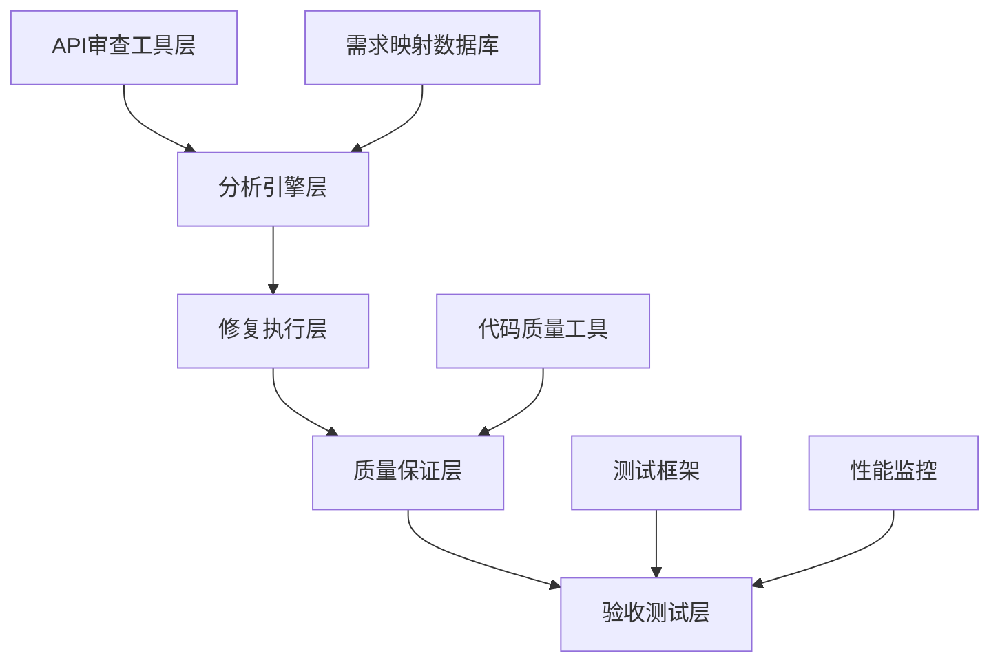

# API 全面审查与修复项目设计文档

## 设计概述

本设计文档基于需求文档中定义的 40 个核心需求，提供了一个系统化的 API 审查和修复方案。设计采用分层架构，确保所有 API 都能满足验收标准，并达到零代码质量问题的目标。

## 架构设计

### 整体架构



### 核心组件

#### 1. API 发现与分析引擎

- **功能**：自动扫描和分析现有 API 端点
- **技术栈**：Python AST 分析 + FastAPI 路由解析
- **输出**：API 清单、功能映射、问题报告

#### 2. 需求映射系统

- **功能**：将 API 与需求 1-40 进行精确映射
- **数据结构**：需求-API 映射表、验收标准检查清单
- **验证机制**：自动化验收标准符合性检查

#### 3. 代码修复引擎

- **功能**：自动生成和修复 API 代码
- **质量保证**：集成 Ruff、mypy、ESLint、tsc
- **模板系统**：标准化 API 代码模板

#### 4. 测试自动化框架

- **单元测试**：pytest + jest 自动化测试生成
- **集成测试**：API 端到端测试
- **性能测试**：负载测试和响应时间验证

## 技术架构

### 前端架构

```typescript
// 前端技术栈
interface FrontendArchitecture {
  framework: 'React 18.x + TypeScript 5.x'
  stateManagement: 'Zustand 4.x'
  routing: 'React Router 6.x'
  httpClient: 'TanStack Query 5.x'
  uiLibrary: 'Mantine 7.x'
  buildTool: 'Vite 5.x'
}

// API客户端标准化
class APIClient {
  private baseURL: string
  private timeout: number = 30000

  async request<T>(endpoint: string, options: RequestOptions): Promise<T> {
    // 标准化请求处理
    // 错误处理
    // 类型安全
    // 超时控制
  }
}
```

### 后端架构

```python
# 后端技术栈
from typing import Dict, List, Optional
from fastapi import FastAPI, Depends, HTTPException
from sqlalchemy.ext.asyncio import AsyncSession
from pydantic import BaseModel

# 单体架构模块化设计
class BackendArchitecture:
    framework = "FastAPI 0.104+"
    database = "PostgreSQL + SQLAlchemy 2.0"
    cache = "Redis"
    queue = "Redis/RabbitMQ"
    ai_service = "DeepSeek API"

# 标准化API端点模板
class StandardAPIEndpoint:
    def __init__(self):
        self.router = APIRouter()
        self.db_session = AsyncSession
        self.auth_service = AuthService
        self.logger = Logger

    async def create_resource(
        self,
        request: CreateRequest,
        current_user: User = Depends(get_current_user),
        db: AsyncSession = Depends(get_db)
    ) -> StandardResponse:
        # 标准化实现模式
        pass
```

## 数据模型设计

### API 映射数据模型

```python
from sqlalchemy import Column, Integer, String, Text, Boolean, DateTime, ForeignKey
from sqlalchemy.orm import relationship

class RequirementAPIMapping(Base):
    """需求-API映射表"""
    __tablename__ = "requirement_api_mapping"

    id = Column(Integer, primary_key=True)
    requirement_id = Column(String(20), nullable=False)  # 如 "REQ-001"
    requirement_name = Column(String(200), nullable=False)
    api_endpoint = Column(String(500), nullable=False)
    http_method = Column(String(10), nullable=False)
    module_name = Column(String(100), nullable=False)

    # 验收标准
    acceptance_criteria = relationship("AcceptanceCriteria", back_populates="requirement")

    # 实现状态
    implementation_status = Column(String(20), default="not_implemented")
    test_status = Column(String(20), default="not_tested")
    quality_status = Column(String(20), default="not_checked")

class AcceptanceCriteria(Base):
    """验收标准表"""
    __tablename__ = "acceptance_criteria"

    id = Column(Integer, primary_key=True)
    requirement_id = Column(String(20), ForeignKey("requirement_api_mapping.requirement_id"))
    criteria_text = Column(Text, nullable=False)
    verification_method = Column(String(100))  # unit_test, integration_test, manual
    is_verified = Column(Boolean, default=False)

    requirement = relationship("RequirementAPIMapping", back_populates="acceptance_criteria")

class APIAuditResult(Base):
    """API审查结果表"""
    __tablename__ = "api_audit_result"

    id = Column(Integer, primary_key=True)
    api_endpoint = Column(String(500), nullable=False)
    audit_date = Column(DateTime, nullable=False)

    # 问题分类
    missing_implementation = Column(Boolean, default=False)
    incorrect_implementation = Column(Boolean, default=False)
    performance_issue = Column(Boolean, default=False)
    security_issue = Column(Boolean, default=False)
    quality_issue = Column(Boolean, default=False)

    # 修复状态
    fix_status = Column(String(20), default="pending")
    fix_description = Column(Text)
    fixed_by = Column(String(100))
    fixed_date = Column(DateTime)
```

## 组件设计

### 1. API 发现组件

```python
class APIDiscoveryEngine:
    """API发现引擎"""

    def __init__(self):
        self.fastapi_analyzer = FastAPIAnalyzer()
        self.react_analyzer = ReactAnalyzer()

    async def discover_backend_apis(self, project_path: str) -> List[APIEndpoint]:
        """发现后端API端点"""
        endpoints = []

        # 扫描FastAPI路由
        for file_path in self._scan_python_files(project_path):
            ast_tree = self._parse_python_file(file_path)
            file_endpoints = self._extract_fastapi_endpoints(ast_tree)
            endpoints.extend(file_endpoints)

        return endpoints

    async def discover_frontend_apis(self, project_path: str) -> List[APICall]:
        """发现前端API调用"""
        api_calls = []

        # 扫描React组件中的API调用
        for file_path in self._scan_typescript_files(project_path):
            ast_tree = self._parse_typescript_file(file_path)
            file_calls = self._extract_api_calls(ast_tree)
            api_calls.extend(file_calls)

        return api_calls

    def _extract_fastapi_endpoints(self, ast_tree) -> List[APIEndpoint]:
        """从AST中提取FastAPI端点"""
        endpoints = []

        for node in ast.walk(ast_tree):
            if isinstance(node, ast.FunctionDef):
                # 检查装饰器是否为FastAPI路由
                for decorator in node.decorator_list:
                    if self._is_fastapi_route_decorator(decorator):
                        endpoint = self._create_endpoint_from_function(node, decorator)
                        endpoints.append(endpoint)

        return endpoints
```

### 2. 需求映射组件

```python
class RequirementMappingEngine:
    """需求映射引擎"""

    def __init__(self):
        self.requirements_db = RequirementsDatabase()
        self.mapping_rules = MappingRules()

    async def map_apis_to_requirements(
        self,
        apis: List[APIEndpoint]
    ) -> Dict[str, List[APIEndpoint]]:
        """将API映射到需求"""
        mapping = {}

        for requirement in self.requirements_db.get_all_requirements():
            mapped_apis = []

            for api in apis:
                if self._is_api_related_to_requirement(api, requirement):
                    mapped_apis.append(api)

            mapping[requirement.id] = mapped_apis

        return mapping

    def _is_api_related_to_requirement(
        self,
        api: APIEndpoint,
        requirement: Requirement
    ) -> bool:
        """判断API是否与需求相关"""
        # 基于路径模式匹配
        if self._path_pattern_match(api.path, requirement.path_patterns):
            return True

        # 基于功能关键词匹配
        if self._keyword_match(api.description, requirement.keywords):
            return True

        # 基于模块归属匹配
        if self._module_match(api.module, requirement.modules):
            return True

        return False
```

### 3. 代码修复组件

```python
class CodeFixEngine:
    """代码修复引擎"""

    def __init__(self):
        self.template_engine = TemplateEngine()
        self.quality_checker = QualityChecker()

    async def fix_missing_api(
        self,
        requirement: Requirement,
        missing_endpoint: str
    ) -> FixResult:
        """修复缺失的API"""
        try:
            # 1. 生成API代码
            api_code = await self._generate_api_code(requirement, missing_endpoint)

            # 2. 生成测试代码
            test_code = await self._generate_test_code(requirement, missing_endpoint)

            # 3. 质量检查
            quality_result = await self.quality_checker.check_code(api_code)
            if not quality_result.passed:
                api_code = await self._fix_quality_issues(api_code, quality_result)

            # 4. 写入文件
            await self._write_api_file(missing_endpoint, api_code)
            await self._write_test_file(missing_endpoint, test_code)

            return FixResult(success=True, endpoint=missing_endpoint)

        except Exception as e:
            return FixResult(success=False, error=str(e))

    async def _generate_api_code(
        self,
        requirement: Requirement,
        endpoint: str
    ) -> str:
        """生成API代码"""
        template = self.template_engine.get_template("fastapi_endpoint")

        context = {
            "endpoint_path": endpoint,
            "http_method": requirement.http_method,
            "request_model": requirement.request_model,
            "response_model": requirement.response_model,
            "business_logic": requirement.business_logic,
            "validation_rules": requirement.validation_rules,
            "permission_required": requirement.permission_required
        }

        return template.render(context)
```

### 4. 质量保证组件

```python
class QualityAssuranceEngine:
    """质量保证引擎"""

    def __init__(self):
        self.linters = {
            "python": ["ruff", "mypy"],
            "typescript": ["eslint", "tsc"]
        }
        self.test_runners = {
            "python": "pytest",
            "typescript": "jest"
        }

    async def run_quality_checks(self, file_path: str) -> QualityResult:
        """运行质量检查"""
        file_type = self._detect_file_type(file_path)
        results = []

        # 运行linter检查
        for linter in self.linters.get(file_type, []):
            result = await self._run_linter(linter, file_path)
            results.append(result)

        # 运行测试
        test_result = await self._run_tests(file_path)
        results.append(test_result)

        return QualityResult(
            passed=all(r.passed for r in results),
            results=results
        )

    async def _run_linter(self, linter: str, file_path: str) -> LinterResult:
        """运行linter检查"""
        if linter == "ruff":
            cmd = f"ruff check {file_path}"
        elif linter == "mypy":
            cmd = f"mypy {file_path} --strict"
        elif linter == "eslint":
            cmd = f"eslint {file_path}"
        elif linter == "tsc":
            cmd = f"tsc --noEmit {file_path}"
        else:
            raise ValueError(f"Unknown linter: {linter}")

        result = await self._execute_command(cmd)

        return LinterResult(
            linter=linter,
            passed=result.returncode == 0,
            output=result.stdout,
            errors=result.stderr
        )
```

## 实施策略

### 阶段一：基础设施搭建

1. **环境准备**

   - 配置开发环境
   - 安装代码质量工具
   - 设置测试框架

2. **工具开发**
   - API 发现引擎
   - 需求映射系统
   - 代码模板库

### 阶段二：API 审查执行

1. **自动化扫描**

   - 扫描所有现有 API
   - 生成 API 清单
   - 识别问题 API

2. **需求映射**
   - 建立 API-需求映射关系
   - 标识缺失功能
   - 生成修复计划

### 阶段三：修复实施

1. **代码生成**

   - 自动生成缺失 API
   - 修复错误实现
   - 优化性能问题

2. **质量保证**
   - 运行代码质量检查
   - 执行自动化测试
   - 性能基准测试

### 阶段四：验收测试

1. **功能验证**

   - 逐一验证需求 1-40
   - 端到端业务流程测试
   - 用户体验测试

2. **最终交付**
   - 生成审查报告
   - 更新文档
   - 部署到生产环境

## 风险控制

### 技术风险

- **代码质量风险**：通过自动化质量检查和严格的 linter 配置控制
- **性能风险**：通过性能基准测试和监控预警控制
- **兼容性风险**：通过全面的集成测试控制

### 项目风险

- **进度风险**：采用敏捷开发，分阶段交付
- **质量风险**：零容忍质量标准，自动化质量门禁
- **范围风险**：严格按照需求 1-40 执行，不增加额外功能

## 成功指标

### 功能指标

- ✅ 需求 1-40 验收标准 100%通过
- ✅ API 响应时间符合性能要求
- ✅ 系统并发能力达标

### 质量指标

- ✅ Linter 错误数 = 0
- ✅ 单元测试覆盖率 > 80%
- ✅ 集成测试通过率 = 100%

### 交付指标

- ✅ 按时完成所有阶段交付
- ✅ 文档完整性 = 100%
- ✅ 用户满意度 > 95%
