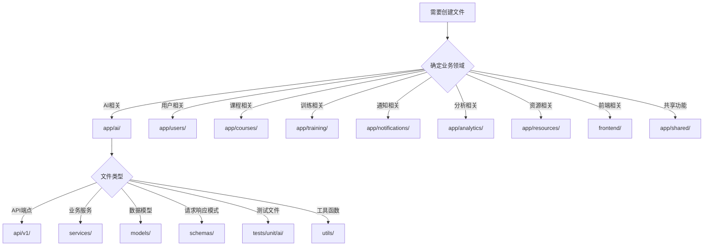

# 目录结构指导原则

## 🎯 核心原则

### 1. 单体架构模块化设计
项目采用单体架构，通过模块化设计实现功能分离。**绝对不要**在错误的模块下创建不相关的文件。

### 2. 模块边界清晰
每个模块负责特定的业务领域，文件必须放在对应模块的目录下。

## 📁 标准目录结构

### 单体架构根目录结构
```
/
├── frontend/                    # 前端应用（React + TypeScript）
│   ├── src/
│   │   ├── components/         # 通用组件
│   │   ├── pages/              # 页面组件
│   │   ├── hooks/              # 自定义Hooks
│   │   ├── stores/             # Zustand状态管理
│   │   ├── api/                # API调用
│   │   └── utils/              # 工具函数
│   ├── public/                 # 静态资源
│   └── package.json            # 前端依赖
├── app/                        # 后端单体应用（8000端口）
│   ├── __init__.py
│   ├── main.py                 # 应用入口
│   ├── core/                   # 核心配置
│   │   ├── __init__.py
│   │   ├── config.py           # 应用配置
│   │   ├── database.py         # 数据库配置
│   │   └── deps.py             # 依赖注入
│   ├── users/                  # 用户管理模块
│   ├── courses/                # 课程管理模块
│   ├── training/               # 训练系统模块
│   ├── ai/                     # AI集成模块
│   ├── notifications/          # 通知系统模块
│   ├── analytics/              # 数据分析模块
│   ├── resources/              # 资源库模块
│   └── shared/                 # 共享组件
├── tests/                      # 测试目录
│   ├── unit/                   # 单元测试
│   ├── integration/            # 集成测试
│   └── e2e/                    # 端到端测试
├── docker-compose.yml          # Docker编排
├── requirements.txt            # Python依赖
├── scripts/                    # 构建和部署脚本
└── docs/                       # 项目文档
```

### 模块标准结构
```
app/{module-name}/
├── __init__.py
├── api/                        # API路由
│   ├── __init__.py
│   └── v1/
│       ├── __init__.py
│       └── {domain}_endpoints.py
├── models/                     # 数据模型
│   ├── __init__.py
│   └── {domain}_models.py
├── schemas/                    # Pydantic模式
│   ├── __init__.py
│   └── {domain}_schemas.py
├── services/                   # 业务逻辑
│   ├── __init__.py
│   └── {domain}_service.py
└── utils/                      # 工具函数
    ├── __init__.py
    └── {utility}_utils.py
```

## 🚨 单体架构模块文件放置规则

### 应用核心文件规则
```yaml
应用核心文件位置规则:
  - 应用入口: app/main.py
  - 应用配置: app/core/config.py
  - 数据库配置: app/core/database.py
  - 依赖注入: app/core/deps.py
  - 共享工具: app/shared/
  
严重错误位置:
  ❌ backend/app/          # 不存在backend目录
  ❌ services/             # 不存在services目录
  ❌ 根目录下的业务文件      # 业务文件必须在app/模块下
```

### AI模块相关文件
```yaml
AI模块文件位置规则:
  - AI核心服务: app/ai/services/
  - AI API端点: app/ai/api/v1/
  - AI数据模型: app/ai/models/
  - AI请求响应模式: app/ai/schemas/
  - AI模块测试: tests/unit/ai/ 或 tests/integration/ai/
  - AI工具函数: app/ai/utils/
  
严重错误位置:
  ❌ services/ai-service/          # 微服务目录不存在
  ❌ app/services/ai_service.py    # 应该在app/ai/services/下
  ❌ tests/ai_service/             # 应该在tests/unit/ai/下
  
正确位置示例:
  ✅ app/ai/services/deepseek_service.py
  ✅ app/ai/api/v1/ai_endpoints.py
  ✅ tests/unit/ai/test_deepseek_service.py
```

### 用户模块相关文件
```yaml
用户模块文件位置规则:
  - 用户核心服务: app/users/services/
  - 用户API端点: app/users/api/v1/
  - 用户数据模型: app/users/models/
  - 用户模块测试: tests/unit/users/
```

### 课程模块相关文件
```yaml
课程模块文件位置规则:
  - 课程核心服务: app/courses/services/
  - 课程API端点: app/courses/api/v1/
  - 课程数据模型: app/courses/models/
  - 课程模块测试: tests/unit/courses/
```

### 训练模块相关文件
```yaml
训练模块文件位置规则:
  - 训练核心服务: app/training/services/
  - 训练API端点: app/training/api/v1/
  - 训练数据模型: app/training/models/
  - 训练模块测试: tests/unit/training/
```

## 🔍 智能体编码检查清单

### 创建文件前必须检查
1. **确定业务领域** - 这个文件属于哪个业务领域？
2. **确定服务归属** - 应该放在哪个微服务下？
3. **确定文件类型** - 是API、服务、模型、测试还是配置？
4. **检查目录存在** - 目标目录是否存在？
5. **避免重复创建** - 是否已有类似功能的文件？

### 文件创建决策树


## 📋 常见错误和修正

### 错误模式1：模块混乱
```yaml
错误:
  - app/services/ai_service.py          # 应该在具体模块下
  - app/models/user_model.py            # 应该在具体模块下
  - tests/ai_service/test_ai.py         # 应该在tests/unit/ai/下

修正:
  - app/ai/services/ai_service.py
  - app/users/models/user_model.py
  - tests/unit/ai/test_ai.py
```

### 错误模式2：模块边界不清
```yaml
错误:
  - app/ai/services/user_service.py     # 用户服务放在AI模块下
  - app/users/services/ai_service.py    # AI服务放在用户模块下

修正:
  - app/users/services/user_service.py
  - app/ai/services/ai_service.py
```

### 错误模式3：测试文件位置错误
```yaml
错误:
  - tests/ai_service/test_temperature.py    # 应该按模块组织
  - app/ai/tests/test_ai_service.py         # 测试不应该在模块内

修正:
  - tests/unit/ai/test_temperature.py      # 单元测试按模块组织
  - tests/integration/ai/test_ai_integration.py  # 集成测试按模块组织
```

## 🛠️ 智能体实施指南

### 1. 文件创建前置检查函数
```python
def validate_file_path(file_path: str, content_type: str) -> bool:
    """
    验证文件路径是否符合微服务架构规范
    
    Args:
        file_path: 要创建的文件路径
        content_type: 文件内容类型 (ai, user, course, training, notification)
    
    Returns:
        bool: 路径是否正确
    """
    
    # 检查是否在正确的服务目录下
    if content_type == "ai" and not file_path.startswith("services/ai-service/"):
        return False
    
    if content_type == "user" and not file_path.startswith("services/user-service/"):
        return False
    
    # ... 其他服务检查
    
    return True
```

### 2. 自动模块检测
```python
def detect_module_from_content(content: str) -> str:
    """
    从文件内容检测应该属于哪个模块
    
    Args:
        content: 文件内容
    
    Returns:
        str: 模块名称
    """
    
    ai_keywords = ["deepseek", "ai_service", "temperature", "openai", "llm"]
    user_keywords = ["user_service", "authentication", "login", "register"]
    course_keywords = ["course_service", "curriculum", "lesson", "syllabus"]
    training_keywords = ["training_service", "exercise", "practice", "quiz"]
    notification_keywords = ["notification", "message", "email", "sms"]
    
    content_lower = content.lower()
    
    if any(keyword in content_lower for keyword in ai_keywords):
        return "ai"
    elif any(keyword in content_lower for keyword in user_keywords):
        return "users"
    elif any(keyword in content_lower for keyword in course_keywords):
        return "courses"
    elif any(keyword in content_lower for keyword in training_keywords):
        return "training"
    elif any(keyword in content_lower for keyword in notification_keywords):
        return "notifications"
    
    return "shared"  # 默认放在共享模块
```

### 3. 重复代码检测
```python
def check_duplicate_functionality(file_path: str, content: str) -> List[str]:
    """
    检查是否存在功能重复的文件
    
    Args:
        file_path: 新文件路径
        content: 新文件内容
    
    Returns:
        List[str]: 可能重复的文件列表
    """
    
    # 提取关键函数和类名
    functions = extract_functions(content)
    classes = extract_classes(content)
    
    # 在对应服务目录下搜索类似功能
    service_dir = get_service_directory(file_path)
    existing_files = scan_service_files(service_dir)
    
    duplicates = []
    for existing_file in existing_files:
        existing_content = read_file(existing_file)
        existing_functions = extract_functions(existing_content)
        existing_classes = extract_classes(existing_content)
        
        # 检查功能重复度
        if calculate_similarity(functions, existing_functions) > 0.8:
            duplicates.append(existing_file)
    
    return duplicates
```

## 📊 目录结构验证工具

### 验证脚本
```bash
#!/bin/bash
# scripts/validate_directory_structure.sh

echo "🔍 验证项目目录结构..."

# 检查单体应用目录结构
if [ ! -d "app" ]; then
    echo "❌ 缺少应用目录: app/"
    exit 1
fi

# 检查核心模块
for module in users courses training ai notifications analytics resources shared; do
    if [ ! -d "app/$module" ]; then
        echo "❌ 缺少模块目录: app/$module"
        continue
    fi
    
    # 检查标准子目录
    for dir in api models schemas services; do
        if [ ! -d "app/$module/$dir" ]; then
            echo "❌ 缺少目录: app/$module/$dir"
        fi
    done
done

# 检查核心配置目录
if [ ! -d "app/core" ]; then
    echo "❌ 缺少核心配置目录: app/core"
fi

# 检查测试目录结构
if [ ! -d "tests" ]; then
    echo "❌ 缺少测试目录: tests/"
fi

for test_type in unit integration e2e; do
    if [ ! -d "tests/$test_type" ]; then
        echo "❌ 缺少测试类型目录: tests/$test_type"
    fi
done

# 检查是否有文件在错误位置
echo "🔍 检查错误位置的文件..."

# 检查是否有微服务目录残留
if [ -d "services" ]; then
    echo "❌ 发现微服务目录残留: services/"
    echo "   单体架构不应该有services目录"
fi

if [ -d "backend" ]; then
    echo "❌ 发现backend目录残留: backend/"
    echo "   单体架构不应该有backend目录"
fi

# 检查根目录下是否有业务文件
for file in app/*.py; do
    if [[ "$file" != "app/main.py" && "$file" != "app/__init__.py" ]]; then
        echo "❌ 发现根目录业务文件: $file"
        echo "   业务文件应该在对应模块下"
    fi
done

echo "✅ 目录结构验证完成"
```

## 🎯 智能体行为规范

### 强制执行规则
1. **创建任何文件前**，必须先确定业务领域和服务归属
2. **检查目标目录**是否存在，不存在则先创建目录结构
3. **搜索重复功能**，避免创建功能相似的文件
4. **验证文件路径**，确保符合微服务架构规范
5. **更新相关文档**，保持文档与代码同步

### 自动化检查
- 每次文件创建后自动运行目录结构验证
- 定期扫描重复代码和功能
- 监控文件创建模式，及时发现问题

### 错误恢复
- 发现错误位置文件时，立即移动到正确位置
- 清理空目录和无用文件
- 更新相关引用和导入路径

通过这套完整的目录结构指导原则，智能体可以确保始终在正确的位置创建文件，避免重复功能，维护清晰的单体架构模块化设计。