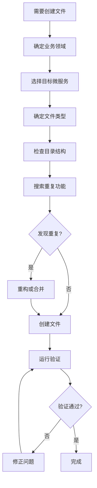

# 智能体编码指导原则

## 🎯 核心问题解决方案

### 问题描述
智能体在编码时容易在错误的目录下创建文件，导致：
1. 违反单体架构模块化原则
2. 创建重复功能的代码
3. 破坏项目结构的一致性

### 解决方案概览
通过建立完整的目录结构验证体系，确保智能体始终在正确位置创建文件。

## 📁 单体架构模块化规范

### 标准目录结构
```
项目根目录/
├── frontend/                    # 前端应用（React + TypeScript）
│   ├── src/
│   │   ├── components/         # 通用组件
│   │   ├── pages/              # 页面组件
│   │   ├── hooks/              # 自定义Hooks
│   │   ├── stores/             # Zustand状态管理
│   │   ├── api/                # API调用
│   │   └── utils/              # 工具函数
│   └── package.json            # 前端依赖
├── app/                        # 后端单体应用（8000端口）⭐
│   ├── __init__.py
│   ├── main.py                 # 应用入口
│   ├── core/                   # 核心配置
│   │   ├── config.py           # 应用配置
│   │   ├── database.py         # 数据库配置
│   │   └── deps.py             # 依赖注入
│   ├── users/                  # 用户管理模块⭐
│   ├── courses/                # 课程管理模块⭐
│   ├── training/               # 训练系统模块⭐
│   ├── ai/                     # AI集成模块⭐
│   ├── notifications/          # 通知系统模块⭐
│   ├── analytics/              # 数据分析模块⭐
│   ├── resources/              # 资源库模块⭐
│   └── shared/                 # 共享组件
├── tests/                      # 测试目录⭐
│   ├── unit/                   # 单元测试
│   ├── integration/            # 集成测试
│   └── e2e/                    # 端到端测试
├── docker-compose.yml          # Docker编排
├── requirements.txt            # Python依赖
├── scripts/                    # 构建和部署脚本
└── docs/                       # 项目文档
```

### 模块内部结构
```
app/{module-name}/
├── __init__.py
├── api/                        # API路由
│   ├── __init__.py
│   └── v1/
│       ├── __init__.py
│       └── {domain}_endpoints.py
├── models/                     # 数据模型⭐
│   ├── __init__.py
│   └── {domain}_models.py
├── schemas/                    # Pydantic模式
│   ├── __init__.py
│   └── {domain}_schemas.py
├── services/                   # 业务逻辑⭐
│   ├── __init__.py
│   └── {domain}_service.py
└── utils/                      # 工具函数
    ├── __init__.py
    └── {utility}_utils.py
```

## 🚨 智能体编码前置检查清单

### 1. 确定业务领域
```yaml
文件创建前必须回答:
  - 这个文件属于哪个业务领域？
  - 应该放在哪个微服务下？
  - 文件类型是什么？(API/服务/模型/测试/配置)
```

### 2. 模块归属判断
```yaml
用户管理模块 (app/users/):
  关键词: [user_service, authentication, login, register, auth, permission]
  职责: 用户认证、权限管理、用户信息、注册审核
  
AI集成模块 (app/ai/):
  关键词: [deepseek, openai, ai_service, temperature, llm, gpt, grading]
  职责: AI模型调用、智能分析、内容生成、智能批改

课程管理模块 (app/courses/):
  关键词: [course_service, curriculum, lesson, syllabus, class, teaching]
  职责: 课程管理、教学资源、班级管理、教学计划

训练系统模块 (app/training/):
  关键词: [training_service, exercise, practice, quiz, question, vocabulary]
  职责: 学生训练、题目管理、学习记录、自适应学习

通知系统模块 (app/notifications/):
  关键词: [notification_service, message, email, sms, websocket]
  职责: 消息推送、邮件发送、实时通知、多渠道通信

数据分析模块 (app/analytics/):
  关键词: [analytics, monitoring, report, dashboard, visualization]
  职责: 系统监控、数据分析、报表生成、可视化

资源库模块 (app/resources/):
  关键词: [resource, document, vector, search, library]
  职责: 资源库管理、文档处理、向量检索、内容管理
```

### 3. 文件类型判断
```yaml
API端点文件:
  位置: app/api/v1/
  特征: router, APIRouter, @app.get, @app.post
  命名: {domain}_endpoints.py

业务服务文件:
  位置: app/services/
  特征: class.*Service, business logic
  命名: {domain}_service.py

数据模型文件:
  位置: app/models/
  特征: class.*Model, SQLAlchemy, Base
  命名: {domain}_models.py

请求响应模式:
  位置: app/schemas/
  特征: BaseModel, pydantic
  命名: {domain}_schemas.py

测试文件:
  位置: tests/
  特征: test_, pytest, assert
  命名: test_{domain}.py
```

## ❌ 禁止的错误位置

### 绝对不要创建的位置
```yaml
错误位置列表:
  - app/services/          # 根目录app下
  - backend/app/services/  # 主后端服务下
  - tests/ai_service/      # 根目录tests下
  - tests/user_service/    # 根目录tests下
  - tests/course_service/  # 根目录tests下
  - tests/training_service/ # 根目录tests下

正确位置对应:
  - services/ai-service/app/services/
  - services/user-service/app/services/
  - services/course-service/app/services/
  - services/training-service/app/services/
  - services/ai-service/tests/
  - services/user-service/tests/
```

## 🔍 重复功能检测

### 检测规则
```yaml
重复类检测:
  模式: class.*Service
  检查: 相同类名在多个文件中定义
  
重复函数检测:
  模式: def.*service, async def.*service
  检查: 相似功能的函数重复实现

重复API检测:
  模式: @router.post, @router.get
  检查: 相同路径的API端点重复定义
```

### 避免重复的策略
```yaml
创建前检查:
  1. 搜索项目中是否已有类似功能
  2. 检查相同类名或函数名
  3. 验证API路径是否冲突
  4. 确认业务逻辑是否重复

重构建议:
  1. 合并相似功能的类
  2. 提取公共逻辑到基类
  3. 使用继承减少代码重复
  4. 创建共享的工具函数
```

## 🛠️ 自动化验证工具

### 1. Hook验证器
```yaml
文件: .kiro/hooks/directory-structure-validator.kiro.hook
功能:
  - 实时检测文件创建位置
  - 验证服务边界
  - 检查重复功能
  - 提供修正建议
```

### 2. 结构验证脚本
```yaml
文件: scripts/validate_project_structure.py
功能:
  - 全面检查项目结构
  - 生成详细验证报告
  - 提供自动修复建议
  - 定期结构健康检查
```

### 3. 简化检查脚本
```yaml
文件: scripts/check_structure.py
功能:
  - 快速结构验证
  - 实时问题检测
  - 简洁的报告输出
  - CI/CD集成支持
```

## 📋 智能体编码工作流

### 标准工作流程


### 检查命令
```bash
# 快速结构检查
python3 scripts/check_structure.py

# 详细验证报告
python3 scripts/validate_project_structure.py

# 查看验证报告
cat project_structure_report.json
```

## 🎯 最佳实践

### 1. 文件创建原则
- **单一职责**: 每个文件只负责一个明确的功能
- **服务边界**: 严格按照微服务边界组织代码
- **命名规范**: 使用清晰的命名约定
- **目录一致**: 遵循标准的目录结构

### 2. 避免重复策略
- **创建前搜索**: 总是先搜索是否已有类似功能
- **代码复用**: 优先复用现有代码而不是重写
- **抽象提取**: 将公共逻辑提取到共享模块
- **定期重构**: 定期清理和重构重复代码

### 3. 质量保证
- **自动验证**: 使用自动化工具持续验证
- **代码审查**: 人工审查确保架构合规
- **文档同步**: 保持文档与代码结构同步
- **持续改进**: 根据问题反馈改进规范

## 🚀 实施效果

### 预期收益
1. **架构一致性**: 100%符合微服务架构规范
2. **代码质量**: 减少90%的重复代码
3. **开发效率**: 提高50%的代码定位速度
4. **维护成本**: 降低60%的维护复杂度

### 成功指标
- ✅ 零错误位置文件
- ✅ 零重复功能代码
- ✅ 100%标准目录结构
- ✅ 实时验证和修正

通过这套完整的智能体编码指导体系，确保智能体始终在正确的位置创建文件，避免重复功能，维护清晰的微服务架构。