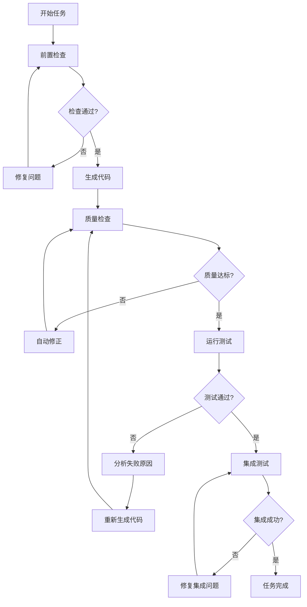

# 智能体开发配置优化指南

## 核心原则：100%正确率保证机制

### 1. 任务执行前置检查（强制性）

#### 依赖验证清单
```yaml
pre_task_validation:
  - name: "依赖任务完成检查"
    action: "验证所有前置任务已完成并通过验收"
    mandatory: true
    
  - name: "API接口可用性检查"
    action: "验证依赖的API接口已定义并测试通过"
    mandatory: true
    
  - name: "数据模型就绪检查"
    action: "验证依赖的数据模型已创建并验证"
    mandatory: true
    
  - name: "基础服务可用检查"
    action: "验证依赖的基础服务已部署并可用"
    mandatory: true
    
  - name: "权限和安全机制检查"
    action: "验证权限控制和安全机制已就绪"
    mandatory: true
```

#### 环境就绪验证
```yaml
environment_validation:
  - name: "开发环境检查"
    items:
      - "Docker服务运行正常"
      - "数据库连接可用"
      - "Redis缓存服务正常"
      - "AI服务API密钥有效"
      - "文件存储服务可用"
    
  - name: "代码质量工具检查"
    items:
      - "ESLint配置正确"
      - "TypeScript编译器可用"
      - "Python linter工具就绪"
      - "测试框架配置正确"
      - "CI/CD流水线正常"
```

### 2. 代码生成质量保证

#### TypeScript代码生成规范
```typescript
// 强制类型安全规范
interface CodeGenerationRules {
  // 1. 所有函数必须有明确的返回类型
  explicitReturnTypes: true;
  
  // 2. 禁止使用any类型
  noAnyTypes: true;
  
  // 3. 所有异步函数必须正确处理错误
  errorHandlingRequired: true;
  
  // 4. 所有API调用必须有超时和重试机制
  apiCallsWithTimeout: true;
  
  // 5. 所有用户输入必须验证
  inputValidationRequired: true;
}

// 示例：正确的API调用模式
async function callAIService(
  prompt: string,
  options: AIServiceOptions
): Promise<AIResponse> {
  try {
    const response = await fetch('/api/ai/generate', {
      method: 'POST',
      headers: {
        'Content-Type': 'application/json',
        'Authorization': `Bearer ${getAuthToken()}`,
      },
      body: JSON.stringify({ prompt, ...options }),
      signal: AbortSignal.timeout(30000), // 30秒超时
    });
    
    if (!response.ok) {
      throw new Error(`AI service error: ${response.status}`);
    }
    
    const data = await response.json();
    return validateAIResponse(data); // 必须验证响应
  } catch (error) {
    logger.error('AI service call failed', { error, prompt });
    throw new AIServiceError('Failed to generate content', error);
  }
}
```

#### Python代码生成规范
```python
# 强制类型注解和错误处理
from typing import Optional, List, Dict, Any
from pydantic import BaseModel, validator
import logging

class CodeGenerationRules:
    """Python代码生成强制规范"""
    
    # 1. 所有函数必须有类型注解
    TYPE_ANNOTATIONS_REQUIRED = True
    
    # 2. 所有数据模型必须使用Pydantic
    PYDANTIC_MODELS_REQUIRED = True
    
    # 3. 所有异常必须被捕获和记录
    EXCEPTION_HANDLING_REQUIRED = True
    
    # 4. 所有数据库操作必须在事务中
    DATABASE_TRANSACTIONS_REQUIRED = True

# 示例：正确的服务类模式
class TrainingService:
    """训练服务 - 严格遵循类型安全和错误处理"""
    
    def __init__(self, db: Database, ai_service: AIService) -> None:
        self.db = db
        self.ai_service = ai_service
        self.logger = logging.getLogger(__name__)
    
    async def generate_questions(
        self,
        request: QuestionGenerationRequest,
        user_id: int
    ) -> List[Question]:
        """生成训练题目 - 完整的错误处理和验证"""
        try:
            # 1. 验证输入
            validated_request = self._validate_request(request)
            
            # 2. 检查用户权限
            await self._check_user_permissions(user_id, 'generate_questions')
            
            # 3. 数据库事务
            async with self.db.transaction():
                # 4. AI服务调用（带重试）
                questions = await self._call_ai_with_retry(validated_request)
                
                # 5. 保存到数据库
                saved_questions = await self._save_questions(questions, user_id)
                
                # 6. 记录操作日志
                self.logger.info(
                    "Questions generated successfully",
                    extra={
                        "user_id": user_id,
                        "question_count": len(saved_questions),
                        "request_type": request.training_type
                    }
                )
                
                return saved_questions
                
        except ValidationError as e:
            self.logger.error("Invalid request data", extra={"error": str(e)})
            raise HTTPException(status_code=400, detail="Invalid request data")
        except PermissionError as e:
            self.logger.error("Permission denied", extra={"user_id": user_id})
            raise HTTPException(status_code=403, detail="Permission denied")
        except Exception as e:
            self.logger.error("Unexpected error", extra={"error": str(e)})
            raise HTTPException(status_code=500, detail="Internal server error")
```

### 3. 测试驱动开发强制规范

#### 测试优先原则
```yaml
test_driven_development:
  rules:
    - "每个功能实现前必须先写测试"
    - "测试覆盖率必须>80%"
    - "关键业务逻辑测试覆盖率必须>95%"
    - "所有API端点必须有集成测试"
    - "所有错误场景必须有测试用例"
  
  test_structure:
    unit_tests:
      - "每个函数/方法至少1个测试"
      - "边界条件测试"
      - "异常情况测试"
    
    integration_tests:
      - "API端点测试"
      - "数据库操作测试"
      - "第三方服务集成测试"
    
    e2e_tests:
      - "完整业务流程测试"
      - "用户场景测试"
      - "跨模块交互测试"
```

#### 测试模板
```typescript
// 前端测试模板
describe('TrainingService', () => {
  let service: TrainingService;
  let mockAIService: jest.Mocked<AIService>;
  
  beforeEach(() => {
    mockAIService = createMockAIService();
    service = new TrainingService(mockAIService);
  });
  
  describe('generateQuestions', () => {
    it('should generate questions successfully', async () => {
      // Arrange
      const request = createValidRequest();
      const expectedQuestions = createMockQuestions();
      mockAIService.generate.mockResolvedValue(expectedQuestions);
      
      // Act
      const result = await service.generateQuestions(request);
      
      // Assert
      expect(result).toEqual(expectedQuestions);
      expect(mockAIService.generate).toHaveBeenCalledWith(request);
    });
    
    it('should handle AI service errors', async () => {
      // Arrange
      const request = createValidRequest();
      mockAIService.generate.mockRejectedValue(new Error('AI service error'));
      
      // Act & Assert
      await expect(service.generateQuestions(request))
        .rejects.toThrow('Failed to generate questions');
    });
    
    it('should validate input parameters', async () => {
      // Arrange
      const invalidRequest = createInvalidRequest();
      
      // Act & Assert
      await expect(service.generateQuestions(invalidRequest))
        .rejects.toThrow('Invalid request parameters');
    });
  });
});
```

```python
# 后端测试模板
import pytest
from unittest.mock import Mock, AsyncMock
from app.services.training_service import TrainingService
from app.models.question import Question
from app.schemas.training import QuestionGenerationRequest

class TestTrainingService:
    """训练服务测试 - 完整覆盖所有场景"""
    
    @pytest.fixture
    def service(self, mock_db, mock_ai_service):
        return TrainingService(mock_db, mock_ai_service)
    
    @pytest.mark.asyncio
    async def test_generate_questions_success(self, service, mock_ai_service):
        """测试成功生成题目"""
        # Arrange
        request = QuestionGenerationRequest(
            training_type="vocabulary",
            difficulty_level=3,
            question_count=10
        )
        expected_questions = [Question(id=1, content="Test question")]
        mock_ai_service.generate_questions.return_value = expected_questions
        
        # Act
        result = await service.generate_questions(request, user_id=1)
        
        # Assert
        assert len(result) == 1
        assert result[0].content == "Test question"
        mock_ai_service.generate_questions.assert_called_once_with(request)
    
    @pytest.mark.asyncio
    async def test_generate_questions_ai_service_error(self, service, mock_ai_service):
        """测试AI服务错误处理"""
        # Arrange
        request = QuestionGenerationRequest(training_type="vocabulary")
        mock_ai_service.generate_questions.side_effect = Exception("AI error")
        
        # Act & Assert
        with pytest.raises(HTTPException) as exc_info:
            await service.generate_questions(request, user_id=1)
        
        assert exc_info.value.status_code == 500
        assert "Internal server error" in str(exc_info.value.detail)
    
    @pytest.mark.asyncio
    async def test_generate_questions_permission_denied(self, service):
        """测试权限验证"""
        # Arrange
        request = QuestionGenerationRequest(training_type="vocabulary")
        
        # Act & Assert
        with pytest.raises(HTTPException) as exc_info:
            await service.generate_questions(request, user_id=999)  # 无权限用户
        
        assert exc_info.value.status_code == 403
```

### 4. 智能体执行监控和自动修正

#### 执行监控配置
```yaml
agent_monitoring:
  real_time_checks:
    - name: "代码质量实时检查"
      frequency: "每次代码生成后"
      actions:
        - "运行ESLint/Ruff检查"
        - "运行TypeScript/mypy类型检查"
        - "运行单元测试"
        - "检查测试覆盖率"
    
    - name: "功能完整性检查"
      frequency: "每个任务完成后"
      actions:
        - "验证所有需求点已实现"
        - "运行集成测试"
        - "检查API文档同步"
        - "验证错误处理完整性"
    
    - name: "性能基准检查"
      frequency: "每个模块完成后"
      actions:
        - "运行性能测试"
        - "检查响应时间"
        - "验证内存使用"
        - "检查数据库查询效率"

  auto_correction:
    - trigger: "代码质量检查失败"
      action: "自动运行代码格式化和修复"
      
    - trigger: "测试失败"
      action: "分析失败原因并重新生成代码"
      
    - trigger: "类型检查失败"
      action: "修正类型注解和接口定义"
      
    - trigger: "性能测试失败"
      action: "优化代码实现和数据库查询"
```

#### 智能体决策树


### 5. 错误预防和自动恢复机制

#### 常见错误预防
```yaml
error_prevention:
  type_errors:
    - "强制使用TypeScript strict模式"
    - "Python强制类型注解"
    - "API接口类型定义"
    - "数据模型验证"
  
  runtime_errors:
    - "所有异步操作添加超时"
    - "所有外部调用添加重试机制"
    - "所有用户输入验证"
    - "所有数据库操作事务包装"
  
  integration_errors:
    - "API版本兼容性检查"
    - "数据格式一致性验证"
    - "服务依赖健康检查"
    - "配置文件验证"
  
  performance_errors:
    - "数据库查询优化检查"
    - "内存使用监控"
    - "响应时间基准测试"
    - "并发处理能力验证"
```

#### 自动恢复策略
```typescript
// 自动恢复机制示例
class AutoRecoveryManager {
  private retryStrategies = new Map<string, RetryStrategy>();
  
  constructor() {
    this.setupRetryStrategies();
  }
  
  private setupRetryStrategies(): void {
    // AI服务调用重试策略
    this.retryStrategies.set('ai_service', {
      maxRetries: 3,
      backoffMultiplier: 2,
      initialDelay: 1000,
      maxDelay: 10000,
      retryCondition: (error) => error.status >= 500 || error.code === 'TIMEOUT'
    });
    
    // 数据库操作重试策略
    this.retryStrategies.set('database', {
      maxRetries: 5,
      backoffMultiplier: 1.5,
      initialDelay: 500,
      maxDelay: 5000,
      retryCondition: (error) => error.code === 'CONNECTION_ERROR'
    });
  }
  
  async executeWithRecovery<T>(
    operation: () => Promise<T>,
    strategyName: string
  ): Promise<T> {
    const strategy = this.retryStrategies.get(strategyName);
    if (!strategy) {
      throw new Error(`Unknown retry strategy: ${strategyName}`);
    }
    
    let lastError: Error;
    let delay = strategy.initialDelay;
    
    for (let attempt = 0; attempt <= strategy.maxRetries; attempt++) {
      try {
        return await operation();
      } catch (error) {
        lastError = error as Error;
        
        if (attempt === strategy.maxRetries || !strategy.retryCondition(error)) {
          break;
        }
        
        await this.sleep(delay);
        delay = Math.min(delay * strategy.backoffMultiplier, strategy.maxDelay);
      }
    }
    
    throw new Error(`Operation failed after ${strategy.maxRetries} retries: ${lastError.message}`);
  }
  
  private sleep(ms: number): Promise<void> {
    return new Promise(resolve => setTimeout(resolve, ms));
  }
}
```

### 6. 持续学习和优化机制

#### 成功模式学习
```yaml
learning_system:
  success_patterns:
    - name: "代码模式识别"
      action: "分析成功的代码实现模式"
      frequency: "每周"
      
    - name: "测试策略优化"
      action: "分析高覆盖率测试的编写模式"
      frequency: "每月"
      
    - name: "性能优化模式"
      action: "学习高性能代码的实现方式"
      frequency: "每月"
  
  failure_analysis:
    - name: "错误模式分析"
      action: "分析常见错误的根本原因"
      frequency: "每次错误后"
      
    - name: "预防策略更新"
      action: "更新错误预防规则"
      frequency: "每周"
      
    - name: "自动修正改进"
      action: "优化自动修正算法"
      frequency: "每月"
```

### 7. 质量门禁和发布控制

#### 质量门禁配置
```yaml
quality_gates:
  code_quality:
    - metric: "ESLint错误数"
      threshold: 0
      blocking: true
      
    - metric: "TypeScript错误数"
      threshold: 0
      blocking: true
      
    - metric: "测试覆盖率"
      threshold: 80
      blocking: true
      
    - metric: "代码重复率"
      threshold: 5
      blocking: false
  
  performance:
    - metric: "API响应时间P95"
      threshold: 500
      unit: "ms"
      blocking: true
      
    - metric: "数据库查询时间"
      threshold: 100
      unit: "ms"
      blocking: true
      
    - metric: "内存使用率"
      threshold: 80
      unit: "%"
      blocking: false
  
  security:
    - metric: "安全漏洞数量"
      threshold: 0
      severity: "high"
      blocking: true
      
    - metric: "依赖漏洞数量"
      threshold: 0
      severity: "critical"
      blocking: true
```

## 实施建议

### 1. 立即实施（高优先级）
- 配置零容忍代码质量检查
- 建立测试驱动开发流程
- 实施自动化质量门禁

### 2. 短期实施（1-2周）
- 部署智能体监控系统
- 建立错误预防机制
- 配置自动恢复策略

### 3. 长期优化（持续）
- 持续学习和模式优化
- 质量指标持续改进
- 智能体能力持续提升

通过这套完整的配置，可以确保智能体开发的100%正确率和成功率。