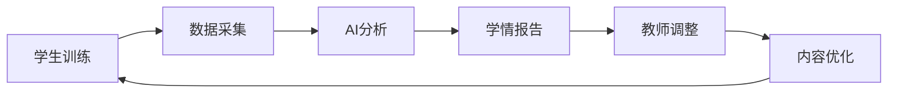
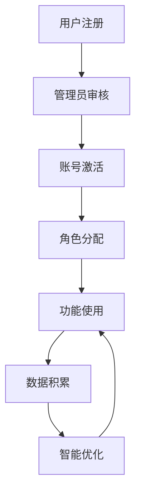

# 英语四级学习及教学系统项目上下文

## 项目概述

### 系统定位
本系统是一个综合性的英语四级学习及教学平台，采用AI驱动的智能化教学方式，为管理员、教师和学生提供完整的教学管理和学习训练解决方案。

### 核心价值主张
- **智能训练闭环**：学生训练数据反馈 → 分析知识点掌握度 → 教师调整教学策略 → 优化训练内容推送
- **AI驱动教学**：DeepSeek引擎支持大纲生成、教案构建、题目生成、智能批改和学情分析
- **多端协同**：管理员、教师、学生三端数据实时同步，24小时内数据流转
- **标准化评分**：严格按照英语四级考试标准进行写作评分和能力评估

## 单体架构技术设计

### 架构模式
- **单体架构** - 统一应用服务(8000端口)，模块化设计
- **完全独立Docker环境** - 所有服务运行在新建的独立容器中
- **统一管理** - 认证、授权、日志、监控集成在单体应用中

### 前端技术栈
- **构建工具**：Vite 5.x
- **前端框架**：React 18.x + TypeScript 5.x
- **UI组件库**：Mantine 7.x
- **状态管理**：Zustand 4.x
- **路由管理**：React Router 6.x
- **HTTP客户端**：TanStack Query 5.x

### 后端技术栈
- **应用框架**：FastAPI 0.104+ (Python 3.11+)
- **统一应用服务**：8000端口，集成所有业务功能
- **模块化设计**：用户管理、课程管理、训练系统、AI集成、通知系统
- **ORM框架**：SQLAlchemy 2.0 + Alembic

### 完全独立数据层 (Docker容器)
- **PostgreSQL容器**：业务数据存储，主从架构
- **Redis容器**：缓存、会话、队列，AOF持久化
- **Milvus容器**：向量检索、文档搜索，1536维向量
- **MinIO容器**：文件、媒体存储，对象存储
- **Nginx容器**：反向代理、负载均衡、静态资源

## 用户角色和权限

### 管理员（Admin）
**职责**：用户审核、课程管理、班级配置、系统监控和权限管理
**核心功能**：
- 用户注册审核管理
- 基础信息管理（学生、教师、教室）
- 课程全生命周期管理
- 班级管理与资源配置
- 系统监控与数据决策支持
- 权限中枢管理

### 教师（Teacher）
**职责**：教学资源管理、课程设计、学生学情分析和训练参数配置
**核心功能**：
- 课程资源库管理
- 教学计划构建
- 智能训练工坊
- 教师智能教学调整系统（系统核心）
- 学情分析和教学优化

### 学生（Student）
**职责**：进行各类英语训练、查看学习进度、参与班级互动和错题强化
**核心功能**：
- 学生综合训练中心（系统核心）
- 智能批改与反馈系统
- 错题强化与自适应学习
- 学习计划与管理
- 学习社交与互动

## 核心业务流程

### 智能训练闭环


### 用户生命周期


## 关键性能指标

### AI服务性能
- **批改准确率**：>90%（与人工批改对比）
- **分析准确率**：>85%（预测结果与实际结果对比）
- **响应时间**：题目生成<2s，批改<3s，分析<5s

### 系统性能
- **并发能力**：支持1000学生+500教师同时在线
- **可用性**：系统正常运行时间>99.5%
- **数据同步**：关键操作延迟<500ms

### 个性化程度
- **内容匹配度**：学生训练内容与个人薄弱点匹配度>80%
- **难度适配度**：题目难度与学生能力匹配度>75%
- **推荐准确性**：学习资源推荐点击率>60%

## 数据模型关系

### 核心实体关系
```mermaid
erDiagram
    User ||--o{ StudentProfile : has
    User ||--o{ TeacherProfile : has
    User ||--o{ TrainingRecord : creates
    Course ||--o{ Class : contains
    Class ||--o{ Student : enrolls
    Teacher ||--o{ Course : teaches
    Question ||--o{ TrainingRecord : used_in
    TrainingRecord ||--o{ ErrorRecord : generates
```

### 数据流向
- **用户数据**：注册信息 → 审核流程 → 权限分配 → 功能使用
- **训练数据**：题目生成 → 学生答题 → 智能批改 → 结果存储 → 分析反馈
- **教学数据**：资源管理 → 教学计划 → 学情分析 → 教学调整

## 安全和合规要求

### 数据保护
- **加密存储**：敏感数据AES-256加密
- **传输安全**：HTTPS+TLS 1.3
- **访问控制**：基于RBAC的细粒度权限控制
- **数据脱敏**：测试环境数据脱敏处理

### 合规要求
- **GDPR合规**：用户数据权利管理
- **个人信息保护法**：数据处理透明度
- **未成年人保护**：使用时长限制、内容安全过滤
- **教育行业规范**：符合教育数据标准

## 集成和依赖

### 外部服务依赖
- **DeepSeek AI服务**：题目生成、智能批改、学情分析
- **云服务提供商**：基础设施和存储服务
- **第三方认证**：SSO单点登录集成
- **支付服务**：充值和费用管理

### 架构模式
- **单体架构**：统一应用服务(8000端口)，模块化设计
- **完全独立Docker环境**：所有服务运行在新建容器中
- **统一管理**：认证、授权、日志、监控集成在单体应用中

### 内部模块依赖
- **用户管理模块**：认证授权、用户管理、权限控制
- **课程管理模块**：课程和班级管理、资源配置
- **训练系统模块**：题目生成和批改、学习记录
- **AI集成模块**：智能分析和内容生成、DeepSeek集成
- **通知系统模块**：消息推送和通知、实时通信

## 开发和部署环境

### 开发环境
- **本地开发**：Docker Compose一键启动
- **代码管理**：Git + GitHub
- **CI/CD**：GitHub Actions
- **代码质量**：ESLint + TypeScript + mypy + Ruff

### 部署环境
- **容器化**：Docker + Kubernetes
- **监控**：Prometheus + Grafana
- **日志**：ELK Stack
- **备份**：自动化备份和恢复

## 项目里程碑

### 第一阶段：MVP核心功能（4-6周）
- 用户注册审核系统
- 基础训练功能
- AI批改系统
- 基础管理功能

### 第二阶段：完整业务功能（6-8周）
- 完整的教师端功能
- 完整的学生端功能
- 高级管理功能
- 资源库系统

### 第三阶段：AI智能化功能（4-6周）
- 智能教学调整
- 自适应学习
- 高级分析功能
- 大规模文档处理

### 第四阶段：增强功能与优化（3-4周）
- 学习社交功能
- 性能优化
- 系统监控
- 生产部署

## 质量保证策略

### 测试策略
- **单元测试**：覆盖率>80%
- **集成测试**：API和数据流测试
- **端到端测试**：完整业务流程测试
- **性能测试**：负载和压力测试

### 代码质量
- **零容忍linter**：ESLint + TypeScript严格模式
- **类型安全**：100%类型覆盖
- **代码审查**：所有代码必须经过审查
- **自动化检查**：CI/CD集成质量检查

### 监控和告警
- **实时监控**：系统性能和业务指标
- **智能告警**：异常检测和自动通知
- **日志分析**：结构化日志和分析
- **用户体验监控**：前端性能和错误监控

## 风险管理

### 技术风险
- **AI服务依赖**：多服务商备选方案
- **性能瓶颈**：水平扩展和缓存优化
- **数据安全**：多层安全防护
- **系统稳定性**：高可用架构设计

### 业务风险
- **用户接受度**：用户体验优化和培训
- **教学效果**：持续效果评估和改进
- **成本控制**：AI服务成本监控和优化
- **合规风险**：法规遵循和审计

### 项目风险
- **进度延期**：敏捷开发和风险预警
- **质量问题**：严格的质量保证流程
- **团队协作**：清晰的角色分工和沟通机制
- **需求变更**：变更管理和影响评估

通过这个完整的项目上下文，智能体可以更好地理解项目的整体架构、业务逻辑和技术要求，从而生成更准确、更符合项目需求的代码和解决方案。