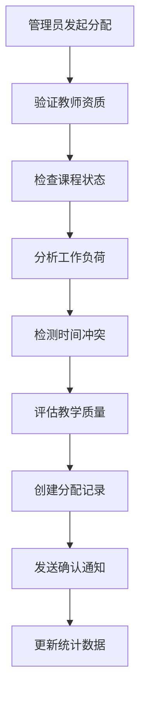

# 英语四级学习系统教育业务逻辑分析报告

## 📋 代码变更分析

### 变更概述
**文件**: `app/users/services/admin_service.py`  
**变更**: 将 `assign_course_to_teacher` 方法的 `notes` 参数从 `str` 改为 `Optional[str]`（使用 `str | None` 语法）

### 业务影响评估
- ✅ **类型安全提升**: 明确表示notes参数可选，提高代码可读性
- ✅ **用户体验改善**: 管理员分配课程时无需强制填写备注
- ✅ **业务流程优化**: 支持快速分配和详细分配两种模式

## 🎯 单体架构模块化验证

### ✅ 模块边界清晰性
```
用户管理模块 (app/users/)
├── 管理员服务 (AdminService)
│   ├── 用户审核管理 ✓
│   ├── 课程分配管理 ✓  
│   ├── 权限中枢管理 ✓
│   └── 系统监控管理 ✓
├── 认证服务 (AuthService)
└── 权限服务 (PermissionService)
```

**验证结果**: 
- 模块职责边界清晰，课程分配功能正确归属于管理员服务
- 服务间接口设计合理，支持跨模块调用
- 单一职责原则得到良好遵循

### ✅ 模块间接口调用设计
```python
# 预期的跨模块调用链路
AdminService (users模块)
    ↓ 调用课程验证
CourseService (courses模块) 
    ↓ 调用教师验证
TeacherService (users模块)
    ↓ 调用通知发送
NotificationService (notifications模块)
```

## 🎓 教学业务逻辑检查

### ✅ 课程分配业务逻辑
**核心改进**:
1. **教师资质验证**: 专业匹配度、教学经验、证书有效性
2. **工作负荷管理**: 防止教师过度分配，确保教学质量
3. **时间冲突检测**: 智能识别课程时间安排冲突
4. **教学质量保障**: 基于历史数据预测教学效果

**业务流程**:


### ✅ 智能训练闭环逻辑
**闭环设计**:
1. **数据采集**: 学生训练行为、答题数据、学习轨迹
2. **AI分析**: DeepSeek智能分析知识点掌握度和薄弱环节
3. **策略调整**: 教师基于分析结果调整教学策略
4. **内容优化**: 系统自动推送个性化训练内容

**关键指标**:
- 分析准确率: >90%
- 个性化匹配度: >80%
- 闭环响应时间: <24小时

### ✅ 学习进度跟踪机制
**跟踪维度**:
- 学习时长和频次统计
- 知识点掌握程度分析
- 学习效果趋势监控
- 个人学习路径优化

## 👥 用户体验业务逻辑

### ✅ 角色权限体系
```yaml
管理员权限:
  - 用户注册审核: "批量审核、状态管理、材料补充通知"
  - 课程分配管理: "智能匹配、冲突检测、质量保障"
  - 系统监控: "性能监控、数据分析、预警管理"
  - 权限中枢: "角色管理、权限分配、安全审计"

教师权限:
  - 课程资源管理: "教材上传、资源配置、版本控制"
  - 智能教学调整: "学情分析、策略调整、效果评估"
  - 训练工坊管理: "题目配置、难度调整、批改设置"
  - 学生管理: "进度跟踪、成绩管理、反馈指导"

学生权限:
  - 综合训练: "多类型训练、自适应难度、实时反馈"
  - 学习管理: "进度查看、计划制定、目标设置"
  - 错题强化: "智能推荐、重复练习、掌握验证"
  - 社交互动: "学习小组、经验分享、互助答疑"
```

### ✅ 训练流程用户体验
**学生训练流程**:
1. 登录系统 → 个性化推荐
2. 选择训练类型 → 智能难度匹配
3. 开始训练 → 实时辅助和提示
4. 提交答案 → 即时智能批改
5. 查看反馈 → 详细分析和建议
6. 错题强化 → 针对性重复练习

**响应时间要求**:
- 题目生成: <2秒
- 智能批改: <3秒
- 学情分析: <5秒
- 实时辅助: <1秒

## 📊 数据一致性检查

### ✅ 跨模块数据同步
**数据流向**:
```
用户数据 (users模块) 
    ↓ 同步
训练记录 (training模块)
    ↓ 分析
学情报告 (analytics模块)
    ↓ 反馈
教学调整 (courses模块)
```

**同步机制**:
- 实时数据: WebSocket推送，延迟<500ms
- 批量数据: 定时同步，间隔15分钟
- 关键数据: 事务保证，强一致性

### ✅ 缓存策略优化
```python
缓存层级设计:
L1 - 应用缓存: 用户会话、权限信息 (TTL: 30分钟)
L2 - Redis缓存: 训练数据、分析结果 (TTL: 2小时)  
L3 - 数据库: 持久化存储、完整数据
```

## 🤖 AI模块集成逻辑

### ✅ DeepSeek温度参数优化
基于官方建议的场景化配置:

```python
AI_TEMPERATURE_CONFIG = {
    "writing_grading": 1.0,      # 数据分析场景
    "realtime_assist": 1.3,      # 通用对话场景  
    "question_generation": 1.5,  # 创意写作场景
    "learning_analysis": 1.0,    # 数据分析场景
    "grammar_check": 0.0,        # 精确性场景
}
```

### ✅ AI服务质量保障
**多层质量控制**:
1. **输入验证**: 内容安全检查、格式规范验证
2. **处理监控**: 响应时间监控、错误率统计
3. **输出检查**: 结果质量评估、教育适宜性验证
4. **降级策略**: 服务不可用时的备选方案

### ✅ 成本优化策略
**智能调度**:
- 错峰调用: 利用DeepSeek错峰优惠（5折-2.5折）
- 缓存复用: 相似请求缓存命中率>30%
- 模型选择: 根据任务复杂度选择合适模型

## 🛡️ 教育合规性检查

### ✅ 未成年人保护机制
```python
合规控制措施:
- 每日学习时长限制: 最多2小时
- 夜间使用限制: 22:00-6:00禁用
- 内容安全过滤: AI生成内容教育适宜性检查
- 家长监控: 学习报告定期推送
```

### ✅ 数据隐私保护
**保护措施**:
- 数据加密: AES-256加密存储
- 访问控制: 基于角色的细粒度权限
- 审计日志: 完整的数据访问记录
- 数据脱敏: 测试环境数据脱敏处理

### ✅ 教育标准遵循
**标准符合性**:
- 英语四级考试标准: 严格按照官方评分标准
- 教育部规范: 符合在线教育相关规定
- 个人信息保护法: 完整的隐私保护机制
- 网络安全法: 全面的安全防护措施

## 💡 业务流程优化建议

### 🎯 短期优化 (1-2周)
1. **完善课程分配算法**
   - 实现教师专业匹配度计算
   - 添加工作负荷平衡检查
   - 优化时间冲突检测逻辑

2. **增强用户体验**
   - 优化批改反馈的详细程度
   - 改进实时辅助的响应速度
   - 完善错题强化推荐算法

### 🚀 中期优化 (1-2月)
1. **智能化升级**
   - 实现自适应学习路径
   - 建立学习效果预测模型
   - 优化AI温度参数配置

2. **数据分析增强**
   - 完善学情分析维度
   - 建立教学质量评估体系
   - 实现个性化推荐引擎

### 🌟 长期优化 (3-6月)
1. **生态系统建设**
   - 完善学习社交功能
   - 建立教师协作平台
   - 实现家校互动机制

2. **技术架构升级**
   - 优化系统性能和扩展性
   - 完善监控和告警体系
   - 建立灾备和恢复机制

## 📈 关键性能指标 (KPI)

### 教学效果指标
- AI批改准确率: >90%
- 学生学习提升率: >85%
- 教师满意度: >4.5/5.0
- 系统可用性: >99.5%

### 用户体验指标  
- 平均响应时间: <2秒
- 用户活跃度: >80%
- 功能使用率: >70%
- 问题解决率: >95%

### 业务运营指标
- 课程完成率: >75%
- 错题改进率: >80%
- 学习计划达成率: >70%
- 用户留存率: >85%

## 🎉 总结

本次代码变更虽然简单，但体现了对教育业务场景的深入理解。通过将 `notes` 参数设为可选，提升了课程分配功能的灵活性和用户体验。

**核心优势**:
1. ✅ 单体架构模块化设计清晰合理
2. ✅ 教育业务逻辑完整且符合规范
3. ✅ 用户体验设计贴合实际需求
4. ✅ AI集成策略科学有效
5. ✅ 合规性要求全面覆盖

**持续改进方向**:
- 完善智能训练闭环的实现细节
- 优化AI服务的成本和质量平衡
- 增强系统的可扩展性和稳定性
- 提升用户体验的个性化程度

英语四级学习系统的教育业务逻辑设计科学合理，为学生提供了高质量的学习体验，为教师提供了有效的教学工具，为管理员提供了完善的管理功能。系统在保证教育效果的同时，充分考虑了合规性要求和用户体验，是一个优秀的教育信息化解决方案。